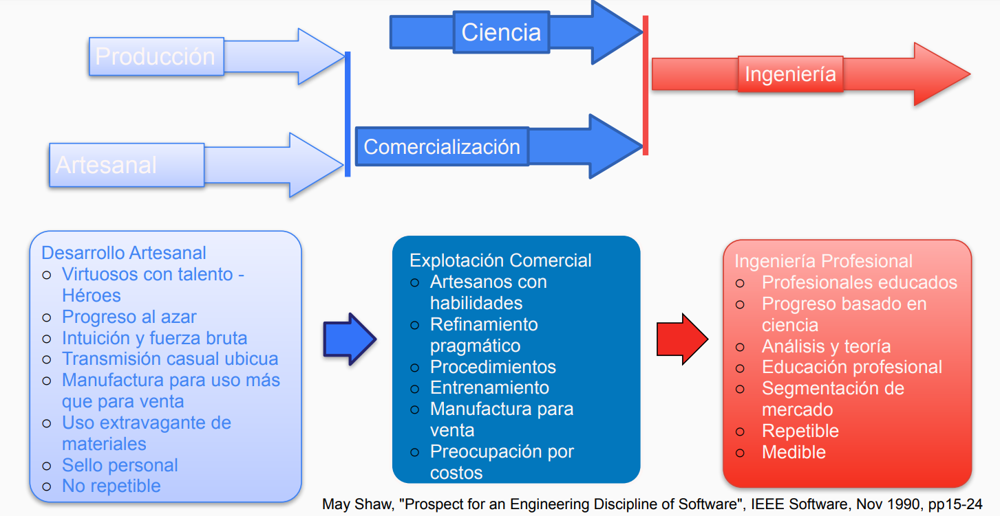

---
tags:
- flashcards/swe/teoria/1P
- flashcards/swe/teoria/U1
---

# IEEE

## Definición 1

Aplicación de un enfoque:

- Sistemático (Sistema).
- Disciplinado (Método).
- Y cuantificable (Métricas).

Al:

- Desarrollo.
- Operación (SW usable).
- Y mantenimiento.

De SW.

---

- Es la aplicación de ==1;;un enfoque==.
- El mismo es ==1;;sistemático==, ==1;;disciplinado== & ==1;;cuantificable==.
- Son aplicados al ==1;;desarrollo==, ==1;;operación== & ==1;;mantenimiento== de SW.
<!--SR:!2025-05-08,5,248-->

---

## Definición 2

Disciplina:

- Tecnológica.
- De administración

Que se ocupa de:

- La producción sistemática.
- Mantenimiento

De productos de SW que son desarrollados en:

- Tiempo
- Costo estimados.

---

- La SWE es una ==1;;disciplina==.
- La misma es de carácter ==1;;tecnológica== y ==1;;de administración==.
- Se ocupa de la ==1;;producción sistemática== y ==1;;mantenimiento== de productos de SW.
- Los mismos deben ser desarrollados en ==1;;tiempo== y ==1;;costo estimados==.
<!--SR:!2025-05-04,1,168-->

---

# SW Engineering Institute (SEI)

## Definición de "Ingeniería"

Aplicación sistemática del conocimiento científico en la:

- Creación.
- Construcción de soluciones.

Para resolver problemas prácticos al servicio del hombre.

---

- Es una ==1;;aplicación sistemática== del ==1;;conocimiento científico==.
- El mismo es aplicado sobre ==1;;la creación== & ==1;;construcción de soluciones==.
- Finalidad: ==1;;Resolver problemas prácticos al servicio del hombre==.
<!--SR:!2025-05-06,3,211-->

---

## Definición de "Ingeniería del SW"

Aquella parte de la ingeniería que aplica los principios de:

- Las ciencias de la computación.
- Las matemáticas.

Para alcanzar soluciones a problemas de SW.

---

- Aquella parte de la ingeniería que aplica los principios de ==1;;las ciencias de la computación== & ==1;;las matemáticas==.
- Finalidad: ==1;;Alcanzar soluciones a problemas de SW==.
<!--SR:!2025-05-06,3,208-->

---

# Fairley (1985) (SW Engineering Concepts)

Es la disciplina tecnológica y de administración que se ocupa de la producción sistemática & mantenimiento de productos de SW que son desarrollados en tiempo y costo estimados.

# Cosas que comparten las definiciones

En general esas definiciones comparten los siguientes puntos:

- Crear soluciones "cost-effective".
- A problemas prácticos (concretos).
- Aplicando conocimiento científico / codificado.
- Construyendo SW que sirva al hombre.

La ingeniería permite a una persona común hacer cosas que antes requería de gente virtuosa.

Eficiente en términos de costo: que sea la más barata posible o bien más barata en comparación a una solución hecha por una persona que no sea un SWE.

---

Las soluciones deben ser de carácter ==1;;"Cost-effective"==.
<!--SR:!2025-05-08,5,268-->

(Control U1) Defina con sus palabras qué es la ingeniería del SW. ¿Su definición tiene alguna diferencia/discrepancia con la definición de la IEEE? ¿Cuáles?
?
La SWE es una disciplina que permite:
- Crear soluciones "cost-effective".
- A problemas prácticos (concretos).
- Aplicando conocimiento científico / codificado.
- Construyendo SW que sirva al hombre.
- La definición difiere en que:
	- Es la aplicación de un enfoque.
	- El mismo es sistemático, disciplinado & cuantificable.
	- Son aplicados al desarrollo, operación & mantenimiento de SW.
<!--SR:!2025-05-05,2,208-->

---

# Notas

Se trabaja siempre en contra de un presupuesto, tiempo, restricción, mientras que las ciencias ven el fenómeno y nada más.
