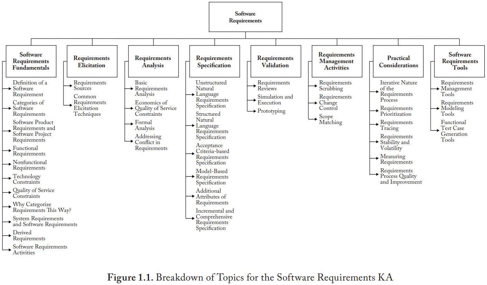
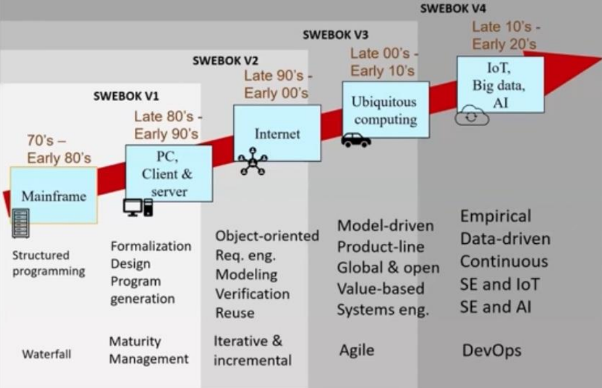

---
tags:
- flashcards/swe/teoria/1P
- flashcards/swe/teoria/U1
---

# SWEBoK (SWE [[02-body-of-knowledge|Body of Knowledge]])

- Libro que describe el "[[02-body-of-knowledge|cuerpo de conocimiento]]" que existe de la [[01-definiciones|Ingeniería de SW]].
- Objetivo: "Convertir a la SWE en una disciplina legítima y una profesión reconocida" (IEEE Computer Society).
- Describe o relata los conocimientos que son relevantes para la formación de un Ingeniero de SW.
- Describe el conocimiento generalmente aceptado en la disciplina de la SWE.
	- "Generalmente aceptado": El conocimiento y las prácticas descritas son aplicables a la mayoría de los proyectos y existe un amplio consenso acerca de su valor y utilidad.
	- No quiere decir que sea aplicada en forma uniforme en todos los proyectos: el equipo de gestión de proyectos es siempre responsable de determinar lo que es apropiado para un proyecto determinado.
- Conformado por 18 Knowledge Areas que sintetizan conceptos básicos y referencian a información más detallada. Las mismas son:
	1. SW Requirements.
	2. SW Architecture (**V4**).
	3. SW Design.
	4. SW Construction.
	5. SW Testing.
	6. SW Engineering Operations (**V4**).
	7. SW Maintenance.
	8. SW Configuration Management.
	9. SW Engineering Management.
	10. SW Engineering Process.
	11. SW Engineering Models and Methods.
	12. SW Quality.
	13. SW Security (**V4**).
	14. SW Engineering Professional Practice.
	15. SW Engineering Economics.
	16. Computing Foundations.
	17. Mathematical Foundations.
	18. Engineering Foundations.

---

(Control U1) ¿Qué es el SWEBOK?
?
El SWEBoK es un libro que:
- Describe el "cuerpo de conocimiento" que existe de la Ingeniería de SW.
- Describe aquellos puntos relevantes que son relevantes para la formación de un Ingeniero de SW.
- Dicho conocimiento es el generalmente aceptado en la disciplina.
<!--SR:!2025-05-05,1,170-->

(Control U1) Nombre 3 de las Key Areas del SWEBOK.
?
- SW Requirements.
- SW Architecture (**V4**).
- SW Design.
- SW Testing.
- SW Maintenance.
- SW Configuration Management.
- SW Quality.
- SW Security (**V4**).
<!--SR:!2025-05-11,7,270-->

El SWEBoK se encuentra conformado por ==1;;18 Knowledge Areas==.
<!--SR:!2025-05-12,8,270-->

¿Para qué sirven las Knowledge Areas?::Sintetizan conceptos básicos y referencian a información más detallada.
<!--SR:!2025-05-05,1,190-->

El objetivo principal del SWEBoK (IEEE) es "convertir a la SWE en ==1;;una disciplina legítima== y ==1;;una profesión reconocida==".
<!--SR:!2025-05-08,4,230-->

---

Ejemplo de breakdown structure de la KA "SW Requirements":

## Propósito

#exam-question

- Define y clasifica el contenido de la Ingeniería de SW como disciplina.
	- ¿Qué temas abarca la SWE?
	- Segregadas en 18 KAs.
- Promueve una comprensión a nivel global, consistente de la SWE.
	- Compartir visión general globalmente respecto a qué es o no es SWE.
- Clarifica los límites entre de la SWE en relación con otras disciplinas:
	- Limitar respecto a qué es o no es SWE.
		- ¿Hasta dónde llega la ciencia de los algoritmos/las matemáticas/etc?
- Proporciona los fundamentos para material de entrenamiento y desarrollo de una currícula.
	- Sea para universidad/posgrado, en una compañía al momento de contratar gente para cierto rol (para contratar a un _tester_ sería el capítulo de _Testing_), etc.
- Puede soportar certificaciones y licencias de Ingeniería en SW.
	- En algún momento saldrán matrículas para SWE, al igual que los médicos, contadores, etc.
- Refleja el estado de desarrollo actual e integra prácticas emergente.
	- ¿Qué es a día de hoy SWE y qué temas incluye?
	- Inclusión de prácticas emergentes lo suficientemente difundidas como para empezar a tratarlas dentro de la SWE.

---

(Control U1) ¿Para qué nos sirve el SWEBOK? Nombre 3 usos diferentes que se le puede dar.
?
- **Caracterización de contenidos**: Define el contenido de la Ingeniería de SW como disciplina.
- **Visión consistente de la SWE**: Promueve una comprensión a nivel global, consistente de la SWE.
- **Establecer fronteras**: Clarifica los límites entre de la SWE en relación con otras disciplinas.
- **Planes de estudio**: Proporciona los fundamentos para material de entrenamiento y desarrollo de una currícula.
- Refleja el estado de desarrollo actual e integra prácticas emergente.
<!--SR:!2025-05-05,1,210-->

¿Qué papel cumple SWEBoK?::Describe el "cuerpo de conocimiento" que existe de la Ingeniería de SW.
<!--SR:!2025-05-05,1,190-->

¿Cuál es el objetivo principal del SWEBoK?::Convertir a la SWE en una disciplina legítima y una profesión reconocida (liderado: IEEE Computer Society). Describe o relata aquellos puntos relevantes que son relevantes para la formación de un Ingeniero de SW.
<!--SR:!2025-05-05,1,190-->

El SWEBoK define ==1;;el contenido de la Ingeniería de SW como disciplina==.
<!--SR:!2025-05-06,2,210-->

El SWEBoK promueve una ==1;;comprensión a nivel global==, ==1;;consistente== de la SWE.
<!--SR:!2025-05-05,1,130-->

El SWEBoK clarifica ==1;;los límites entre de la SWE== en relación con otras disciplinas.
<!--SR:!2025-05-08,4,230-->

El SWEBoK proporciona los fundamentos para ==1;;el material de entrenamiento== y ==1;;desarrollo== de una ==1;;currícula==.
<!--SR:!2025-05-05,1,170-->

El SWEBoK puede soportar ==1;;certificaciones y licencias== de SWE.
<!--SR:!2025-05-07,3,210-->

El SWEBoK refleja el ==1;;estado de desarrollo actual== e integra ==1;;prácticas emergentes==.
<!--SR:!2025-05-05,1,150-->

---

## Evolución

