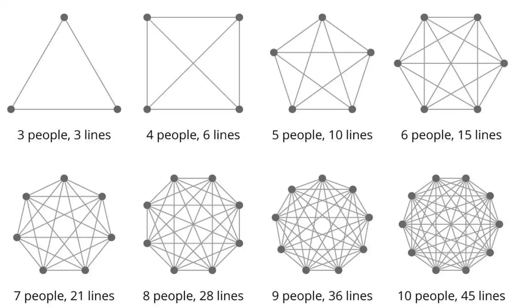
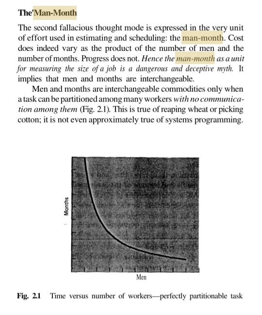
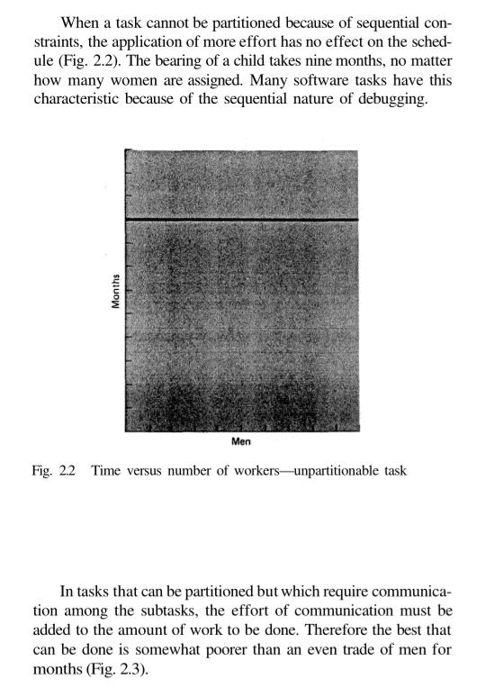
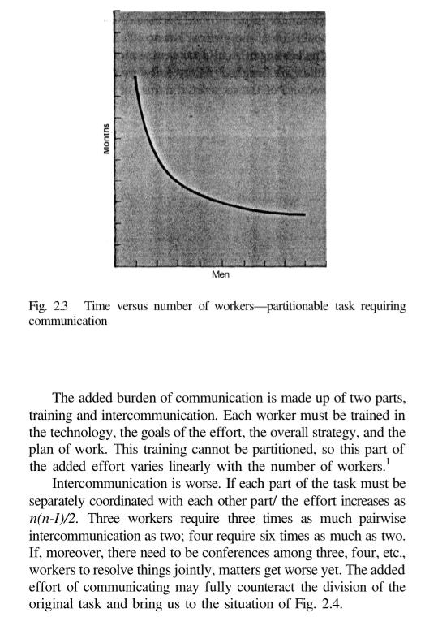
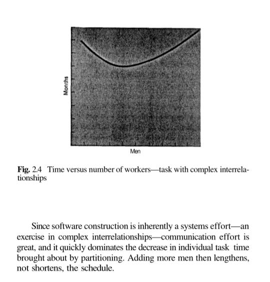

---
tags:
- flashcards/swe/teoria/1P
- flashcards/swe/teoria/U1
---

**"Agregar más mano de obra a un proyecto de SW en retraso, lo retrasará más"** - F. P. Brooks

- Aumentar # desarrolladores no siempre implica (=/=>) mayor velocidad de compleción.
- "Man-month": Concepto de calcular la duración del proyecto, multiplicando:
	- $$ManMonth = CantidadPersonasTrabajandoEnProyecto * CantidadMesesParaCompletarProyecto$$
	- F. P. Brooks lo sustenta como: "Por ende el _Man-Month_, como una unidad para medir el [[01-conceptos-de-estimaciones-de-sw|tamaño de una tarea]], es un mito peligroso y engañoso".
- Este approach simplista falla al no tener en cuenta factores como:
	- Cantidad de líneas de comunicación: _Overhead_ en la comunicación.
	- Curva de aprendizaje: Tiempo que tardan los nuevos miembros en entrar al ritmo del proyecto.
	- Ponderación de que la tarea sea particionable / paralelizable.

## Impactos negativos de agregar más personal a un proyecto de SW en retraso

- Tiempo de familiarización de nuevos miembros con el proyecto:
	- Baja productividad durante este período.
- Aumento en el _overhead_ de comunicación a medida que el equipo crece:
	- Aumenta complejidad en la comunicación.
	- Aumenta tiempo invertido en la coordinación:
		- Mayor líneas de comunicación => Necesidad de un coordinador.
- Fragmentación de tareas:
	- Si bien al tener más desarrolladores es posible segregar las tareas en tareas más pequeñas, no siempre implica un incremento en la eficiencia.

> [!TIP]
>
> - El tamaño del equipo debe ser limitado.
> - En caso de que la organización crezca en demasía, tal que se requiere múltiples equipos, la ley de Conway entra en juego.

## En contra la Ley de Brooks: Condiciones para que agregar más gente no sea un problema

1. Personal capacitado (con aptitudes): Minimizar la curva de aprendizaje.
2. Tareas no necesitan mucha comunicación: Mantener la # de líneas de comunicación lo más bajo posible.
3. Tareas deben ser particionables/paralelizables: Consideración del camino crítico.

---

Nombrar las 3 condiciones para que "agregar más gente a un proyecto" no sea un problema.
?
1. Personal capacitado (con aptitudes): Minimizar la curva de aprendizaje.
2. Tareas no necesitan mucha comunicación: Mantener la # de líneas de comunicación lo más bajo posible.
3. Tareas deben ser particionables/paralelizables: Consideración del camino crítico.
<!--SR:!2025-05-06,2,230-->

---

## The'Man-Month

Existen 5 casos posibles:

1. Las tareas son particionables y no se requiere comunicación entre las mismas:
	- Relación: Lineal.
	- Rara vez se da en el dominio de la construcción del SW
2. La tarea es perfectamente particionable:
	- Relación: Hiperbólica.
	- De alguna forma terminan expresando comunicación entre las partes
3. La tarea no es particionable:
	- Relación: Constante.
4. La tarea es particionable y requiere comunicación entre las subtareas:
	- Relación: Hiperbólica.
5. La tarea es particionable pero sus subtareas requieren de mucha comunicación y poseen una interrelación compleja:
	- Relación: Cuadrática.
	- e.g., una subtarea requiere alta coordinación con otra.
