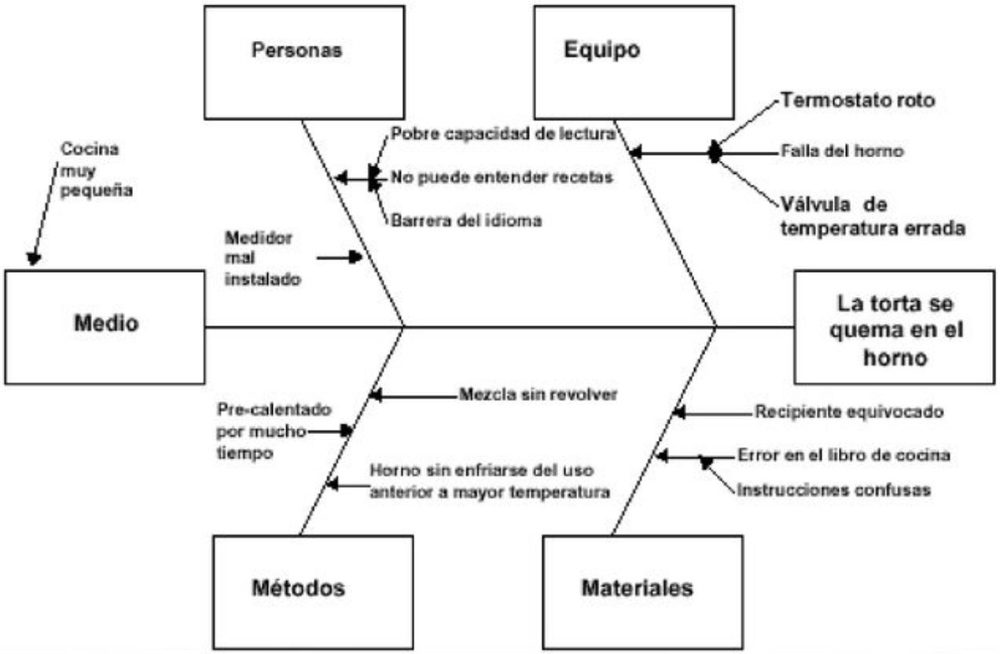

---
tags:
- flashcards/swe/teoria/1P
- flashcards/swe/teoria/U1
---

# Diagrama Causa - Efecto / Diagrama de Ishikawa / Espina de Pescado

- Representación gráfica de varios elementos (causas) de un sistema que pueden contribuir al problema (efecto).
- Es útil para la recolección de datos.
- Es efectivo para estudiar los procesos y situaciones.
- Usado para identificar las posibles causas de un y solamente un problema en específico.
	- La naturaleza gráfica del diagrama permite que:
		- Los grupos organicen grandes cantidades de información sobre el problema.
		- Determinar exactamente las posibles causas.
	- Aumenta la probabilidad de identificar las causas principales.
- Un diagrama causa efecto bien preparado es un vehículo para ayudar a los equipos de mejora continua a tener una concepción común de un problema **complejo**.
- Diagrama:
	
- Partes del diagrama:
	- La cabeza del pescado: El **problema a analizar** ("la torta se quema en el horno").
	- Macro-causas: Los equipos van descubriendo **grupos de causas** ("Medio", "Personas", etc.) que pueden ser los generadores raíz del problema experimentado.
	- Micro-causas: Espinas afluentes a la espina de la macro-causa.
- Permite el trabajo en equipo y hacer manifiesto de la mejor forma de comunicación: "un grupo de gente reunido con un dashboard, trabajando y discutiendo ideas".
- Es posible emplearlo como una _Retro Tool_.
- Como acción posterior al diagrama, cada integrante del equipo se lleva una micro-causa del grupo para atacar el problema en cuestión.
- Es posible hacer el diagrama en forma de _bullet points_.

## Pasos

1. Identificación del problema complejo.
2. Identificación de las micro-causas para cada grupo de información (6Ms).
	1. Las micro-causas pueden tener a su vez sus propias micro-causas.
3. Agrupación de las micro-causas a cada grupo de información (6Ms).

---

(Control U1) ¿Qué es el diagrama de Ishikawa?::Es una representación gráfica de varios elementos (causas) de un sistema que pueden contribuir al problema (efecto).
<!--SR:!2025-05-05,1,168-->

(Control U1) ¿Para qué sirve el diagrama de Espina de Pescado?::Sirve para identificar las posibles causas de un y solamente un problema en específico. Sirve para la recolección de datos y es efectivo para estudiar los procesos y situaciones.
<!--SR:!2025-05-07,3,226-->

(Control U1) Describa los pasos a seguir para emplear el diagrama de Ishikawa
?
1. Identificación de un y solamente un problema complejo.
2. Identificación de las micro-causas para cada grupo de información (6Ms).
	1. Las micro-causas pueden tener a su vez sus propias micro-causas.
3. Agrupación de las micro-causas a cada grupo de información (6Ms).
<!--SR:!2025-05-10,6,266-->

V o F. Es posible realizar ponderaciones sobre el diagrama de Ishikawa.::V
<!--SR:!2025-05-06,2,248-->

V o F. El diagrama de Espina de Pescado nos ayuda a descubrir los problemas, para luego solucionarlos.
?
Esta es algo raro de contestar solo por V o F, ya que se requiere una justificación para expresar lo que uno entiende de "\[...\]para luego solucionarlos.". La justificación es que si bien nos ayuda a descubrir los problemas, la herramienta no soluciona los problemas mágicamente si no ponemos manos a la obra.
<!--SR:!2025-05-06,2,249-->

¿Para qué es útil el diagrama de Ishikawa?::Es útil para la recolección de datos.
<!--SR:!2025-05-06,2,186-->

¿Para qué es efectivo el diagrama de Ishikawa?::Es efectivo para estudiar los procesos y situaciones.
<!--SR:!2025-05-06,2,206-->

¿Para qué es empleado el diagrama de Ishikawa?::Es empleado para identificar las posibles causas de un problema específico.
<!--SR:!2025-05-08,4,246-->

¿Qué cosas facilita la naturaleza gráfica del diagrama?::Permite que los grupos organicen grandes cantidades de información sobre el problema y determinar exactamente las posibles causas.
<!--SR:!2025-05-05,1,170-->

V o F: El diagrama de Ishikawa permite aumentar la probabilidad de identificar las causas principales.::V
<!--SR:!2025-05-10,6,266-->

V o F: El diagrama de Ishikawa es empleado para identificar problemas simples y pequeños::F
<!--SR:!2025-05-10,6,266-->

V o F: El diagrama de Ishikawa permite identificar más de 1 problema::F
<!--SR:!2025-05-10,6,266-->

¿Cómo es el impacto de un diagrama causa efecto bien preparado?::Es un vehículo para ayudar a los equipos de mejora continua a tener una concepción común de un problema complejo.
<!--SR:!2025-05-07,3,208-->

Un ejemplo de un diagrama de Ishikawa "bien preparado" es.
?

<!--SR:!2025-05-09,5,246-->

---
