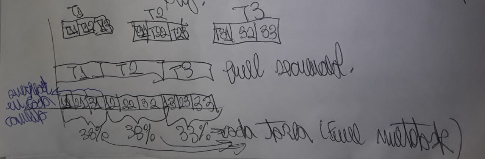

---
tags:
- flashcards/swe/teoria/1P
- flashcards/swe/teoria/U1
---

# Paper: Classic Mistakes

- **Classic Mistakes**: errores que se cometen tan seguido y por tanta gente que las consecuencias de cometerlos deberían ser predecibles y los mismos errores deberían ser evitables.
- Problemas recurrentes en todos los proyectos de D&M de SW.
- Suelen tener un gran impacto negativo en el desarrollo.
- Conocerlos (sus causas y consecuencias) para evitar que sucedan o reaccionar de la mejor manera posible ante su ocurrencia.

---

(Control U1) ¿Qué es un Classic Mistake (CM)?::Un CM es un error que se comete tan seguido y por tanta gente que las consecuencias de cometerlo debería ser predecible y el mismo debería ser evitable.
<!--SR:!2025-05-05,1,210-->

Los _Classic Mistakes_ son ==1;;problemas recurrentes== en todos los proyectos de D&M de SW y suele tener ==1;;un gran impacto negativo== en el desarrollo.
<!--SR:!2025-05-05,1,210-->

(Control U1) ¿Por qué es importante conocer y tener en cuenta los CMs?::Es con el fin de evitar que sucedan o reaccionar de la mejor manera posible ante su ocurrencia.
<!--SR:!2025-05-05,1,230-->

<!--
(Control U1) ¿Cuáles son, según el paper de Steve McConnell los 5 CM más relevantes **por frecuencia**? Describa los 3 primeros.
?
1. Overly optimistic schedules.
2. Unrealistic expectations.
3. Excessive multi-tasking.
4. Shortchanged QA.
5. Noisy, crowded offices.

(Control U1) Describa los 3 CMs más relevantes **por frecuencia**, según el paper de Steve McConnell.
?
1. Overly optimistic schedules:
	- Prepara a un proyecto para el fracaso al subestimar el alcance del proyecto.
	- Finaliza la planificación efectiva.
	- Abrevia actividades críticas como: Análisis de requerimientos y diseño.
	- Ejerce una presión excesiva sobre los desarrolladores, afectando negativamente a la moral y productividad de estos.
2. Unrealistic expectations:
	- Causas más comunes de fricción entre los desarrolladores <-> clientes o gerentes.
	- Clientes: comienzan con expectativas poco realistas (parte de la naturaleza humana).
	- Gerentes: los desarrolladores se buscan problemas con estos al obtener la aprobación del proyecto basándose en estimaciones optimistas.
	- Encuesta del Standish Group: determinó que las expectativas realistas son 1 de los 5 factores principales necesarios para garantizar el éxito de un proyecto de SW.
3. Excessive multi-tasking:
	- La sobreasignación de desarrolladores a proyectos obliga a que "cambien de tarea", al cambiar su enfoque de un proyecto a otro.
	- Deben salir del "flujo" en un proyecto y entrar en el "flujo" del otro.
	- Puede ser un factor significativo: algunos estudios indican que cada cambio de tarea en el desarrollo de SW puede implicar un tiempo de inactividad de 5~30 minutos mientras el desarrollador sale del flujo de un proyecto y entra en el flujo del otro.
-->

<!--
(Control U1) ¿Cuáles son, según el paper de Steve McConnell los 5 CM más relevantes **por impacto**? Describa los 3 primeros.
?
1. Unrealistic expectations.
2. Weak personnel.
3. Overly optimistic schedules.
4. Wishful thinking.
5. Shortchanged QA.

(Control U1) Describa los 3 CMs más relevantes **por impacto**, según el paper de Steve McConnell.
?
1. Unrealistic expectations:
	- Causas más comunes de fricción entre los desarrolladores <-> clientes o gerentes.
	- Clientes: comienzan con expectativas poco realistas (parte de la naturaleza humana).
	- Gerentes: los desarrolladores se buscan problemas con estos al obtener la aprobación del proyecto basándose en estimaciones optimistas.
	- Encuesta del Standish Group: determinó que las expectativas realistas son 1 de los 5 factores principales necesarios para garantizar el éxito de un proyecto de SW.
2. Weak personnel:
	- Después de la motivación, las capacidades individuales de los miembros del equipo como su relación como equipo, probablemente tienen la mayor influencia en la productividad.
	- Contratar personal poco calificado puede poner en peligro el esfuerzo de desarrollo.
	- En algunos proyectos, la selección de personal se basa en quién podría ser contratado más rápido en lugar de quién podría realizar más trabajo durante el ciclo de vida del proyecto.
	- Esta práctica permite que el proyecto comience rápidamente, pero no lo prepara para una finalización exitosa.
3. Overly optimistic schedules:
	- Prepara a un proyecto para el fracaso al subestimar el alcance del proyecto.
	- Finaliza la planificación efectiva.
	- Abrevia actividades críticas como: Análisis de requerimientos y diseño.
	- Ejerce una presión excesiva sobre los desarrolladores, afectando negativamente a la moral y productividad de estos.
-->

(Control U1) ¿Cuáles son, según el paper de Steve McConnell los 5 CM más relevantes **por nivel de riesgo**?
?
1. Unrealistic expectations.
2. Overly optimistic schedules.
3. Shortchanged QA.
4. Wishful thinking.
5. Confusing estimates with targets.
<!--SR:!2025-04-03,4,275-->

(Control U1) Describa los 3 CMs más relevantes por **nivel de riesgo**, según el paper de Steve McConnell.
?
1. Unrealistic expectations:
	- Causas más comunes de fricción entre los desarrolladores <-> clientes o gerentes.
	- Clientes: comienzan con expectativas poco realistas (parte de la naturaleza humana).
	- Gerentes: los desarrolladores se buscan problemas con estos al obtener la aprobación del proyecto basándose en estimaciones optimistas.
	- Encuesta del Standish Group: determinó que las expectativas realistas son 1 de los 5 factores principales necesarios para garantizar el éxito de un proyecto de SW.
2. Overly optimistic schedules:
	- Prepara a un proyecto para el fracaso al subestimar el alcance del proyecto.
	- Finaliza la planificación efectiva.
	- Abrevia actividades críticas como: Análisis de requerimientos y diseño.
	- Ejerce una presión excesiva sobre los desarrolladores, afectando negativamente a la moral y productividad de estos.
3. Shortchanged QA:
	- Proyectos que tienen prisa usualmente:
		- Recortan pasos eliminando las revisiones de diseño y código (ventaja percibida en el cronograma).
		- Eliminan la planificación de pruebas (pruebas superficiales).
		- Proyecto alcanza su hito, pero aún es demasiado defectuoso para ser lanzado.
<!--SR:!2025-04-02,3,255-->

---

## Errores que ocurren por frecuencia (Most Frequent CMs)

1. Overly optimistic schedules.
2. Unrealistic expectations.
3. Excessive multi-tasking.
4. Shortchanged QA.
5. Noisy, crowded offices.
6. Feature creep.
7. Wishful thinking.
8. Insufficient risk management.
9. Confusing estimates with targets.
10. Omitting necessary tasks from estimates.

(En base a la tabla 1).

## Errores que ocurren por impacto (Most Severe CMs)

1. Unrealistic expectations.
2. Weak personnel.
3. Overly optimistic schedules.
4. Wishful thinking.
5. Shortchanged QA.
6. Inadequate design.
7. Lack of project sponsorship.
8. Confusing estimates with targets.
9. Excessive multi-tasking.
10. Lack of user involvement.

(En base a la tabla 5).

## Errores que ocurren por nivel de riesgo (Highest Mistake Exposure Index (MEI)) (Most Damaging CMs Overall)

$$MEI = Frequency * Severity$$

1. Unrealistic expectations.
2. Overly optimistic schedules.
3. Shortchanged QA.
4. Wishful thinking.
5. Confusing estimates with targets.
6. Excessive multi-tasking.
7. Feature creep.
8. Noisy, crowded offices.
9. Abandoning of planning under pressure.
10. Insufficient risk management.

(En base a la tabla 8, es el mismo que la tabla F del apéndice).

> [!IMPORTANT]
>
> Se toma en cuenta esta tabla para la cátedra, ya que en clases se mencionó que es "la tabla que combina y resume el resultado de la multiplicación de los valores de las 2 tablas anteriores".

## Descripciones

### Unrealistic expectations (Expectativas poco realistas)

- Causas más comunes de fricción entre los desarrolladores <-> clientes o gerentes.
- Clientes: comienzan con expectativas poco realistas (parte de la naturaleza humana).
- Gerentes: los desarrolladores se buscan problemas con estos al obtener la aprobación del proyecto basándose en estimaciones optimistas.
- Encuesta del Standish Group: determinó que las expectativas realistas son 1 de los 5 factores principales necesarios para garantizar el éxito de un proyecto de SW.

### Overly optimistic schedules (Cronogramas muy optimistas)

- Prepara a un proyecto para el fracaso al subestimar el alcance del proyecto.
- Finaliza la planificación efectiva.
- Abrevia actividades críticas como: Análisis de requerimientos y diseño.
- Ejerce una presión excesiva sobre los desarrolladores, afectando negativamente a la moral y productividad de estos.

### Shortchanged QA (Escatimar en QA)

Proyectos que tienen prisa usualmente:
- Recortan pasos eliminando las revisiones de diseño y código (ventaja percibida en el cronograma).
- Eliminan la planificación de pruebas (pruebas superficiales).
- Proyecto alcanza su hito, pero aún es demasiado defectuoso para ser lanzado.

### Wishful Thinking (Ilusiones/pensamiento deseoso)

- No es solo optimismo: cerrar los ojos y esperar que algo funcione cuando no existen bases razonables para que así sea.
- Al comienzo de un proyecto conduce a grandes problemas al final del proyecto.
- Finaliza la planificación detallada y puede ser la raíz de otros problemas.

> [!TIP]
>
> En clases se mencionó: "Hacer las cosas sin fundamento".

### Confusing estimates with targets (Confundir estimaciones con objetivos)

- Algunas organizaciones establecen cronogramas basándose únicamente en la deseabilidad de los objetivos de negocio, sin haber creado estimaciones de costos o cronogramas.
- Algunas organizaciones se refieren al _objetivo_ como la "estimación", lo que le otorga una autenticidad injustificada y engañosa como base para crear planes, cronogramas y compromisos.

> [!TIP]
>
> En clases se mencionó: "Estimación Vs. Deseo / objetivo que tengo".

### Excessive multi-tasking (Multitasking Excesivo)

- La sobreasignación de desarrolladores a proyectos obliga a que "cambien de tarea", al cambiar su enfoque de un proyecto a otro.
- Deben salir del "flujo" en un proyecto y entrar en el "flujo" del otro.
- Puede ser un factor significativo: algunos estudios indican que cada cambio de tarea en el desarrollo de SW puede implicar un tiempo de inactividad de 5~30 minutos mientras el desarrollador sale del flujo de un proyecto y entra en el flujo del otro.

> [!TIP]
>
> Es un diagrama realizado en clase. Es un análisis similar al que hace F. P. Brooks en el 2° capítulo de _Mythical Man-Month_.

### Feature creep (Exceso de features/Funcionalidad que fluye)

- El proyecto promedio experimenta aproximadamente un 25% de cambio en los requerimientos a lo largo de su ciclo de vida.
- Esto genera al menos un 25% de aumento en el esfuerzo y el cronograma del SW.
- Usualmente no se tiene en cuenta en los planes del proyecto ni tampoco son reconocidos en los informes del estado del proyecto.

### Noisy, crowded offices (Oficinas ruidosas o pobladas)

- Impide la concentración y evita alcanzar un estado de "flujo" que es útil para lograr altos niveles de productividad.
- Oficinas privadas y silenciosas permiten significativamente mejorar el desempeño.

### Abandoning of planning under pressure (Abandono de planificación bajo presión)

- Los proyectos planifican y luego los abandonan rutinariamente cuando enfrentan problemas de cronograma.
- Esto no sería un problema si las planificaciones se actualizaran para tener en cuenta las dificultades del cronograma.
- El problema surge cuando las planificaciones se abandonan sin un sustituto, lo que tiende a hacer que el proyecto recaiga en un modo _code & fix_.

### Insufficient risk management (Gestión del riesgo insuficiente)

- Algunos errores se cometen con tanta frecuencia que se consideran errores clásicos.
- Otros problemas potenciales deben identificarse proyecto por proyecto a través de la gestión de riesgos.
- El problema más común con la gestión de riesgos es no hacer ninguna gestión de riesgos.
- El segundo problema más común es no hacer suficiente gestión de riesgos.

### Omitting necessary tasks from estimates (Omisión de tareas necesarias en las estimaciones)

- No llevar un registro cuidadoso de proyectos anteriores => Olvidar tareas menos visibles, siendo las mismas las que más se acumulan.
- Las actividades olvidadas pueden agregar entre un 20%~30% al cronograma de desarrollo.

### Weak personnel

- Después de la motivación, las capacidades individuales de los miembros del equipo como su relación como equipo, probablemente tienen la mayor influencia en la productividad.
- Contratar personal poco calificado puede poner en peligro el esfuerzo de desarrollo.
- En algunos proyectos, la selección de personal se basa en quién podría ser contratado más rápido en lugar de quién podría realizar más trabajo durante el ciclo de vida del proyecto.
- Esta práctica permite que el proyecto comience rápidamente, pero no lo prepara para una finalización exitosa.

### Inadequate design

- Es un caso especial de [[#Shortchanged Upstream Activities|recortar actividades iniciales]].
- Los proyectos apresurados perjudican el diseño:
	- Al no asignar suficiente tiempo para ello.
	- Al crear un ambiente de alta presión que dificulta la consideración reflexiva de alternativas de diseño.
- Esto resulta en pasar por varios ciclos de diseño que consumen mucho tiempo antes de que el sistema pueda completarse.

### Lack of project sponsorship

- El patrocinio de alto nivel del proyecto es necesario para respaldar muchos aspectos del desarrollo efectivo:
	- Estimaciones realistas.
	- Una asignación adecuada de recursos.
	- Cronogramas alcanzables
	- Eliminar obstáculos una vez que el proyecto está en marcha.
- Sin un patrocinador de proyecto efectivo, otros miembros de alto nivel en la organización pueden obligar a:
	- Aceptar plazos poco realistas.
	- Realizar cambios que perjudiquen al proyecto.

### Lack of user involvement

La participación del usuario es necesaria para definir requisitos significativos. El grado de participación del usuario puede influir en qué tan rápido o qué tan lento se resuelven los problemas.

### Lack of Stakeholder Buy-In

> Buy-In: Participación.

- Todos los actores principales en el desarrollo de SW deben comprometerse con el proyecto, incluyendo al patrocinador ejecutivo, líder y miembros del equipo, marketing, usuarios finales, clientes y cualquier otro interesado.
- Solo con la cooperación cercana que surge del compromiso total de todas las partes, se logra la coordinación precisa del desarrollo, algo imposible sin ese nivel de involucramiento.

### Lack of Automated Source-Code Control

- No utilizar un sistema automatizado de control de versiones expone a los proyectos a riesgos innecesarios.
- Sin este tipo de control, los desarrolladores deben coordinar manualmente su trabajo, lo que puede llevar a sobrescribir accidentalmente el trabajo de otros.
- Además, es común que se desarrolle código sobre interfaces desactualizadas, lo que obliga a rediseñar cuando se descubre el error.
- También puede ocurrir que los usuarios reporten fallos imposibles de reproducir, ya que no se dispone de un mecanismo para recrear la versión exacta del SW que utilizaban.

> [!NOTE]
>
> Que "se llene el servidor de archivos fuentes y que haya costado 15 días en remediarlo", no se relaciona a este CM, ya que esta situación no tiene nada que ver con:
> 	- La sobreescritura de líneas de código.
> 	- Archivos desactualizados que generan retrabajo.
> 	- Problemas de un bug irreproducible por tener una versión distinta del código.

### Heroics

- Algunos equipos de proyecto valoran mucho las actitudes heroicas, creyendo que pueden ser beneficiosas. No obstante, hacer énfasis sobre el heroísmo suele ser más perjudicial que útil.
	- Mayor importancia a una actitud de "sí se puede" Vs. Progreso constante y a la comunicación realista del estado del proyecto.
	- Gestores priorizan estas actitudes optimistas por sobre los reportes precisos (aunque éstos sean negativos) => Pierden capacidad para detectar problemas a tiempo y tomar medidas correctivas, enterándose del daño solo cuando ya es demasiado tarde.
- Las actitudes heroicas pueden:
	- Transformar pequeños contratiempos en desastres mayores.
	- Fomentar la toma de riesgos extremos.
	- Desalentar la cooperación entre los distintos involucrados en el desarrollo de SW.

### Silver-Bullet Syndrome

- En algunos proyectos, se confía excesivamente en los beneficios promocionados de tecnologías, herramientas o aplicaciones externas que no se han utilizado antes, sin contar con suficiente información sobre cómo funcionarían realmente en el entorno actual de desarrollo.
- Cuando los equipos adoptan una nueva metodología o tecnología esperando que resuelva por sí sola problemas de costo, cronograma o calidad, terminan inevitablemente decepcionados.

### Shortchanged Upstream Activities

- A veces, los proyectos omiten actividades no relacionadas con la codificación, como los requisitos, la arquitectura y el diseño, en un error conocido como "saltar directamente al código".
- Las consecuencias de esta decisión son predecibles: Los proyectos que reducen estas actividades iniciales suelen verse obligados a realizarlas más adelante, pero a un costo entre 10 y 100 veces mayor que si se hubieran llevado a cabo desde el principio.

### Adding People to a Late Project

- [[06.1-ley-de-brooks|Agregar personas a un proyecto retrasado puede reducir más la productividad]] de los miembros actuales que el beneficio que aportan los nuevos integrantes.
- Incorporar más gente a un proyecto que ya está atrasado es comparable a echar gasolina al fuego, ya que suele empeorar la situación en lugar de mejorarla.
