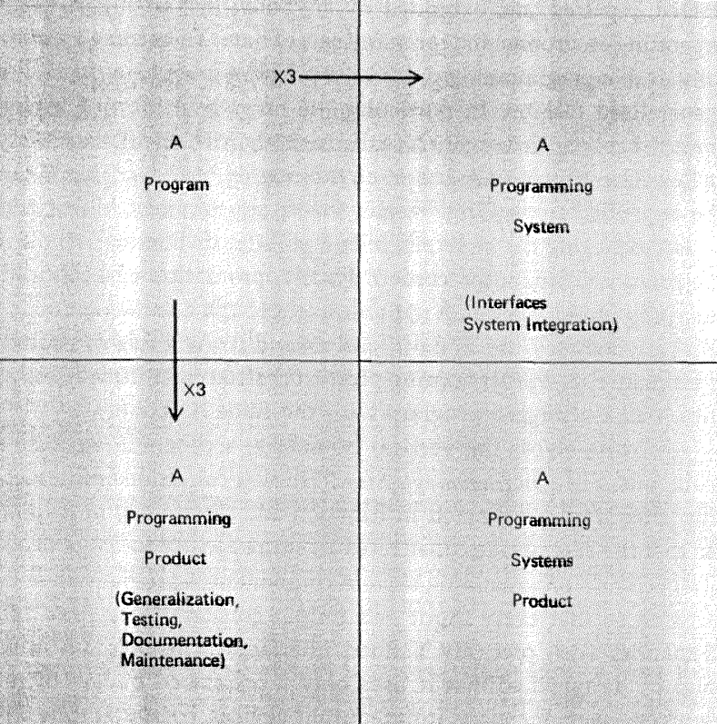

---
tags:
- flashcards/swe/teoria/1P
- flashcards/swe/teoria/U1
---

# El Producto de Sistemas de Programación

Este apartado se introduce mediante la cuestión: ¿por qué motivos los equipos de programación, aquellos de nivel industrial, no son reemplazados por simple "duos de garage"? (aquellos que salen en las noticias típicamente por haber programado una aplicación relevante, siendo solo 2 personas).

F. P. Brooks Jr. sustenta que hay que contemplar _la cosa_ siendo construida.

Para ello segrega en 4 cuadrantes la discriminación de dicha "cosa":

- **"Un programa" (2° cuadrante)**:
	- Completo en sí mismo.
	- Listo para ser ejecutado en la máquina sobre la cuál fue desarrollada.
	- Justamente _esto_ es lo que se producen en los garajes.
	- Este es el objeto que emplea el programador en estimar la productividad.
- Existen 2 formas en que un programa puede ser convertido en un objeto más útil, pero a su vez más costoso:
	- **"Un producto de programación" (3° cuadrante)**:
		- Puede ser ejecutado, testeado, reparado y extendido por cualquiera.
		- Es usable en varios entornos (SOs), sobre varios conjuntos de datos.
		- Para que un producto de programación sea usable en su generalidad:
			- Debe ser escrito justamente en forma general.
			- La forma y el rango de los inputs deben ser generalizados hasta donde los algoritmos básicos lo permitan.
		- Debe ser testeado arduamente y poder confiarnos del banco de pruebas.
		- Debe tener documentación detallada para que cualquiera pueda emplearla, repararla y extenderla.
		- "Un producto de programación" depurado cuesta al menos 3 veces más que "un programa" con las mismas funcionalidades.
	- **"Un componente en un sistema de programación" (1° cuadrante)**:
		- Colección de programas que interactúan.
		- Coordinados en funciones.
		- Disciplinados en formatos.
		- Debe estar programado tal que:
			- Cada input y output conforme una sintaxis y semántica de interfaces precisamente definidas.
			- Emplee solamente los recursos presupuestados:
				- Memoria.
				- Dispositivos I/O.
				- Tiempo de cómputo.
		- Debe ser testeado con otros componentes del sistema, en todas sus combinaciones.
		- "Un componente en un sistema de programación" cuesta al menos 3 veces más que "un programa" individual de la misma funcionalidad.
			- El costo puede ser mayor si el sistema posee varios componentes.
- **"Un producto de sistemas de programación" (4° cuadrante)**:
	- Difiere respecto a "un programa" en todas las formas antemencionadas.
	- Es el objeto realmente útil.
	- Es el producto objetivo de la mayoría de los esfuerzos de programación de sistemas.
	- "Un producto de sistemas de programación" depurado cuesta al menos 9 veces más que "un programa" individual con las mismas funcionalidades.

---

(Control U1) ¿Qué características tiene el SW como producto?
?
- **"Un programa" (2° cuadrante)**:
	- Completo en sí mismo.
	- Listo para ser ejecutado en la máquina sobre la cuál fue desarrollada.
	- Justamente _esto_ es lo que se producen en los garajes.
	- Este es el objeto que emplea el programador en estimar la productividad.
- Existen 2 formas en que un programa puede ser convertido en un objeto más útil, pero a su vez más costoso:
	- **"Un producto de programación" (3° cuadrante)**:
		- Puede ser ejecutado, testeado, reparado y extendido por cualquiera.
		- Es usable en varios entornos (SOs), sobre varios conjuntos de datos.
		- Para que un producto de programación sea usable en su generalidad:
			- Debe ser escrito justamente en forma general.
			- La forma y el rango de los inputs deben ser generalizados hasta donde los algoritmos básicos lo permitan.
		- Debe ser testeado arduamente y poder confiarnos del banco de pruebas.
		- Debe tener documentación detallada para que cualquiera pueda emplearla, repararla y extenderla.
		- "Un producto de programación" depurado cuesta al menos 3 veces más que "un programa" con las mismas funcionalidades.
	- **"Un componente en un sistema de programación" (1° cuadrante)**:
		- Colección de programas que interactúan.
		- Coordinados en funciones.
		- Disciplinados en formatos.
		- Debe estar programado tal que:
			- Cada input y output conforme una sintaxis y semántica de interfaces precisamente definidas.
			- Emplee solamente los recursos presupuestados:
				- Memoria.
				- Dispositivos I/O.
				- Tiempo de cómputo.
		- Debe ser testeado con otros componentes del sistema, en todas sus combinaciones.
		- "Un componente en un sistema de programación" cuesta al menos 3 veces más que "un programa" individual de la misma funcionalidad.
			- El costo puede ser mayor si el sistema posee varios componentes.
- **"Un producto de sistemas de programación" (4° cuadrante)**:
	- Difiere respecto a "un programa" en todas las formas antemencionadas.
	- Es el objeto realmente útil.
	- Es el producto objetivo de la mayoría de los esfuerzos de programación de sistemas.
	- "Un producto de sistemas de programación" depurado cuesta al menos 9 veces más que "un programa" individual con las mismas funcionalidades.
<!--SR:!2025-05-05,1,190-->

---
