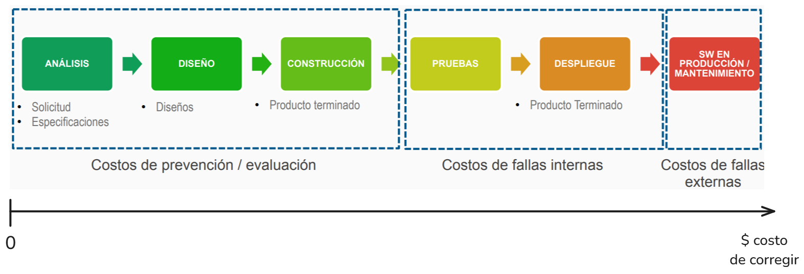
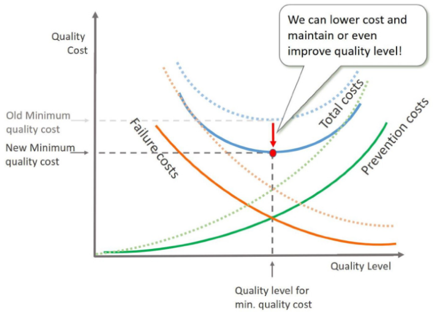
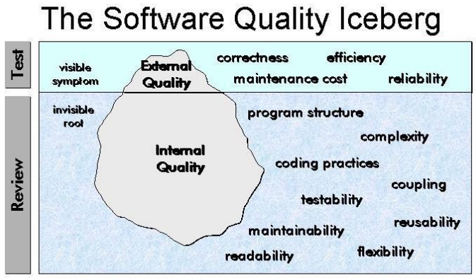

---
tags:
- flashcards/swe/teoria/1P
- flashcards/swe/teoria/U2
---

# Etapas del desarrollo de SW

Instancias de corrección:

- Costos de calidad (prevención / evaluación):
	- Izquierda: La corrección no tiene que ver con líneas de código, e.g., épicas, documentación, arquitectura, etc.
- Costos de no calidad (de fallas internas + de fallas externas):
	- Centro: Se manifestó un error y se debe, e.g., depurar para corregirlo.
	- Derecha: Llega a manos del cliente.

---

V o F. Es más barato corregir un defecto en las etapas finales del proyecto.::F
<!--SR:!2025-05-06,2,252-->

La prevención y evaluación/medición se relaciona con el ==1;;costo de calidad==.
<!--SR:!2025-05-06,2,250-->

Las fallas internas y las fallas externas se relacionan con el ==1;;costo de no calidad==.
<!--SR:!2025-05-06,2,232-->

---

# Costos ocultos de la "No-Calidad"

- Baja motivación de los equipos de trabajo.
- Duplicación de esfuerzos.
- Over-time constante.
- Re-trabajo constante (Mayor costo $).
- Desgaste del equipo de trabajo.
- Imagen negativa ante el cliente.

---

¿Cuáles son los costos ocultos de la no calidad?
?
- Baja motivación de los equipos de trabajo.
- Duplicación de esfuerzos.
- Over-time constante.
- Re-trabajo constante (Mayor costo $).
- Desgaste del equipo de trabajo.
- Imagen negativa ante el cliente.
<!--SR:!2025-05-05,1,212-->

---

# Relación nivel-costo de la calidad de SW

- "Total costs":
	- Es la curva resultante de la suma de los 2 costos (de calidad + de no-calidad).
	- Es posible reducir los costos **mejorando procesos** (es la transición de las curvas punteadas -> curvas sólidas): Traslación de las curvas hacia abajo.
- La intersección de ambas curvas sólidas:
	- Representa el punto óptimo en donde queremos trabajar.
	- Depende del dominio en que estemos trabajando:
		- E.g., un sistema en tiempo real no posee el mismo punto de intersección que un juego.

---

V o F. La curva de costo total es la curva resultante de la suma de los 2 costos (calidad + no-calidad).::V
<!--SR:!2025-05-06,2,252-->

¿De qué forma es posible reducir el costo total?::Mejorando procesos (es la transición de las curvas punteadas -> curvas sólidas). Traslación de las curvas hacia abajo.
<!--SR:!2025-05-06,2,254-->

¿Qué representa la intersección de ambas curvas sólidas?::Representa el punto óptimo en donde queremos trabajar.
<!--SR:!2025-05-06,2,254-->

V o F. La intersección de las curvas de calidad y de no calidad depende del dominio en que estemos trabajando.::V. Un sistema en tiempo real no posee el mismo punto de intersección que un juego.
<!--SR:!2025-05-06,2,254-->

(Control U2) Mayor calidad implica mayor costo (S/N). Justifique.
?
No, es posible mantener o hasta incluso mejorar el nivel de calidad **mejorando los procesos**. Esto implica una traslación de las 3 curvas de costo (costo de calidad, costo de no calidad y costo total) hacia abajo.
<!--SR:!2025-05-05,1,237-->

---
 
# El iceberg de la calidad de SW

- Parte superior: Atacado mediante costos de no calidad.
- Parte inferior: Atacado mediante costos de calidad (prevención).

---

¿Cómo atacar la parte superior del iceberg de la calidad de SW?::Es posible atacarlo mediante costos de no calidad.
<!--SR:!2025-05-06,2,234-->

¿Cómo atacar la parte inferior del iceberg de la calidad de SW?::Es posible atacarlo mediante costos de calidad.
<!--SR:!2025-05-06,2,234-->

---
