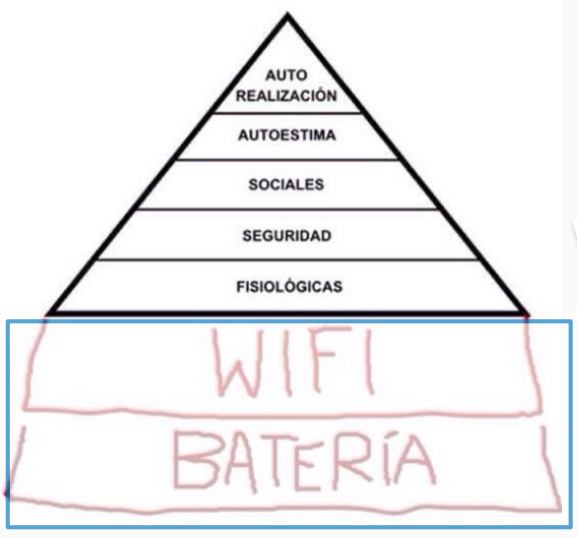
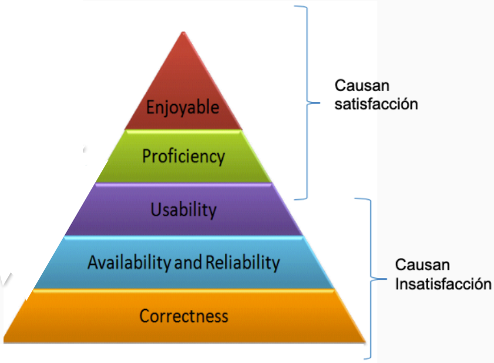
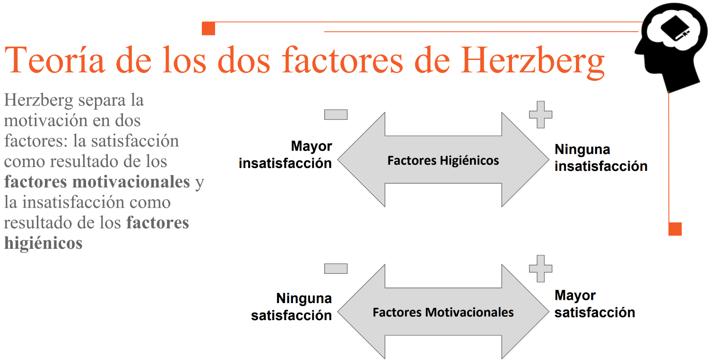

---
tags:
- flashcards/swe/teoria/1P
- flashcards/swe/teoria/U2
---

# Pirámide de Maslow

# Pasa algo parecido con la calidad

(En-Pro-Usa-ARCo)

## Causan satisfacción ("Wow")

- Enjoyable: disfrute.
	- e.g., si Whatsapp está caído, no lo borro de inmediato, ya que como comunidad hemos establecido que es una aplicación disfrutable y usada por todos.
- Proficiency: muy buena para lo que hace.

> [!TIP]
>
> - También conocidos como "factores motivacionales o intrínsecos".
> - Si son óptimos: mayor satisfacción.
> - Si son pésimos: ninguna satisfacción.

---

¿Cuáles son los factores de la pirámide de calidad que causan satisfacción?
?
- Enjoyable: disfrute.
	- e.g., si Whatsapp está caído, no lo borro de inmediato, ya que como comunidad hemos establecido que es una aplicación disfrutable y usada por todos.
- Proficiency: muy buena para lo que hace.
<!--SR:!2025-05-06,2,250-->

---

## Causan insatisfacción

- Usability.
- Availability & Reliability.
- Correctness. (e.g., calculadora que no funciona a la primera => la borro).

> [!TIP]
>
> - También conocidos como "factores higiénicos o extrínsecos".
> - Si son óptimos: ninguna insatisfacción.
> - Si son pésimos: mayor insatisfacción.

---

¿Cuáles son los factores de la pirámide de calidad que causan insatisfacción?
?
- Usability.
- Availability & Reliability.
- Correctness. (e.g., calculadora que no funciona a la primera => la borro).
<!--SR:!2025-05-05,1,210-->

---

## Teoría de los 2 factores de Herzberg

