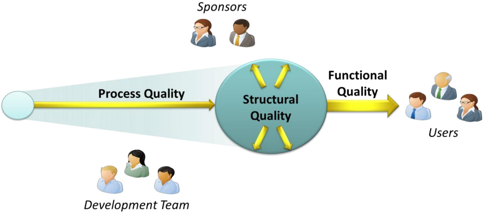

El mundo funciona sobre SW => Simplemente no es aceptable un SW de baja calidad.

# ¿Qué cosa NO es calidad de SW?

- Es tentador querer ver a la calidad de un SW desde la perspectiva de otros tipos de calidad.
- e.g., un proceso de manufacturación: tiene como objetivo principal minimizar los defectos en los productos creados mediante un proceso repetible: metodologías como "las 6 sigmas" son efectivas para este caso.
- Un proyecto de SW requiere innovar, por lo que el proyecto no estará ejecutando procesos exactamente repetibles.

# ¿A quiénes le interesa la calidad?

- Usuarios del SW: emplean el SW sobre un problema en particular.
- El equipo de desarrollo: crean el SW.
- Sponsors del proyecto: invierten en la creación del SW (en caso de _dogfooding_, los sponsors son usualmente personas de dicha organización).

No todos poseen el mismo interés respecto a la calidad.

# Definiendo calidad de SW: 3 aspectos

## Functional quality

> [!TIP]
>
> El SW hace lo que dice hacer.

Atributos:

- **Cumplir los requerimientos especificados**:
	- Sean provenientes de los sponsors o usuarios, es una condición indispensable (_sine qua non_) de la calidad funcional.
	- A veces incluyen cumplimiento de leyes y regulaciones.
	- El equipo de desarrollo debe entender e implementar correctamente los requerimientos cambiantes durante el ciclo de vida del proyecto, no solamente aquellos definidos inicialmente.
- **Crear SW que tenga pocos defectos**:
	- Incluyen bugs que:
		- Reducen la fiabilidad del SW.
		- Comprometen la seguridad del SW.
		- Limitan las funcionalidades del SW.
	- Es demasiado pedir el hecho de llegar a 0 defectos, pero la realidad es que pocas veces un usuario estará contento con un SW que lo percibe como defectuoso.
- **Performance lo suficientemente bueno**:
	- No existe para un usuario una aplicación que sea a la vez lenta y buena.
- **Fácil de aprender y de usar**:
	- Para un usuario la UI _ES_ la aplicación: los atributos de calidad funcional son usualmente provistos por una UI efectiva y de flujos cuidadosamente diseñados.

El testing usualmente se enfoca en la calidad funcional.

## Structural quality

> [!TIP]
>
> El código se encuentra bien estructurado.

A diferencia de la calidad funcional, la calidad estructural es difícil de testear, aunque posee herramientas que permiten tomar mediciones.

Atributos:

- **Testeabilidad**: ¿el código se organiza de tal manera que se presta para testearlo?
- **Mantenibilidad**: ¿qué tan fácil es añadir nuevo código o modificar código existente sin introducir nuevos bugs?
- **Claridad / comprensibilidad**: impacta sobre qué tan rápido pueden los nuevos desarrolladores arrancar a trabajar sobre el código base existente.
	- ¿Es el código legible?
	- ¿Se complica más de lo necesario?
- **Eficiencia**: en entornos donde los recursos son escasos, es crucial escribir código eficiente.
- **Seguridad**:
	- ¿Permite el SW vectores de ataque comunes tales como buffer overflows o inyecciones SQL?
	- ¿Es inseguro de alguna otra forma?

## Process quality

> [!TIP]
>
> La calidad del proceso de desarrollo afecta en gran medida el valor percibido por los usuarios, el equipo de desarrollo y sponsors.

Atributos:

- **Cumplimiento en fechas de entrega**: ¿el SW fue entregado a tiempo?
- **Cumplimiento del presupuesto**: ¿el SW fue entregado dentro del presupuesto estimado?
- **Un proceso de desarrollo repetible que de manera fidedigna entregue SW de calidad**:
	- En caso de un SW posea los 2 primeros atributos (entregado en tiempo y costo estimado), pero hace que el equipo de desarrollo se estrese, haciendo que sus mejores miembros quieran irse del proyecto, **no es considerado un proceso de calidad**.
	- Una verdadera calidad de proceso significa ser consistente de un proyecto a otro.

# Relaciones entre los 3 aspectos

Existen varias conexiones entre los 3 aspectos de la calidad de SW.

Es posible mejorar varios aspectos:

- Mejorando la calidad de proceso, mediante metodologías ágiles, incrementa las chances de cumplir los requerimientos del proyecto, mejorando la calidad funcional.

Como también existen situaciones de _trade-offs_:

- Una organización puede acelerar el desarrollo para cumplir una fecha límite, mejorando la calidad de proceso, solo para encontrarse luego que se han incrementado la cantidad de defectos en el SW, empeorando la calidad funcional.
- Limitar la cantidad de funcionalidades puede decrementar la calidad funcional, pero puede mejorar la calidad de proceso, ya que aumenta las posibilidades de llegar a tiempo una fecha de release.

# Incumbencias de los grupos

- Usuarios:
	- Calidad funcional: principalmente, ya que es lo que ven.
	- Calidad de proceso: e.g., fecha de entrega de la versión final del SW.
	- Calidad estructural: usualmente no les importa en absoluto, aunque su carencia puede afectarles a lo largo del ciclo de vida del SW.
- Equipo de desarrollo:
	- Calidad funcional: aunque un poco menos que a los usuarios, ya que el hecho de reducir las funcionalidades les hace la vida más fácil.
	- Calidad de proceso: ya que inciden varias métricas por los que serán medidos.
	- Calidad estructural: principalmente, ya que son aquellos que se verán afectados en caso de que haya poca calidad en este aspecto.
- Sponsors:
	- Les importa todos los aspectos.
	- Saben que el hecho de flaquear en un aspecto es una mala estrategia a largo plazo.
	- Buscan crear valor de negocio: la mejor forma de hacerlo es teniendo una visión amplia de la calidad de SW.
	- Deben entender la relación entre calidad y riesgo: no es lo mismo aceptar el riesgo de tener baja calidad en una aplicación web que en un sistema de control de aviones.

> [!TIP]
>
> La toma correcta de decisiones requiere hacer _trade-offs_ entre objetivos que compiten entre sí.
