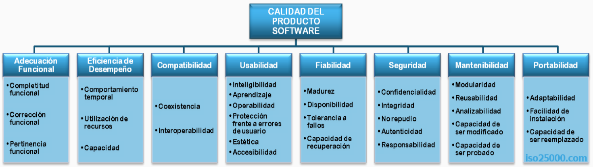
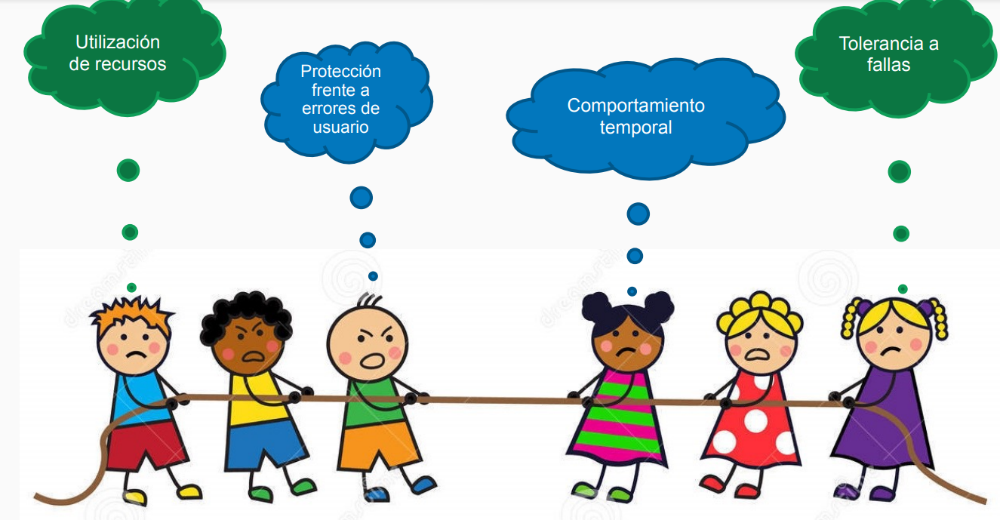

---
tags:
- flashcards/swe/teoria/1P
- flashcards/swe/teoria/U2
---

> [!IMPORTANT]
>
> Este es el 1° modelo de calidad. Nos permite medir la calidad de un producto SW.
>
> Nos paramos en la [[05-visiones-de-la-calidad#Visión del producto|visión del producto]].

Las características son:

3 3 2 6 4 5 5 3
(Ana y Francisco-EDucaron-Cuatro-Uvas-Frescas-(y)-Saludaron-(a)-Mamá-Prácticamente)
(C-C-P)
(Contepomi Tacklea-Utiliza Recursos-(y)-Capacita)
(Caras-Inteligentes)
(Adecuación-Aprendizaje-Usado-Protección-Estética-(y)-Accesible)
(Maduro-Dispone-Tolerar Fallos-(con)-Capacidad de Recuperación)
(C-I-R-No Repudio-Autenticidad)
(M-R-A-C(Modif)-C(Prob)) o (M-R-A-M-P)
(ADAptabilidad-C(Inst)-C(Reempl)) o (A-I-R)

- [[08.1-adecuacion-funcional|Adecuación funcional]]
- [[08.2-eficiencia-de-desempeño|Eficiencia de Desempeño]]
- [[08.3-compatibilidad|Compatibilidad]]
- [[08.4-usabilidad|Usabilidad]]
- [[08.5-fiabilidad|Fiabilidad]]
- [[08.6-seguridad|Seguridad]]
- [[08.7-mantenibilidad|Mantenibilidad]]
- [[08.8-portabilidad|Portabilidad]]

> [!TIP]
>
> Mientras más puntuales y objetivas sean las valoraciones de características y sub características => Mejor.

> [!IMPORTANT]
>
> Si bien tratamos puntualmente la ISO 25010, es importante recordar que es parte de una familia de ISOs, en este caso la familia ISO 250XX: También conocida como SQuaRE (SW Product Quality Requirements and Evaluation), es una norma internacional que proporciona una guía para la evaluación de la calidad del SW.

---

(Control U2) ¿Qué es el modelo ISO 25000?
?
El modelo ISO 25000 (también conocido como _SQuaRE_ - SW product Quality Requirements and Evaluation) es un estándar internacional que establece un marco de trabajo en común para **evaluar y gestionar** la calidad de productos SW. Sustituye a la antigua norma ISO 9126.
<!--SR:!2025-05-05,1,230-->

(Control U2) ¿En qué se diferencia el modelo CMMI del modelo ISO25000?::El CMMI evalúa procesos de desarrollo de SW, mientras que la ISO 25000 se centra específicamente en atributos de calidad del producto SW.
<!--SR:!2025-05-05,1,230-->

(Control U2) ¿Para qué sirve y que pasos seguiría para usar el modelo ISO 25000?
?
- La ISO 25000 sirve de marco de trabajo en común para evaluar la calidad de un producto de SW. Los pasos a tomar son:
	1. Definir los objetivos de calidad con la ISO 25010:
		- Identificar qué características / sub características son las más prioritarias para el proyecto.
	2. Especificar los requerimientos con la ISO 25030:
		- Documentar métricas concretas.
			- e.g., "El sistema debe soportar 1,000 usuarios concurrentes con <2 segundos de latencia (ISO 25023)".
			- e.g., "La tasa de errores críticos debe ser <0.1% (ISO 25022)".
	3. Medir la calidad con la ISO 2502x:
		- Usar estándares específicos para métricas:
			- e.g., ISO 25023: medición de rendimiento.
			- e.g., ISO 25022: medición de errores y fiabilidad.
		- Aplicar herramientas de testing (ej.: JMeter para rendimiento, SonarQube para mantenibilidad, entre otros).
	4. Evaluar el SW mediante la ISO 25040 e ISO 25041:
		- Realizar pruebas basadas en los requerimientos definidos.
		- Generar informes de cumplimiento.
			- e.g., "El sistema cumple el 95% de los requerimientos de usabilidad".
	5. Mejora continua:
		- Integrar los resultados en ciclos de desarrollo (ágiles o en cascada).
		- Revisión periódica de estándares para adaptarse a nuevos requerimientos.
- (Reitano) Otro uso también que se podría dar es, e.g., para armar una carrera de ingeniería de SW.
<!--SR:!2025-05-05,1,230-->

---

# Entendiendo las características y sub características

- Esta es la representación de cómo funciona el presente modelo en la vida real.
- Una cierta característica / sub característica predomina por sobre las otras.
- e.g., la optimización de la utilización de recursos hace que muy probablemente la tolerancia a fallas no sea buena (menor disponibilidad).
- e.g., la optimización de la tolerancia a fallas hace que muy probablemente la optimización de recursos no sea buena (inversión de más $).
- _Trade-off_: ¿cuál es la característica / sub característica que queremos maximizar? No es posible maximizar todas, según lo visto en [[06-obl-when-good-enough-sw-is-best|When good enough SW is best]]. Hay que entender, para cada dominio y producto SW, cuál característica / sub característica maximizar.

---

(Control U2) V o F. La mejor calidad la obtengo maximizando todos los atributos.
?
F. No es posible maximizar todas según el extracto de Ed Yourdon. En caso de optimizar un atributo, muy probablemente empeore otro atributo. e.g., la optimización de la utilización de recursos hace que muy probablemente la tolerancia a fallas no sea buena (menor disponibilidad) y viceversa.
<!--SR:!2025-05-05,1,230-->

---
