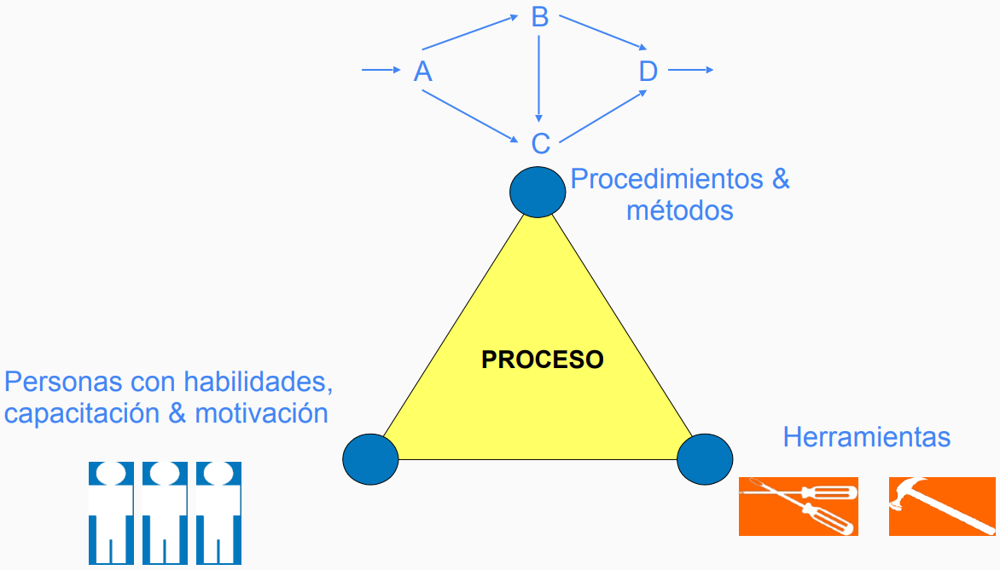

---
tags:
- flashcards/swe/teoria/1P
- flashcards/swe/teoria/U2
---

# Triada: Personas, procesos & herramientas

> [!TIP]
>
> En base a los [[#CMMI (Capability Maturity Model Integrated)|puntos anteriores]], sustenta que un proceso de calidad cuenta con 3 aristas:
> - Set de **herramientas** empleadas.
> - **Personas** que lo ejecutan con una habilidad, capacidad & motivación.
> - El paso a paso de cómo hacer las cosas mediante **procedimientos & métodos**.
>
> Todo esto genera un **proceso**.
>
> e.g.:
> - Herramienta: github.
> - Procedimiento & método: branching. Es posible generar infinitos branches, pero como organización: ¿qué branches definir? ¿cómo hacer los merges?
> - Personas con habilidades, capacitación & motivación: el equipo que tenemos.

---

¿En qué consiste la triada de personas, procesos & herramientas?
?
Sustenta que un proceso de calidad cuenta con 3 aristas:
- Set de **herramientas** empleadas.
- **Personas** que lo ejecutan con una habilidad, capacidad & motivación.
- El paso a paso de cómo hacer las cosas mediante **procedimientos & métodos**.
Ejemplo:
- Herramienta: github.
- Procedimiento & método: branching. Es posible generar infinitos branches, pero como organización: ¿qué branches definir? ¿cómo hacer los merges?
- Personas con habilidades, capacitación & motivación: el equipo que tenemos.
<!--SR:!2025-05-05,1,230-->

---
