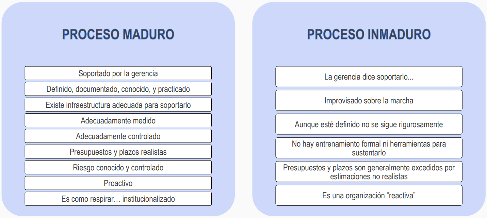

# Proceso maduro Vs. inmaduro

## Proceso maduro

- Soportado por la gerencia (o alta gerencia).
- Definido, documentado, conocido, y practicado.
- Existe infraestructura adecuada para soportarlo.
- Adecuadamente medido.
- Adecuadamente controlado.
- Presupuestos y plazos realistas.
- Riesgo conocido y controlado.
- Proactivo.
- Es como respirar: institucionalizado.

## Proceso inmaduro

- La gerencia dice soportarlo.
- Improvisado sobre la marcha.
- Aunque esté definido no se sigue rigurosamente.
- No hay entrenamiento formal ni herramientas para sustentarlo.
- Presupuestos y plazos son generalmente excedidos por estimaciones no realistas.
- Es una organización "reactiva".

## Ejemplos

- e.g., en un soporte IT se quiere cambiar el mouse:
	- Proceso maduro: levantar primero un ticket primero -> le dan el mouse.
		- En este caso la gerencia corrige a la persona para que cargue un ticket como corresponde.
	- Proceso inmaduro: "¿vos sabés quién soy yo?" -> le dan el mouse.
- e.g., definido, documentado, conocido, y practicado. Vs. un tiro al aire.
- e.g., adecuadamente medido y controlado (predecir la cantidad de mouses que se necesitarán en el futuro) Vs. más o menos.
- e.g., presupuesto, plazo de entrega, conocemos qué hacer y qué no Vs. más o menos.
- e.g., proactivo (pienso en lo que puede venir) Vs. reactivo (pasan cosas y lo atajo).
	- e.g., en un sprint planning, se promete que se hará 5 épicas, pero al final se termina haciendo 4, 15 o 1 (esto también es parte de la predictividad).
- e.g., está institucionalizado (todos saben cómo funciona).
	- Es una especie de tener experiencia en el proceso que tenemos definido: e.g., ante la llegado de un nuevo requerimiento del usuario, todos sepan qué hacer.
