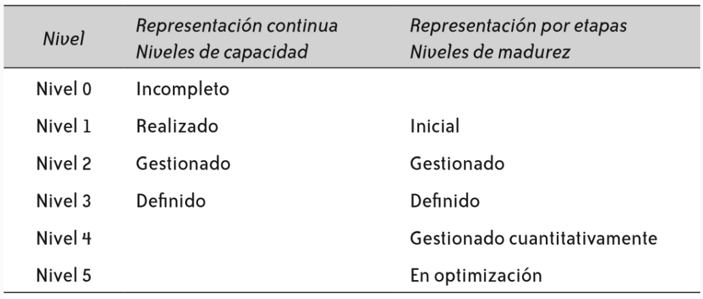

# CMMI: 2 representaciones

El CMMI propone 2 caminos para mejorar los procesos de una organización:

- [[09.5.1-representacion-continua|Representación continua]]. (I-R-G-D)
- [[09.5.2-representacion-por-etapas|Representación por etapas (o por niveles / escalonada)]].
