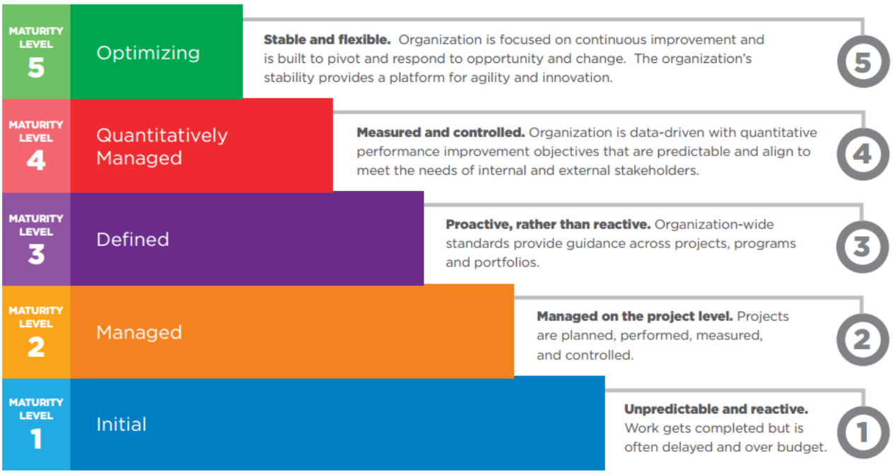

---
tags:
- flashcards/swe/teoria/1P
- flashcards/swe/teoria/U2
---

# Niveles de la representación por etapas

#exam-question 

> [!TIP]
>
> Son como las formas normales:
> - ¿Cuáles son las prácticas necesarias para estar en el nivel 3? Se deben tener todas las prácticas tanto del nivel 2 y 3.
> - ¿Cuáles son las prácticas necesarias para estar en el nivel 4? Se deben tener todas las prácticas tanto del nivel 2, 3 y 4.
> - ¿Cuáles son las prácticas necesarias para estar en el nivel 1? No hay prácticas.

> [!TIP]
>
> - Es posible certificar de un saque para nivel 5.
> - Todas las PAs son evaluables: No existe relación de sub conjunto / super conjunto de PAs por nivel de madurez (es un único conjunto de PAs y es evaluable en cualquier momento).

---

¿Cuál es una analogía a la representación por niveles?::Las formas normales.
<!--SR:!2025-05-06,1,230-->

¿Cuáles son las prácticas necesarias para estar en el nivel 4?::Se deben tener todas las prácticas tanto del nivel 2, 3 y 4.
<!--SR:!2025-05-06,1,230-->

¿Cuáles son las prácticas necesarias para estar en el nivel 1?::Ninguna, ya que en el nivel 1 no hay ninguna práctica definida.
<!--SR:!2025-05-06,1,230-->

---

## 1. Initial

- Impredecible & reactivo.
- El trabajo se completa pero usualmente presenta retrasos y exceso en presupuesto.

> [!IMPORTANT]
>
> - Todas las organizaciones están en el inicial: no hay ningún requerimiento por parte del modelo.
> - Puede que cumpla con algunos de los niveles parcialmente, pero no cumple con ninguno en su totalidad.

> [!TIP]
>
> Las cosas van pasando porque van pasando.

---

¿En qué consiste el nivel 1 (initial)?
?
- Impredecible & reactivo.
- El trabajo se completa pero usualmente presenta retrasos y exceso en presupuesto.
- Todas las organizaciones están en el inicial: no hay ningún requerimiento por parte del modelo.
- Puede que cumpla con algunos de los niveles parcialmente, pero no cumple con ninguno en su totalidad.
<!--SR:!2025-05-06,1,230-->

---

## 2. Managed

- Gestionado a nivel del proyecto.
- Proyectos son planificados, llevado a cabo, medidos y controlados.

> [!IMPORTANT]
>
> Establece ciertos requerimientos / prácticas básicas de administración.
> - e.g., planear, seguir el plan, tener prácticas de calidad, control de cambio básico (_change management_), etc.

> [!TIP]
>
> - Comenzamos a planificar, a administrarnos, a ejecutar, a medir y a controlar, a nivel proyecto (no a nivel área ni tampoco organización).
> - Nos damos cuenta que con el orden de los proyectos comenzamos a tener administrado todo esto.

> [!NOTE]
>
> El pasaje del nivel 1 -> nivel 2 implica:
> 	- Cumplir todas las PAs.
> 	- Comienza a aplicar la frase: "Algunos equipos lo hacen".
> 	- En caso de que no se cumplan algunos objetivos:
> 		- ¿Es muy grave que no se cumpla?
> 			- El consenso es mediante el voto (todos deben dar conformidad para la aprobación).
> 			- La última palabra lo tiene el Lead Appraiser (si todos votan conformidad, pero el LA no da el visto bueno final, no se cumple).

---

¿En qué consiste el nivel 2 (Managed)?
?
- Gestionado a nivel del proyecto.
- Proyectos son planificados, llevado a cabo, medidos y controlados.
- Se comienza a establecer ciertos requerimientos / prácticas básicas de administración / planificación a nivel proyecto:
	- e.g., planificar, seguir el plan, tener prácticas de calidad, control de cambio básico (_change management_), etc.
<!--SR:!2025-05-06,1,230-->

---

## 3. Defined

- Proactivo, en lugar de reactivo.
- Los estándares de toda la organización brindan orientación en proyectos, programas y portafolios (de proyectos/programas).

> [!IMPORTANT]
>
> Ya se hace a nivel organizacional, de un portafolio o de programa entero y no de proyectos puntuales de un grupo X.

> [!TIP]
>
> - Al pasar un tiempo nos damos cuenta que lo podemos definir para toda un área / organización.
> - Comenzamos a estandarizar procesos, a tener guías, proyectos inter-áreas, programas o portfolios.
> - Portafolio: Es un conjunto de proyectos, similar a un Programa.

> [!NOTE]
>
> El pasaje del nivel 2 -> nivel 3 implica:
> 	- Comienzan a aplicar las frases:
> 		- "Toda la organización lo hace".
> 		- "Todos los equipos de la organización lo hacen de la misma forma".

---

¿En qué consiste el nivel 3 (Defined)?
?
- Proactivo, en lugar de reactivo.
- Los estándares de toda la organización brindan orientación en proyectos, programas y portafolios (de proyectos/programas).
- Ya se hace a nivel organizacional, de un portafolio o de programa entero y no de proyectos puntuales de un grupo X.
- Comenzamos a estandarizar procesos, a tener guías, proyectos inter-áreas, programas o portfolios.
<!--SR:!2025-05-06,1,230-->

---

## 4. Quantitatively Managed

- Medido y controlado.
- La organización está orientada por datos (_data-driven_), con objetivos cuantificables de mejora del desempeño que son predecibles y están alineados para satisfacer las necesidades de las partes interesadas, tanto internas como externas.

> [!IMPORTANT]
>
> Lo tenemos medido a nivel organizacional, pero además de tenerlo medido podemos tomar decisiones en base a dichas métricas.
> - e.g., con X defectos graves, Y medianos y Z de criticidad baja, encontrados durante el testing, podemos salir a producción sin tener mayores problemas.
> - Esto lo tenemos medido y ya lo sabemos, ya que hemos tomado mediciones del proceso hace tiempo.

> [!TIP]
>
> - Luego de hacerlo bien por proyecto / área / organización, empiezo a medirlo y controlarlo.
> - Comienzan a darse situaciones como: "tenemos un desvío de X tiempo", "tenemos un desvío de Y $", "nos ahorramos Z tiempo ya que lo hice con K herramienta".
> - Es decir, es posible medir y predecir.

---

¿En qué consiste el nivel 4 (Quantitatively Managed)?
?
- Medido y controlado.
- La organización está orientada por datos (_data-driven_), con objetivos cuantificables de mejora del desempeño que son predecibles y están alineados para satisfacer las necesidades de las partes interesadas, tanto internas como externas.
- Lo tenemos medido a nivel organizacional, pero además de tenerlo medido podemos tomar decisiones en base a dichas métricas.
- Es posible medir y predecir.
<!--SR:!2025-05-06,1,230-->

---

## 5. Optimizing

- Estable y flexible.
- La organización está enfocada en la mejora continua y está diseñada para adaptarse y responder a las oportunidades y cambios. Su estabilidad proporciona una plataforma para la agilidad e innovación.

> [!IMPORTANT]
>
> Continuamente mejorar y adaptar a las nuevas situaciones, tecnologías, etc.

> [!TIP]
>
> - Todas las veces es posible hacerlo un poco mejor.
> - Es posible modificar el proceso para intentar hacerlo un poco mejor.
> - Nos topados con un problema y podemos innovar.

---

¿En qué consiste el nivel 5 (Optimizing)?
?
- Estable y flexible.
- La organización está enfocada en la mejora continua y está diseñada para adaptarse y responder a las oportunidades y cambios. Su estabilidad proporciona una plataforma para la agilidad e innovación.
- Continuamente mejorar y adaptar a las nuevas situaciones, tecnologías, etc.
- Innovar ante el surgimiento de particularidades.
<!--SR:!2025-05-06,1,230-->

---
