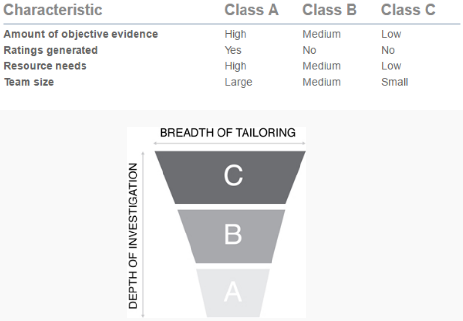

---
tags:
- flashcards/swe/teoria/1P
- flashcards/swe/teoria/U2
---

# CMMI: SCAMPI (método de evaluación)

> [!TIP]
>
> Se describe en 4 fases:
> - Planificación.
> - Preparación de la evaluación.
> - Realización de la evaluación.
> - Informe de resultados.

> [!NOTE]
>
> Tailoring: hecho a medida.

## Clases

SCAMPI define 3 clases dependiendo de la rigurosidad del modelo.

- Clase A:
	- Es el más riguroso.
	- Único capaz de proporcionar un nivel de madurez organizacional de procesos en CMMI para una empresa.
- Clase B:
	- Es menos amplio y detallado que la clase A y aún más económico.
	- Se emplea en la evaluación inicial o parcial y en áreas específicas que requieren atención.
- Clase C:
	- Es el más sencillo y económico, requiere una capacitación menor.
	- Se enfoca en áreas de gran interés o que poseen mayor riesgo dentro de la organización.

## Las Auditorias CMMI

Cuando una organización ha conseguido:

- Mejorar sus procesos.
- Llevar los mismos a un nivel de madurez CMMI.

Es común que se decida que ha llegado el momento de presentarse a una **auditoría que corrobore dicha implantación por un tercero (auditor externo)**.

## ¿Qué es un "Standard CMMI Appraisal Method for Process Improvement" y quién lo realiza?

- Es la **evaluación o auditoría final de concesión oficial de un nivel de madurez de CMMI**:
	- Es un **método sobre cómo evaluar los diferentes procesos de la organización, definiendo el nivel de madurez**.
	- Se distinguen tres tipos de SCAMPI (A, B ó C) en función de la formalidad y la dificultad del mismo.
	- El más riguroso es el SCAMPI A y es el que permite obtener el nivel de madurez oficial.
	- Una vez superado el SCAMPI A, es común que la organización reciba un diploma acreditativo que indica el nivel de madurez alcanzado.
- El SCAMPI A debe ser realizado por una figura denominada _Lead Appraiser_:
	- Es una persona acreditada por el SEI, la cual es propietaria del modelo CMMI, para realizar la evaluación CMMI.
	- Es quién posee la palabra final y emite lo que se conoce como "_Appraisal Disclosure Statement_", documento que muestra los resultados de la evaluación.

## ¿Quién respalda una auditoría CMMI?

- Comúnmente se piensa que es el SEI, ya que es la organización propietaria del modelo, no obstante, **el SEI solamente acredita a los auditores o _Lead Appraiser_ para que puedan realizar evaluaciones CMMI**:
	- **No es el SEI quien emite un certificado**, sino que **son los auditores los que emiten un diploma en el que se indican los datos y resultados de la auditoría**.
	- Son estos auditores y las empresas _partner_ del SEI en las que trabajan los que se responsabilizan de los resultados de la evaluación.
- Tras la realización de un SCAMPI, el _Lead Appraiser_ envía una serie de documentos al SEI para que este realice chequeos y controles de calidad del SCAMPI.
- Una vez terminados estos chequeos, el SEI envía una comunicación al sponsor y al _Lead Appraiser_ del SCAMPI aprobándolo para uso público.
- Desde este momento, los resultados se publican en el PARS (_Published Appraisal Results_) del SEI.
- Por ello normalmente se utiliza el concepto **evaluación en vez de certificación** cuando nos referimos a una auditoría CMMI.

## ¿Durante cuánto tiempo son válidos los resultados de la evaluación?

Los resultados de la evaluación son válidos durante un máximo de 3 años desde la fecha en que se emite el _Appraisal Disclosure Statement_.

## ¿Es necesario evaluar todas las áreas de proceso?

- En función del nivel de madurez que se pretenda alcanzar, será necesario evaluar una serie de áreas de proceso.
- Todas las áreas de proceso correspondientes a un nivel de madurez son obligatorias a excepción de SAM (_Supplier Agreement Management_), que puede no ser aplicable a la organización y por tanto no ser evaluada.
- Para que esta área de proceso no sea evaluada, ha de justificarse su exclusión.

## Notas de clase

- Evaluación o auditoría que evalúa el nivel de madurez del proceso de desarrollo de SW en una organización.
	- A mayor nivel => Mayor complejidad de evaluación => Mayor complejidad de obtener el certificado.
- Proceso largo y complejo.
- SCAMPI se encuentra subdividido en sub características. Estas sub características determinan la profundidad de investigación necesaria:
	- La cantidad de evidencia necesaria para poder certificar.
	- Permite o no determinar el nivel de madurez de la organización.
		- e.g., "tu organización es de nivel 3".
		- **Solamente el SCAMPI de clase A da rating, los otros 2 no**.
	- La cantidad de recursos a invertir para poder certificar.
	- Tamaño del equipo para poder certificar.
		- e.g., es posible trabajar con una muestra pequeña para la clase C, mientras que para la A se requiere de un equipo gigante.
- Flujo usual de SCAMPI en una organización:
	- Comenzar inicialmente con un SCAMPI clase C con alguien conocido de la organización y capacitado para que pueda hacernos una evaluación inicial.
	- Dada la evaluación inicial, es posible:
		- Avanzar a un SCAMPI clase B.
			- SCAMPI clase B: se intenta llamar a alguien externo de la organización que no emite certificación pero "hace como que" fuese una certificación sobre algunos equipos para poder entender los desvíos actuales contra el modelo y realizar cambios a mejora, para así llegar a SCAMPI clase A.
			- SCAMPI clase A: se cita a la gente del SEI para evaluarnos de punta a punta. Se emite la aprobación o desaprobación.
		- Retirarnos (sea por alguna imposibilidad).
- En caso de realizar la evaluación con seriedad y correctamente, cambia para siempre la organización al menos en el proceso de desarrollo del SW.
- Es posible que aparezcamos como una organización anónima en el PARS, si deseamos no figurar con el nombre de la organización.

> [!TIP]
>
> - Es un [[01-fundamentos-de-calidad|costo de calidad]]: ya que es algo realizado antes para tener buena calidad después (no tenga fallas, entrega en tiempo, etc.).
> - Método de evidencias objetivas ("legal") > Método científico:
> 	- SCAMPI no sigue el método científico (veo que algo funciona, lo publico y varias personas lo puede repetirlo).
> 	- Sino que en los proyectos se sigue otro método "legal" que se trata de juntar evidencias:
> 		- Entrevistar personas.
> 		- Ir al lugar.
> 		- Buscar documentación.
> 		- Ver herramientas en donde la información está guardada.
> 		- Entre otros.
> 	- Es armar un rompecabezas con el proyecto ya implementado, se valida todo lo que uno dice que hace, ponderan si están de acuerdo o no, de que funciona o no, etc.
> - Todos los niveles son certificables: 2, 3, 4 y 5. Cada nivel posee sus process areas puntuales y [[#CMMI Representación por niveles|son aditivas]].

> [!TIP]
>
> - En caso de haber un cambio en la estructura de la organización, lo correcto es revalidar, pero al valer mucho $ la certificación (no solamente es traer personas acreditadas del SEI a nuestra organización durante semanas, sino que todo el trayecto de preparación para lograr que los procesos lleguen a un nivel de madurez CMMI, cuesta mucho $).
> - La certificación es con motivo de mejorar como organización, mejorar la cartera de clientes (ya que algunos lo exigen), a veces es excluyente para ser partícipe de alguna industria, puede que tengan exenciones impositivas, entre otros.

---

(Control U2) ¿Cómo determina el CMMI la calidad del SW?
?
El CMMI mide la calidad del SW mediante la medición de la madurez de los procesos de desarrollo de SW de una organización. Esto es realizado mediante el método de evaluación SCAMPI.
<!--SR:!2025-05-06,1,230-->

(Control U2) ¿Qué es un SCAMPI?
?
- SCAMPI es un método de evaluación o auditoría final de concesión oficial de un nivel de madurez de CMMI (en caso de ser de clase A).
- Es un método de evaluación que provee un conjunto de metodologías bien definidas para llevar a cabo las valoraciones relativas a los modelos CMMI.
<!--SR:!2025-05-06,1,230-->

(Control U2) ¿Qué tipos de SCAMPI conoce?
?
- SCAMPI clase A:
	- Es el más riguroso.
	- Único capaz de proporcionar un nivel de madurez organizacional de procesos en CMMI para una empresa.
- SCAMPI clase B:
	- Es menos amplio y detallado que la clase A y aún más económico.
	- Se emplea en la evaluación inicial o parcial y en áreas específicas que requieren atención.
- SCAMPI clase C:
	- Es el más sencillo y económico, requiere una capacitación menor.
	- Se enfoca en áreas de gran interés o que poseen mayor riesgo dentro de la organización.
<!--SR:!2025-05-06,1,230-->

SCAMPI define 3 clases dependiendo de la ==1;;rigurosidad== del modelo.
<!--SR:!2025-05-06,1,230-->

---
