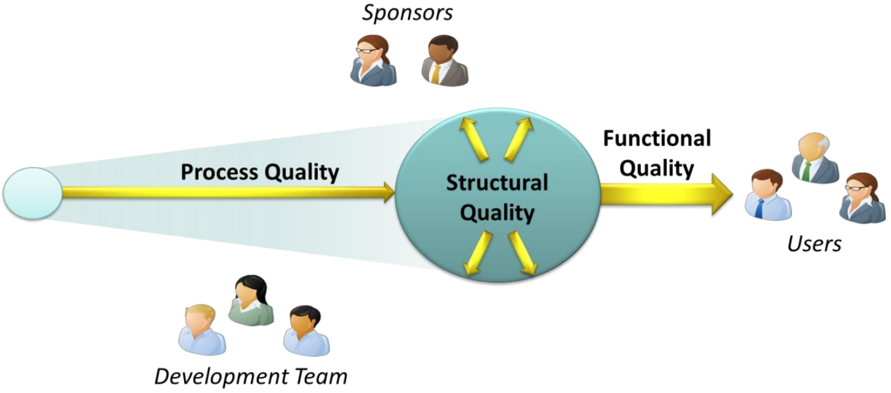

---
tags:
- flashcards/swe/teoria/1P
- flashcards/swe/teoria/U2
---

# ISO 25010 Vs. CMMI

ISO:
- Ponerle peso a las características / sub características ("atributos medibles").
- Realizar mediciones del mismo.
- Apunta al atributo / modelo del producto.

CMMI:
- Apunta al modelo del proceso de desarrollo.
- No dice cómo, pero si qué hacer.
- Realiza preguntas de la índole:
	- ¿Está documentada? (Definición)
		- No es un paso a paso, implica tenerlo escrito en algún lugar.
	- ¿Es ejecutada / se ejecuta? (Ejecución)
	- ¿El grupo de trabajo lo cumple?
- Ya se encuentra definido qué buscar al momento de evaluar una empresa.
- Respecto al TP2:
	- Una empresa podría tener una valuación distinta respecto a las características / sub características de otra empresa.
	- En caso de preguntarle a un integrante del mismo equipo que haya sido partícipe del proceso de valuación de características / sub características, probablemente conteste lo mismo, pues ha sido partícipe de la valuación.

# Ambas en relación a la lectura de The 3 Aspects of SW Quality (D. Chappell)

ISO:
- Incide sobre la [[07-opc-the-three-aspects-of-sw-quality-functional-structural-and-process#Structural quality|calidad estructural]] y **en parte** sobre la [[07-opc-the-three-aspects-of-sw-quality-functional-structural-and-process#Functional quality|calidad funcional]] ([[#ISO 25010 en relación al Iceberg de la calidad del SW|explayado al siguiente]]).
- Usualmente son cosas que no se pueden ver. La parte funcional al final de todo SI es visible.

CMMI:
- Incide sobre la [[07-opc-the-three-aspects-of-sw-quality-functional-structural-and-process#Process quality|calidad de proceso]].

> [!IMPORTANT]
>
> Como regla de la cátedra:
> - Siempre la ISO es más donde veamos **producto**:
> 	- e.g., el famoso "cacho de código".
> - Siempre el CMMI donde veamos un **proceso de construcción**.

# ISO 25010 en relación al Iceberg de la calidad del SW

- Calidad externa (Síntomas visibles):
	- Correctitud: Se asocia a la [[08.1-adecuacion-funcional#Corrección funcional|Adecuación funcional > Corrección funcional]] (ISO 25010).
	- Eficiencia: Se asocia a la [[08.2-eficiencia-de-desempeño|Eficiencia de desempeño]] (ISO 25010).
	- Costos de mantenimiento: Se asocia a la [[08.7-mantenibilidad|Mantenibilidad]] (ISO 25010).
	- Fiabilidad: Se asocia a la [[08.5-fiabilidad|Fiabilidad]] (ISO 25010).
- Calidad interna (Síntomas no visibles):
	- Estructura del programa: Se asocia a la [[07-opc-the-three-aspects-of-sw-quality-functional-structural-and-process#Structural quality|Calidad Estructural]] (D. Chappell).
	- Complejidad: Se asocia a la [[07-opc-the-three-aspects-of-sw-quality-functional-structural-and-process#Structural quality|Calidad Estructural]] (D. Chappell) (En términos de qué tan difícil es entender la lógica del código).
	- Prácticas de programación: Se asocia a la [[07-opc-the-three-aspects-of-sw-quality-functional-structural-and-process#Structural quality|Calidad Estructural]] (D. Chappell).
	- Acoplamiento: Se asocia a la [[08.7-mantenibilidad#Modularidad|Mantenibilidad > Modularidad]] (ISO 25010).
	- Testeabilidad: Se asocia a la [[08.7-mantenibilidad#Capacidad para ser probado|Mantenibilidad > Capacidad para ser probado]] (ISO 25010).
	- Reusabilidad: Se asocia a la [[08.7-mantenibilidad#Reusabilidad|Mantenibilidad > Reusabilidad]] (ISO 25010).
	- Mantenibilidad: Se asocia a la [[08.7-mantenibilidad|Mantenibilidad]] (ISO 25010).
	- Flexibilidad: Se asocia a la [[08.7-mantenibilidad#Capacidad para ser modificado|Mantenibilidad > Capacidad para ser modificado]] (ISO 25010).
	- Legibilidad: Se asocia a la [[07-opc-the-three-aspects-of-sw-quality-functional-structural-and-process#Structural quality|Calidad Estructural]] (D. Chappell).
