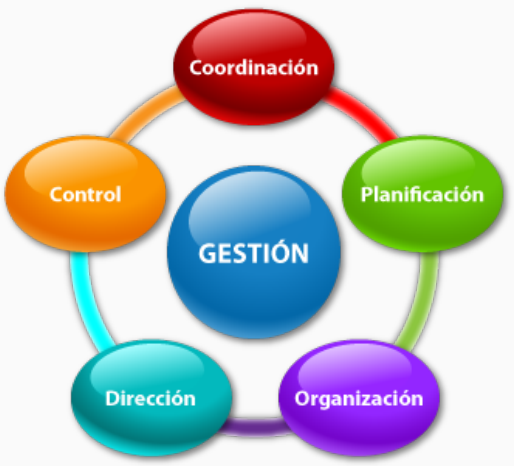
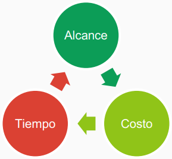
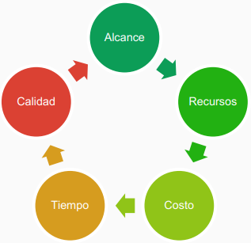

---
tags:
  - flashcards/swe/teoria/1P
  - flashcards/swe/teoria/U3
---

> Gestionando en un contexto cambiante.

# ¿Qué es un proyecto?

- Un proyecto es un esfuerzo temporal emprendido para crear un producto o servicio único para lograr un objetivo.
- Posee las siguientes características:
	- Tiene un **objetivo** o **beneficio** claro a obtener que guía el proyecto.
	- **Temporal**: Tiene principio y fin.
	- **Único**: No es recurrente, cada proyecto es diferente al otro (Contextos distintos).
	- Posee recursos limitados.
	- Consta de una sucesión de actividades o fases en las que se coordinan los distintos recursos.
		- Existe un paso a paso (e.g., CPM/PERT).

> [!NOTE]
>
> - No es lo mismo el objetivo del negocio que el objetivo del proyecto.
> - Los objetivos del proyecto nacen por un objetivo del negocio.
> - Ejemplo:
> 	- Objetivo del negocio: "Reducir los costos en un 5%".
> 	- Objetivos del proyecto:
> 		- "Implementación SAP".
> 		- "Objetivo 2...".
> 		- ...
> 		- "Objetivo N".

---

(Control U3) ¿Qué es un proyecto, qué características tiene?
?
- Un proyecto es un esfuerzo temporal emprendido para crear un producto o servicio único para lograr un objetivo.
- Posee las siguientes características:
	- Tiene un **objetivo** o **beneficio** claro a obtener que guía el proyecto.
	- **Temporal**: Tiene principio y fin.
	- **Único**: No es recurrente, cada proyecto es diferente al otro (Contextos distintos).
	- Posee recursos limitados.
	- Consta de una sucesión de actividades o fases en las que se coordinan los distintos recursos.
		- Existe un paso a paso (e.g., CPM/PERT).
<!--SR:!2025-05-07,1,228-->

---

## ¿Qué es "Project Management"?

- La administración de proyectos es una disciplina.
- Consiste en:
	- Planificar.
	- Organizar.
	- Obtener.
	- Controlar recursos.
	- Utilizando herramientas y técnicas.
  Para logar que el proyecto logre sus objetivos en tiempo y forma.

---

¿Qué es el "Project Management"?::La administración de proyectos es una disciplina.
<!--SR:!2025-05-07,1,228-->

¿En qué consiste el "Project Management"?
?
Consiste en:
- Planificar.
- Organizar.
- Obtener.
- Controlar recursos.
- Utilizando herramientas y técnicas.
- Todo esto con la finalidad de que el proyecto logre sus objetivos en tiempo y forma.
<!--SR:!2025-05-07,1,228-->

---

## Dimensiones de un proyecto de SW

- No se puede cumplir con todas a la vez.
	- [[05-ejercicio-en-clase-lecturas#(Driver && Grado de libertad) (Restricción && Grado de libertad)|No se puede ser driver, restricción y grados de libertad al mismo tiempo]].
- Cada dimensión puede ser:
	- **Driver**: Objetivo vital a lograr, tiene poco/nada de flexibilidad.
	- **Restricción**: No está bajo nuestro control directo y también tiene poco/nada de flexibilidad.
	- **Grado de Libertad**: Libertad para fijar objetivos. Existe Flexibilidad para manejar esta variable.

> [!TIP]
>
> - En caso de que el cliente exprese claramente que [[06-obl-when-good-enough-sw-is-best#Ideal mal aplicado|el costo es lo único que le importa]] => Es candidato a driver o restricción.
> - "Poco/nada": Con "poco" quiere decir que se tiene un margen de negociación.
> - Driver:
> 	- "¿Por qué lo hago?"
> 	- Las cosas que dejamos afuera son candidatas a una fase 1, 2, ..., N.
> - Restricción:
> 	- Administrar: e.g., $200000 en presupuesto.
> - Las dimensiones (aristas del proyecto) nos permiten definir respecto a qué cosas son importantes para el proyecto analizado.

---

(Control U3) ¿Cuáles son las dimensiones de un proyecto y cómo se clasifican?
?
- Las dimensiones son: Tiempo, calidad, costo, personal y alcance.
- Se clasifican en:
	- **Driver**: objetivo vital a lograr, tiene poco/nada de flexibilidad.
	- **Restricción**: no está bajo nuestro control directo y también tiene poco/nada de flexibilidad.
	- **Grado de Libertad**: Libertad para fijar objetivos. Existe Flexibilidad para manejar esta variable.
<!--SR:!2025-05-07,1,228-->

---

### Ejemplo

Proyecto: Implementación de un SW para mejorar las ventas online en el día del niño.

- Driver: Alcance (ventas online).
- Restricción: Tiempo (día del niño).
- Grado de libertad: Costo, calidad y staff.

### Enfoque de las 3 dimensiones (Triple Constraint)

> [!NOTE]
>
> - Tiempo: Rápido.
> - Alcance: Bueno.
> - Costos: Barato.

### Enfoque de las 5 dimensiones

> [!NOTE]
>
> Se agregan:
> - Recursos: Personal/mano de obra.
> - Calidad.

---

El enfoque de las 3 dimensiones no tiene en cuenta a las dimensiones ==1;;recursos== y ==1;;calidad==.
<!--SR:!2025-05-07,1,228-->

---

## Roles principales de un proyecto

### Stakeholders

- Son **todos** los involucrados por el proyecto.
- Tienen poder de decisión con capacidad de influir en la marcha del proyecto.

#### Sponsor

- Es el "owner" del proyecto.
- Es el que tiene la autoridad para llevar adelante el proyecto.

> [!NOTE]
>
> - Dueño de "la cosa".
> - Es quién lo financia: Usualmente es el director de finanzas, CFO, etc.).

#### Usuario Campeón

- Experto en el dominio del problema del proyecto.
- Asegurar su capacidad para la función y su disponibilidad (son muy demandados).

> [!NOTE]
>
> - Es la voz del usuario.
> - En Agile es el PO.
> - Nos define qué hacer.

#### Usuarios Directos

Interactúan directamente con el sistema.

> [!NOTE]
>
> - Toca/opera el SW.
> - Tanto el [[#Sponsor|sponsor]] como el [[#Usuario Campeón|usuario campeón]] terminan eventualmente siendo usuarios directos.
> - e.g., persona 1 usando un ATM:
> 	- Usuario Directo (persona 1) <-> ATM

#### Usuarios Indirectos

Hacen uso del sistema, aunque no necesariamente lo operan.

> [!NOTE]
>
> - Opera el SW sin emplearlo.
> - e.g., persona 1 se acerca a la caja de un banco, en donde lo atiende persona 2 (cajero) que emplea el SW de movimientos bancarios:
> 	- Usuario Indirecto (persona 1) <-> Usuario Directo (persona 2) <-> SW de movimientos bancarios.

---

(Control U3) ¿Cuáles son los distintos tipos de Stakeholders de un proyecto?
?
Todos son _Stakeholders_:
- _Sponsor_:
	- Es el "owner" del proyecto.
	- Es el que tiene la autoridad para llevar adelante el proyecto.
	- Usualmente es quién lo financia.
- _Champion User_:
	- Experto en el dominio del problema del proyecto.
	- Asegurar su capacidad para la función y su disponibilidad (son muy demandados).
	- Voz del usuario, en Agile es PO y es el que define qué hacer.
- Usuarios Directos:
	- Interactúan directamente (toca / opera) con el sistema.
	- Tanto sponsor como el champion user terminan eventualmente siendo usuarios directos.
	- e.g., persona 1 usando un ATM: Usuario Directo (persona 1) <-> ATM
- Usuarios Indirectos:
	- Hacen uso del sistema, aunque no necesariamente lo operan.
	- Opera el SW sin emplearlo.
	- e.g., persona 1 se acerca a la caja de un banco, en donde lo atiende persona 2 (cajero) que emplea el SW de movimientos bancarios: Usuario Indirecto (persona 1) <-> Usuario Directo (persona 2) <-> SW de movimientos bancarios.
<!--SR:!2025-05-07,1,230-->

---
