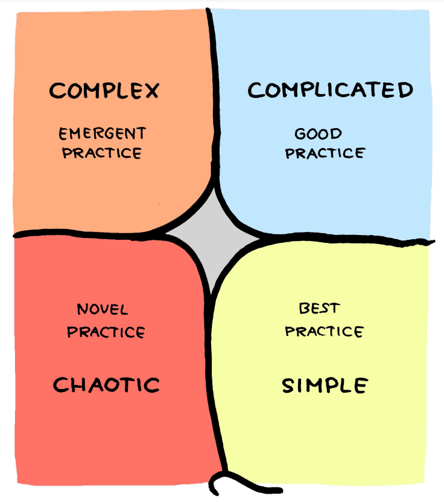
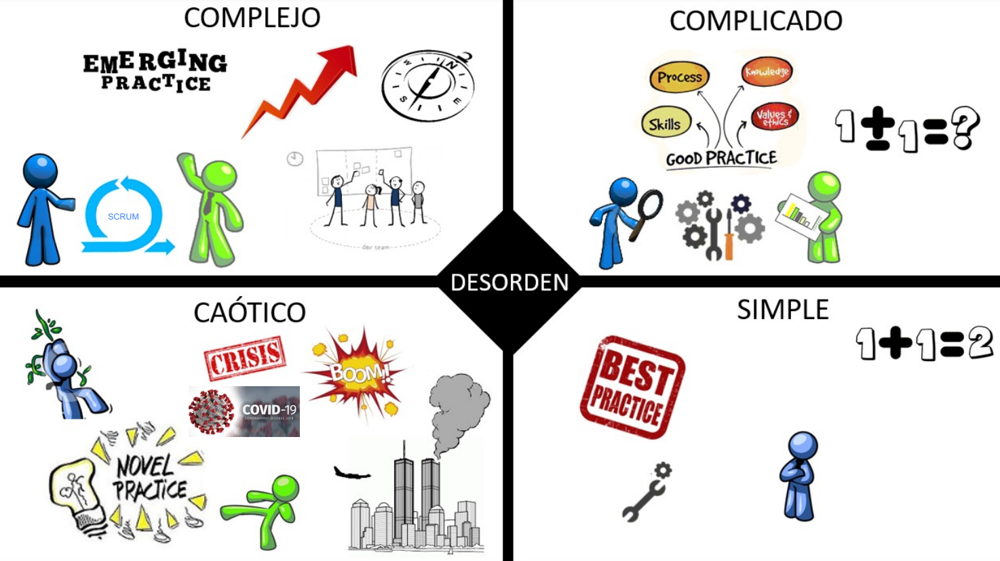
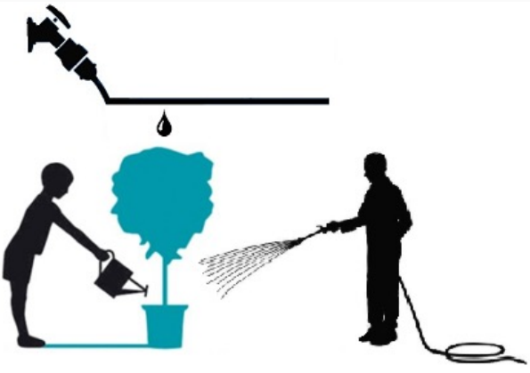
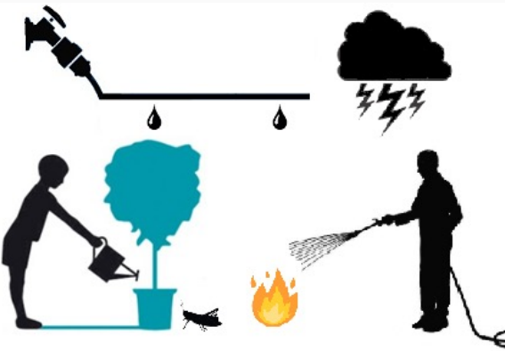
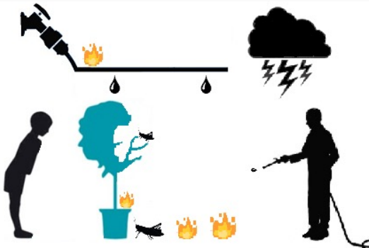

---
tags:
- flashcards/swe/teoria/1P
- flashcards/swe/teoria/U3
---

# Cynefin

Modelo que compara características de cinco dominios de complejidad diferentes: simple, complicado, complejo, caótico y desordenado.

- Ayuda a hacer un análisis donde entendiendo el dominio en el cuál estamos, podemos determinar qué tipo de framework nos conviene utilizar.
- Ayuda a los líderes a determinar el contexto operativo prevaleciente para que puedan tomar las decisiones adecuadas.
- Los contextos simples y complicados:
	- Suponen un universo ordenado.
	- Donde las relaciones de causa y efecto son perceptibles.
	- Las respuestas correctas se pueden determinar en función de los hechos.
- Los contextos complejos y caóticos están desordenados:
	- No hay una relación inmediatamente aparente entre causa y efecto.
	- El camino a seguir se determina según los patrones emergentes.
- El mundo ordenado es el mundo de la gestión basada en hechos.
- El mundo desordenado representa la gestión basada en patrones.

---

(Control U3) ¿Qué es el framework Cynefin y para que nos sirve?
?
Es un modelo que compara características de 5 dominios de complejidad diferentes: simple, complicado, complejo, caótico y desordenado.
- Ayuda a hacer un análisis que permite entender el dominio en el cuál nos encontramos y podemos determinar qué tipo de framework nos conviene utilizar.
- Ayuda a los líderes a determinar el contexto operativo prevaleciente para que puedan tomar las decisiones adecuadas.
- Los contextos simples y complicados suponen un universo ordenado, donde las relaciones de causa y efecto son perceptibles, y las respuestas correctas se pueden determinar en función de los hechos.
- Los contextos complejos y caóticos están desordenados; no hay una relación inmediatamente aparente entre causa y efecto, y el camino a seguir se determina según los patrones emergentes.
- El mundo ordenado es el mundo de la gestión basada en hechos; el mundo desordenado representa la gestión basada en patrones.
<!--SR:!2025-05-09,1,230-->

---

## Dominios de complejidad

> [!NOTE]
>
> Existen 2 mundos:
> - Desordenado: Abarca al contexto complejo y caótico (columna izquierda).
> - Ordenado: Abarca al contexto complicado y simple (columna derecha).
> 	- e.g., su surgiese nuevamente otra pandemia del COVID, probablemente caiga en un contexto complicado / simple.

### Contexto Simple

- Significa que la situación es estable.
- Existen reglas probadas para aplicar.
- Las **Mejores Prácticas** son métodos o técnicas superiores a cualquier otra alternativa que produce los mejores resultados que utilizando otros medios.
- La relación entre causa y efecto es clara: si se realiza X, se espera Y.
- En este domino se establecen los hechos, se categorizan y se responde con una regla o se aplica una mejor práctica (sense-categorize-respond).

> [!NOTE]
>
> - Está categorizado: Las preguntas se pueden responder mediante un árbol de decisión.
> - Consta de simplemente identificar la práctica.
> - No hay incertidumbre.
> - e.g., migrar una tabla SQL -> Oracle: Existe una mejor práctica y no hacen falta pruebas de concepto.

### Contexto Complicado

- La relación causa y efecto requiere análisis o experiencia.
- Existen múltiples respuestas correctas.
- Las **Buenas Prácticas** son métodos o técnicas que pueden aplicarse según la decisión de un experto.
- Se evalúan los hechos, se analizan y se aplica una buena práctica (sense-analyze-respond).
- Es posible trabajar racionalmente hacia una decisión pero requiere un juicio refinado y con experiencia.

> [!NOTE]
>
> - No existe una sola forma de hacerlo (mejor práctica) => Elegir mejor forma de hacerlo.
> - Necesidad de un experto: Alguien que indique el mejor camino => Respondemos.

### Contexto Complejo

- En el dominio Complejo la relación causa y efecto solo puede ser decida en retrospectiva.
- No hay respuestas correctas.
- Los **Diseños Útiles** e Informativos pueden desarrollarse.
	- Se puede considerar experimentos para encontrar una solución a los problemas.
	- Las soluciones son adaptativas.
- Se exploran soluciones, se analizan y se responde al problema (probe-sense-respond).
- No es predecible el resultado de las acciones propuestas.
- El ámbito donde nos encontramos es desconocido y el cambio es constante lo que no permite anticipar todos los resultados.

> [!NOTE]
>
> - No existe buena práctica y menos todavía la mejor práctica.
> - Se descubren prácticas emergentes, exploramos, reciclamos y mejoramos.
> - Una vez bien implementada pasa a ser [[#Contexto Caótico|caótico]] y quizás termina siendo [[#Contexto Simple|simple]] (termina siendo la mejor práctica).
> - Aplicamos, evaluamos y respondemos.
> - Modificación de la conducta: Más adaptativo.
> - e.g., Scrum.

### Contexto Caótico

- En el dominio Caótico la relación causa y efecto es incierta.
- Los eventos en este dominio son muy confusos para esperar una respuesta basada en el conocimiento.
- Cualquier Acción es la respuesta apropiada.
- Nos encontramos frente a una crisis donde lo importante es actuar.
- Se actúa para establecer el orden, se analiza lo que tiene algo de estabilidad y se responde para transformar el caos en complejidad (act-sense-respond).

> [!NOTE]
>
> No existen las mejores prácticas.

---

(Control U3) Desde el punto de vista de las prácticas, ¿qué práctica se utiliza en cada dominio de Cynefin?
?
- **Contexto Simple**:
	- Prácticas: Estable. Existen las **Mejores Prácticas** y son reglas probadas o técnicas superiores a cualquier otra alternativa que produce los mejores resultados.
	- Relación causa-efecto: Es clara, realizo X => Espero Y.
	- Sense-Categorize-Respond:
		- Se perciben los hechos.
		- Se categorizan los mismos.
		- Se responde aplicando una mejor práctica.
- **Contexto Complicado**:
	- Prácticas: Hay varias respuestas correctas => Las **Buenas Prácticas** son técnicas que pueden aplicarse según el criterio de un experto.
	- Relación causa-efecto: Requiere análisis o experiencia.
		- Es posible trabajar racionalmente hacia una decisión pero requiere un juicio refinado y con experiencia.
	- Sense-Analyze-Respond:
		- Se perciben los hechos.
		- Se analizan los mismos.
		- Se aplica una buena práctica.
- **Contexto Complejo**:
	- Prácticas:
		- No posible anticipar el resultado de las acciones propuestas: Ámbito desconocido y el cambio es constante.
		- Los **Diseños Útiles** e Informativos pueden desarrollarse: Considerar experimentos para encontrar una solución a los problemas, las soluciones son adaptativas.
	- Relación causa-efecto: Solo puede ser decidida en retrospectiva. No hay respuestas correctas.
	- Probe-Sense-Respond:
		- Se prueban soluciones.
		- Se perciben los resultados de los mismos.
		- Se responde al problema.
- **Contexto Caótico**:
	- Prácticas:
		- Nos encontramos frente a una crisis donde lo importante es actuar: Cualquier acción es la respuesta apropiada.
		- Los eventos en este dominio son muy confusos para esperar una respuesta en base al conocimiento.
	- Relación causa-efecto: Incierta.
	- Act-Sense-Respond:
		- Se actúa para establecer el orden.
		- Se percibe lo que tenga algo de estabilidad.
		- Se responde para transformar el caos en complejidad.
<!--SR:!2025-05-09,1,230-->

---
