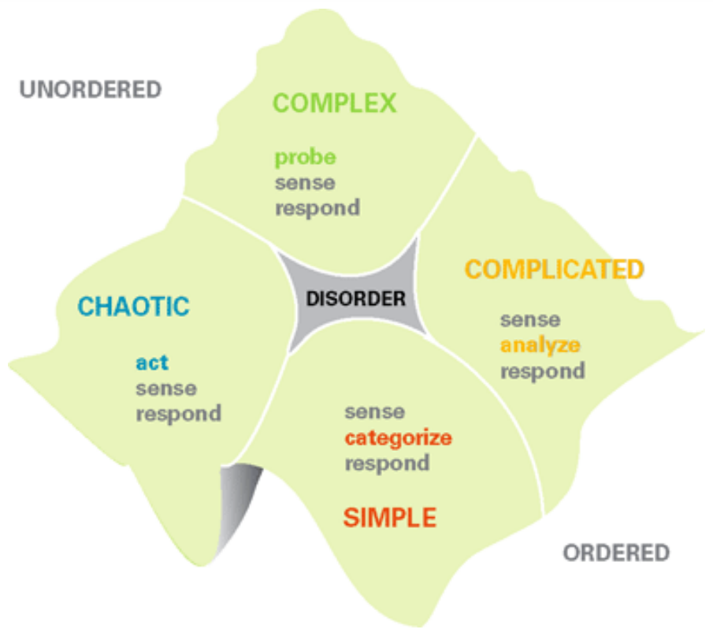
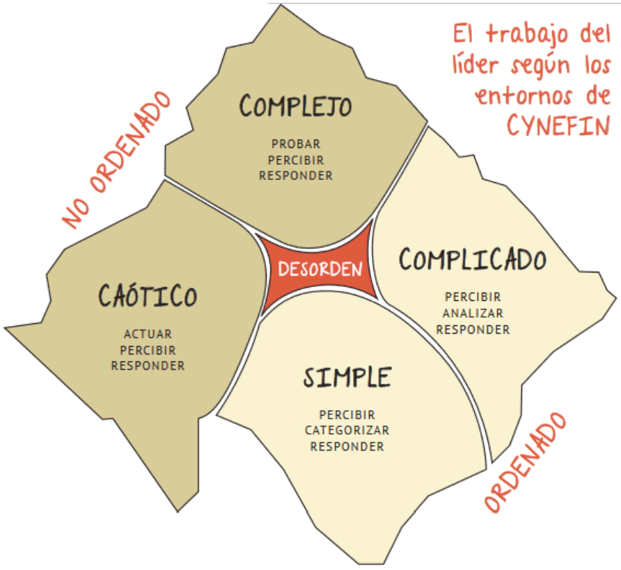
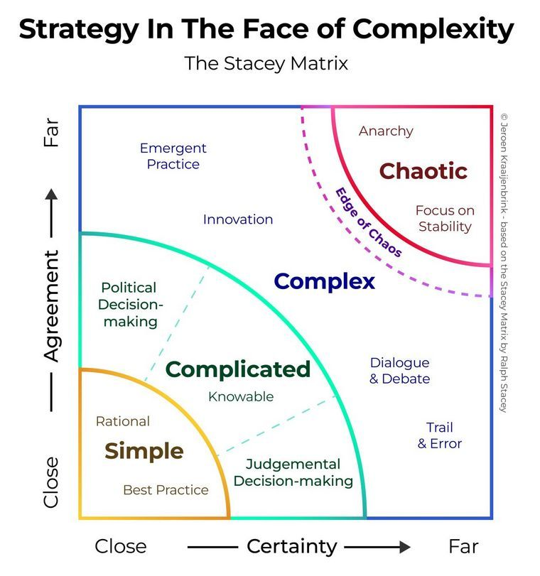
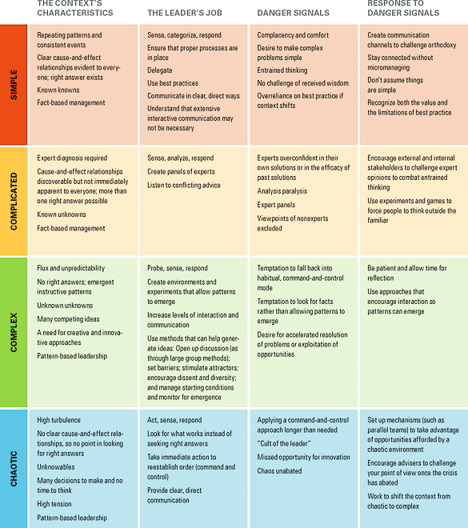

# El framework de un líder para la toma de decisiones

- Managers usualmente se basan en los _approaches_ de liderazgo ordinario:
	- No se obtiene el resultado deseado ante un contexto en donde inciden varias tomas de decisiones y demanda por respuestas.
	- Pueden funcionar bien en algunas situaciones, pero flaquean en otras.
- Estos _approaches_ flaquean debido a una suposición fundamental en la teoría y práctica organizacional: "En el mundo existe un cierto nivel de orden y predictibilidad".
	- Esta suposición, en base a la ciencia _newtoniana_, sustenta el "_management_ científico".
	- El contexto es cambiante y puede volverse más complejo => Fracasan simplificaciones.
	- No existe solución _one-size-fits-all_.

## Entendiendo "complejidad"

- Complejidad:
	- Es más una forma de pensar respecto al mundo que una nueva forma de trabajar con modelos matemáticos.
- Un sistema complejo posee las características:
	- Involucra varios elementos que interactúan entre sí.
	- Las interacciones no son lineales y cambios menores pueden producir consecuencias desproporcionadamente mayores.
	- El sistema es dinámico, el _todo_ es mayor a la suma de sus partes y las soluciones no pueden ser impuestas, sino que aparecen debido a las circunstancias. Esto es usualmente conocido como _emerger_.
	- El sistema posee una historia y el pasado se encuentra integrado con el presente. Los elementos evolucionan entre sí y con el entorno. La evolución es irreversible.
	- Si bien en retrospectiva puede que parezcan ser ordenados y predecibles, esto no implica ninguna previsión, ya que las condiciones y sistemas externos están en constante cambio.
	- A diferencia de los sistemas ordenados (en donde se restringen a los agentes) o sistemas caóticos (en donde no existen restricciones), en un sistema complejo, los agentes y el sistema se restringen mutuamente a lo largo del tiempo. Esto implica que no es posible hacer pronósticos / predicciones de qué pasará.
- Evolución de las teorías sobre sistemas complejos:
	- Teoría inicial: "Los fenómenos complejos emergen de reglas simples"
		- El movimiento de una bandada de pájaros: Volar hacia el centro, regular la velocidad y evitar colisiones.
	- Los sistemas complejos humanos no pueden ser modelados de la misma forma que los animales, debido a la impredecibilidad e intelecto humano:
		- Posee varias identidades y pueden pasar de una a la otra inconscientemente.
			- e.g. una persona puede ser un miembro respetado de una comunidad pero a la vez un terrorista.
		- Toma decisiones en base a patrones de éxito / fracaso previos, en vez de reglas lógicamente definibles.
		- Pueden en ciertas circunstancias (y apropósito) llevar a los sistemas en los que operan a estados de equilibrio, con la finalidad de crear resultados predecibles.

## Cynefin Framework (_ku-nev-in_)

> _ku-nev-in_: "Hábitat", del galés, significa "los múltiples factores de nuestro entorno y de nuestras experiencias que nos influyen de formas que nunca podríamos llegar a entender".

- Basado en las teorías de sistemas, de la complejidad, de redes y del aprendizaje.
- Brinda una caracterización detallada de los diferentes contextos en los que los líderes toman decisiones. Estos son conocidos como "dominios".
- Los contextos son categorizados en base a la naturaleza de la **relación causa y efecto**. Los mismos requieren tomar diferentes acciones.
- 4 de estos requieren que los líderes diagnostiquen las situaciones y actúen de forma apropiada al contexto:
	- Contexto simple y contexto complicado:
		- Asumen un **universo ordenado**: Mundo de la **gestión basada en hechos**.
		- Las relaciones causa-y-efecto son perceptibles.
		- Las respuestas correctas pueden ser determinadas en base a los hechos.
	- Contexto complejo y contexto caótico:
		- Asumen un **universo desordenado**: Mundo de la **gestión basada en patrones**.
		- Las relaciones causa-y-efecto no son perceptibles inmediatamente.
		- El avance se determina en base a patrones emergentes.
- El 5° aplica cuando no es claro cuál de los otros 4 contextos es el predominante:
	- Contexto desordenado:
		- Su naturaleza hace que sea difícil reconocerla cuando uno está inmersa en la misma.
		- Muchas perspectivas tironean por predominancia.
		- Líderes de distintas facciones discuten entre sí.
		- La salida a este reino es:
			- Desglosar la situación en sus partes constituyentes.
			- Asignar cada parte constituyente a alguno de los otros 4 reinos.
			- Los líderes pueden luego tomar decisiones e intervenir apropiadamente según el contexto.
- Permite a los líderes:
	- Establecer un approach distinto al liderazgo tradicional y de toma de decisiones mediante la **[[#Entendiendo "complejidad"|ciencia de la complejidad]]**.
	- Mejorar la comunicación.
	- Determinar el contexto operativo predominante:
		- Para tomar mejores decisiones.
		- Evitar que surjan problemas al momento en que su estilo preferido de dirección les haga cometer errores (usar las fórmulas probadas no siempre es la mejor idea).
	- A partir de identificar en qué dominio se encuentra, responder de manera más eficiente ante cada situación.

### Contextos Simples: El dominio de las Mejores Prácticas

- Características:
	- Estabilidad.
	- Clara relación causa-efecto discernibles fácilmente por cualquiera.
	- Usualmente respuesta correcta es evidente e indiscutida.
	- Reino de "saberes conocidos": Decisiones no son cuestionadas ya que todas las partes comparten la misma concepción.
	- Dirección y monitoreo conciso ("al grano").
	- Conformados por áreas que cambian poco y situaciones fuertemente orientadas a procesos:
		- e.g., área relacionada a la gestión de órdenes y entregas de Amazon.
		- e.g., procesamiento de pago de un préstamo:
			- Identificación del problema: Un deudor paga menos de lo que se debe.
			- Categorización: Revisar la documentación de préstamos para ver cómo procesar pagos parciales.
			- Respuesta apropiada: No aceptar el pago o bien aplicar el monto en base a los términos.
- Líderes:
	- Perciben (_sense_): Hechos de la situación.
	- Categorizan los mismos.
	- Responden: En base a prácticas establecidas.
	- Relación manager <-> empleado:
		- Poseen acceso a la información necesaria para lidiar con la situación del dominio => Es posible un adoptar un estilo _comandar-y-controlar_.
			- Directivas concisas.
			- Decisiones fácilmente delegables.
			- Funciones son automatizadas.
			- Usualmente no requiere comunicación exhaustiva: Pocos los desacuerdos respecto a qué se debe hacer.
- Problemas:
	1. **Incorrecta clasificación por sobre simplificar** (simplificar en exceso):
		- e.g., líderes que usualmente preguntan por información condensada, sin importar de la complejidad de la situación.
	2. Líderes susceptibles al pensamiento condicionado (_entrained thinking_): Una respuesta es condicionada cuando personas son cegadas a nuevas formas de pensar debido a experiencias pasadas, formación y éxitos previos ("en base a prácticas pasadas").
	3. Cuando todo aparenta ir bien, los líderes usualmente se vuelven satisfechos consigo mismo:
		- Si el contexto cambia justo en dicho momento, es probable que se pierda lo que está pasando y reaccione muy tarde.
		- Por este motivo [[#Cynefin Framework (_ku-nev-in_)|el contexto simple se encuentra adyacente al caótico]].
		- La mayoría de los colapsos hacia el caos ocurre debido a que el éxito ha dado lugar a la autocomplacencia. Este desplazamiento puede traer fracasos catastróficos.
			- e.g., tecnologías predominantes perturbadas por alternativas más dinámicas.
		- Evitar que los líderes hagan _micromanagement_ (necesidad extrema de los managers en sentir control sobre el trabajo y toma de decisiones de un empleado) y estén conectados a qué está pasando, con la finalidad de detectar cambios en el contexto.
		- Los líderes deberían estar abiertos a canales de comunicación (un interlocutor, sean o no anónimos) con la finalidad de discernir la etapa de la autocomplacencia y advertirles acerca de estos vicios, para que, ante una eventualidad, la reacción no sea tardía.
	4. Por definición, "mejor práctica" es "práctica pasada".
		- El empleo del mismo es usualmente apropiado y común en contextos simples.
		- Las dificultades aparecen cuando el staff es forzado a seguir empleando la mejor práctica, incluso aunque ya no funcione.
		- Debido a que la retrospectiva no implica previsión luego de que haya habido un desplazamiento en el contexto, se requiere el correspondiente cambio en el estilo de liderazgo.

### Contextos Complicados: El dominio de los expertos

- Características:
	- A diferencia del [[#Contexto Simple El dominio de la Mejor Práctica|contexto simple]], puede contener múltiples respuestas correctas.
	- **Si bien existe clara relación entre la causa y el efecto, no son evidentes / discernibles fácilmente por cualquiera**. No obstante, **es posible conocerse con el apoyo de especialistas y buenas prácticas**.
	- Reino de "saberes desconocidos" ("incógnitas conocidas").
	- Debido a que la complejidad del contexto invita a investigar distintas opciones (los cuáles varios pueden resultar ser excelentes), aplica la buena práctica (en contraposición a la mejor práctica).
		- e.g., la ingeniería de un nuevo celular puede enfatizar la feature A por sobre la feature B, pero un plan alternativo, enfatizar la feature C, puede que resulte igual de valioso.
		- e.g., la búsqueda por depósitos de petróleo o minerales usualmente requiere de un equipo de expertos. Más de un lugar podría aplicar y se requiere de un análisis complicado y entendimiento en varios niveles respecto a las consecuencias, el hecho de conocer las ubicaciones correctas para realizar las perforaciones.
		- e.g., es como trabajan los ingenieros, cirujanos, abogados y hasta donde está llegando la IA (e.g., Alpha Go).
	- Puede tomar mucho tiempo llegar a tomarse una decisión en un dominio complicado y siempre existe un _trade-off_ entre encontrar la respuesta correcta y simplemente tomar una decisión.
	- En caso de que la respuesta sea imprecisa y debemos tomar una decisión en base a datos incompletos => El contexto es probablemente [[#Contextos Complejos El dominio de lo emergente (_Emergence_)|complejo]] más que [[#Contextos Complicados El dominio de expertos|complicado]].
- Líderes:
	- Perciben (_sense_).
	- Analizan.
		- No es posible usar, como ocurría en el contexto simple, un simple esquema previo de categorías, sino que debe analizarse la situación con conocimiento experto para responder adecuadamente.
	- Responden.
	- Este approach no siempre es fácil y usualmente requiere de experiencia:
		- e.g., un motorista puede saber que su auto no funciona bien debido al ruido del motor, pero debe llevarlo al mecánico para diagnosticar el problema.
	- El análisis y la experiencia pueden mostrar más de una respuesta correcta.
- Problemas:
	1. Es peligroso el pensamiento condicionado, más sobre los expertos que sobre los líderes, ya que son más propensos a manifestarlos y son en sí los expertos del dominio.
		- Puede que las sugerencias innovadoras por parte de los no expertos sean desestimadas o tomadas a la ligera, perdiendo oportunidades.
		- Esto es normal ya que fueron entrenados para el dominio y es no es fácil que acepten ideas controversiales.
		- En caso de que este contexto se presente, un líder debe ser capaz de dar bienvenida a nuevos pensamientos y escuchar a los expertos al mismo tiempo.
		- e.g., una fábrica de zapatillas dio apertura al _brainstorming_ de modelos y el modelo adjunto por el guardia de seguridad de la fábrica terminó siendo el _best seller_.
	2. En relación al anterior:
		- Suelen haber situaciones en donde se **confrontan la percepción del líder contra el conocimiento del experto**.
			- e.g., el dueño del auto enfrentando al mecánico.
			- Nuevamente y según lo antemencionado, la solución es ser permeables a aportes ajenos.
	3. Parálisis de análisis: El grupo de expertos terminan en un callejón sin salida, debido a que no pueden llegar a un consenso de ideas (egoísmo / pensamiento condicionado).

### Contextos Complejos: El dominio de lo emergente (_Emergence_)

- Características:
	- A diferencia del [[#Contextos Complicados El dominio de expertos|contexto complicado]], en donde existe al menos 1 respuesta correcta, en el presente contexto **las respuestas correctas no pueden ser descubiertas**.
		- e.g., es como la diferencia entre una Ferrari (el _todo_ es la suma de sus partes) y una porción del bosque de las amazonas (el _todo_ es más que la suma de sus partes).
	- La situación es fluida y el futuro poco predecible:
		- En lugar de buscar entender a priori las relaciones causa-efecto, lo mejor es experimentar y observar, en retrospectiva, los patrones que emergen.
	- Reino de "desconocidos desconocidos" ("incógnitas desconocidas").
	- Es el dominio destino al cual se han desplazado gran parte de los negocios contemporáneos.
		- e.g., encontramos aquí los campos de batalla, mercados, ecosistemas y culturas corporativas. En cada uno es difícil descubrir una respuesta y es adecuado pensarlos como organismos vivos y cambiantes.
		- Elementos que introducen "lo imprevisto".
- Líderes:
	- La mayoría de las situaciones y decisiones de las organizaciones son complejas debido a que un cambio mayor (e.g., un Q malo, un cambio en la gestión, fusión o adquisición) introduce flujo e imprevisibilidad.
	- En este dominio, solamente es posible entender por qué las cosas suceden realizando retrospectivas.
	- Patrones instructivos pueden emerger si el líder conduce experimentos que sean seguros de que fallen.
	- Por este motivo, en vez de tratar de imponer una forma de proceder, los líderes deben pacientemente para que la forma de proceder se revele por sí sola.
	- Deben:
		- Sondear:
			- La secuencia en la toma de decisiones se inicia con el sondeo y la experimentación.
		- Percibir:
			- Se perciben los resultados del sondeo y experimentación, para a partir de allí actuar.
		- Responder.
		- e.g., en la película _Apollo 13_, los astronautas se encuentra con una crisis ("_Houston, we have a problem_") que desplaza la situación a un contexto complejo. Un grupo de expertos son puestos en un cuarto con una mescolanza de materiales que simulaban ser los recursos disponibles de los astronautas en vuelo. Los líderes comunican: "Esto es todo lo que tienen, encuentren una solución o los astronautas morirán". Ninguno de los expertos sabía de antemano qué cosa iba a resultar. En su lugar, tuvieron que dejar que una solución surja a partir de los materiales en mano y tuvieron éxito.
			- "En condiciones de escasez, usualmente se producen resultados más creativos que en condiciones de abundancia".
		- e.g., los fundadores de YouTube no pudieron posiblemente predecir todas las aplicaciones de _streaming_ a día de hoy. Una vez que las personas comenzaron a usar creativamente YouTube, la compañía supo soportar y aumentar los patrones emergentes de uso.
		- Antes de imponer un curso de acción: Probar, percibir los resultados, identificar patrones y tendencias emergentes, y, por último, responder.
		- Entender que el fracaso es una posibilidad y un aspecto esencial de la comprensión experimental.
			- La actitud de reconocer los resultados reales, analizar retrospectivamente e identificar patrones en esa experimentación, permite aprender y asegurar oportunidades para la innovación, creatividad y dar lugar a nuevos modelos operativos y comerciales.
- Problemas:
	1. Tentación de volver a los estilos de liderazgo / gestión tradicional _comandar-y-controlar_: Para demandar planes de negocio con respaldo y resultados definidos.
		- Líderes que no reconozcan que un dominio complejo requiere de una forma más experimental de gestión, puede que pierdan la paciencia cuando no se obtienen los resultados buscados.
		- También puede que les resulte difícil tolerar fallas, el cual es un aspecto fundamental del entendimiento experimental.
		- En caso de tratar de sobre controlar la organización, puede que prevengan la oportunidad de que emerjan los patrones informativos.
		- Líderes que intenten imponer orden en un contexto complejo, fallarán.
		- Líderes que preparan el camino, se apartan un poco => Permiten que los patrones surjan y simplemente les queda determinar cuáles de estos es el más probable de tener éxito (disciernen varias oportunidades para la innovación, creatividad y nuevos modelos de negocio).

#### Herramientas de gestión para contextos complejos

- Apertura a discusiones:
	- Este contexto requiere más comunicación que otros.
	- _Large Group methods_ (LGMs): _Approaches_ eficientes para iniciar sesiones de discusión democráticas, interactivas y multidireccionales.
	- La idea es generar ideas innovadoras que ayuden a líderes con el desarrollo y ejecución de estrategias y decisiones complejas.
- Establecer barreras:
	- Limitan o delinean el comportamiento.
	- Una vez puestas, el sistema puede auto-regularse dentro de dichos límites.
	- e.g., fundadores de eBay crearon barreras estableciendo simples reglas:
		- Pago en tiempo.
		- Delivery rápido de la mercadería.
		- Proveer divulgación respecto a las condiciones de la mercadería.
		- Los participantes se evalúan entre ellos sobre la calidad de sus comportamientos.
- Estimular atractores:
	- Atractores: Fenómeno que emerge cuando pequeños estímulos y sondeos (sea de líderes u otros) resonan sobre las personas.
	- Ganan momentum, proveen estructura y coherencia.
	- e.g., un sondeo fue el primer item a la venta que convirtió una simple subasta virtual en eBay, un atractor notable para personas que querían comprar y vender cosas.
- Promover el desacuerdo y la diversidad:
	- El desacuerdo y los debates formas son activos de comunicación valiosos en contextos complejos, ya que promueve que emerjan los patrones e ideas bien formados.
- Gestionar las condiciones iniciales y monitorear los patrones emergentes:
	- Debido a que los resultados son impredecibles en contextos complejos, los líderes deben enforcarse en crear un entorno en donde puedan emerger cosas buenas, en vez de tratar de producir resultados predeterminados y probablemente perder oportunidades que emergen de forma imprevista.

### Contextos Caóticos: El dominio de la respuesta rápida

- Características:
	- Es inútil la búsqueda por respuestas correctas.
	- Las relaciones entre la causa y el efecto son imposibles de determinar, ya que cambian constantemente y tampoco existen patrones.
	- Reino de "desconocidos" ("lo incognoscible").
		- e.g., los eventos del 9/11. Ser rápido y decidido era la prioridad que llevó a los líderes a accionar velozmente.
	- Turbulencia constante.
	- No hay tiempo para entender, solo hay lugar para atender lo que puede funcionar en la emergencia y actuar rápidamente para establecer algún orden.
- Líderes:
	- El trabajo inmediato no es descubrir patrones (como ocurría en el dominio de lo complejo), sino que es _detener el sangrado_.
	- Deben:
		- Primero _actuar_: Establecer orden.
		- Percibir: Dónde se encuentra la estabilidad y desde dónde se encuentra ausente la estabilidad.
		- Responder: Mediante el trabajo de transformar la situación de caos -> complejidad, donde la identificación de patrones emergentes puede prevenir crisis futuras y discernir nuevas oportunidades.
	- Es imprescindible la comunicación del tipo más directo _top-down_ o del tipo _broadcast_ (unidireccional). Simplemente no hay tiempo para solicitar aportes.
	- Desafortunadamente, la mayoría de las "recetas" de liderazgo emergen de ejemplos de buena gestión de crisis. Esto es un error y no solamente porque las situaciones caóticas son extremadamente inusuales.
	- Los líderes que son altamente exitosos en contextos caóticos, pueden desarrollar una imagen muy altanera, volviéndose leyendas en sus propias mentes.
	- Cuando generan una adoración sectaria, liderar se vuelve más difícil para ellos, porque un círculo de seguidores aduladores los aísla de información acertada.
	- Es casi siempre el mejor lugar para promover la innovación por parte de los líderes.
	- En estas situaciones, las personas están más abiertas al liderazgo novedoso y directivo, en comparación a los otros contextos.
	- Una técnica excelente es gestionar el caos e innovación en paralelo:
		- Al momento de encontrarnos con una crisis, nombrar a un manager confiable o equipo de gestión de crisis para resolver el problema.
		- Al mismo tiempo, elegir a un equipo separado y enfocar a dichos miembros en oportunidades para hacer las cosas en forma distinta.
		- **Si esperamos primero que la crisis se termine, las oportunidades desaparecerán**.

## Tabla: Liderazgo entre los distintos contextos

## Ejemplo

Durante los asesinatos de Palatine de 1993, el jefe adjunto Gasior se enfrentó a 4 contextos al mismo tiempo:
- Caótico: Tuvo que tomar acciones inmediatas mediante los medios para apaciguar los pánicos iniciales, manteniendo a la comunidad informada.
- Simple: Tuvo que seguir gestionando el departamento de policía rutinariamente y en base al procedimiento establecido.
- Complicado: Tuvo que llamar a expertos.
- Complejo: Tuvo que continuar calmando a la comunidad en los días y semanas siguientes al crimen.
	- Este fue el más desafiante.
	- Los padres tuvieron miedo de enviar a sus hijos a las escuelas.
	- Los empleados estuvieron preocupados respecto a la seguridad en sus lugares de trabajo.
	- Si Gasior lo hubiese categorizado como [[#Contextos Simples El dominio de la Mejor Práctica|contexto simple]]: Hubiese dicho "sigan sus caminos" y no hubiese hecho nada para calmar a la comunidad.
	- Si Gasior lo hubiese categorizado como [[#Contextos Complicados El dominio de expertos|contexto complicado]]: Hubiese llamado a los expertos para que digan que era seguro, arriesgando la pérdida confianza y credibilidad.
	- En su lugar, Gasior organizó un foro con los dueños de negocios, estudiantes, maestros y padres para compartir preocupaciones y escuchar los hechos. Fue el approach correcto para un contexto complejo: Permitió que las soluciones surjan desde la comunidad, en vez de tratar de imponerlas.

## Conocimiento y liderazgo en contexto

- En una organización hay múltiples contextos que conviven.
	- Todos los problemas están inmersos en muchos contextos, no solo en uno, los mismos tocan las aristas de todos los escenarios.
	- La clave está en, una vez identificado el área de un problema, desmenuzarla y llevarla hasta cierto nivel de granularidad, para saber exactamente cómo abordarlo y aplicar el enfoque correspondiente.
	- El peligro yace en enfocar una situación desde un único paradigma y se la enfrenta con un único approach: El resultado no será el esperado.
- Mientras más conozcamos respecto a una situación, es posible que el cuadrante en el que se inscriba el framework se mueva en el sentido del reloj:
	- De caótico -> complejo.
	- De complejo -> complicado.
	- De complicado -> Simple.
- Pero también una acumulación de prácticas sesgadas, complacencia frente a cambios en el contexto o faltas de observación pueden provocar que la situación pase de simple -> caótico.
	- Es decir, **puede darse un movimiento antihorario cuando se debilitan las relaciones de causalidad conocidas o se imponen repentinamente unas nuevas**.
- Los líderes suelen confiar con alta frecuencia en el estilo de toma de decisiones que les ha dado buenos resultados en ciertas circunstancias y lo extrapolan a todas.
	- Esto nace del error muy humano y propio de las organizaciones, de considerar que el mundo mantendrá inexorablemente cierta previsibilidad y cierto orden conocido.
- Las empresas que se circunscriben a un (único) contexto, están destinadas a fracasar:
	- Son las que crean estructuras rígidas.
	- Reducen la diversidad.
	- Se asocian con el orden.
	- Lo que obtienen es un sistema muy deficiente, ya que la gente no usa el sistema a su favor, sino que tienen que luchar en contra del sistema para poder hacer las cosas.
	- **Es importante entender: Las situaciones no son independientes del contexto, sino que son sensibles al contexto, y muchas reglas se diseñan en la independencia del contexto**.
- En la industria IT, el ecosistema se organiza alrededor de un líder disruptivo que instala una nueva manera de hacer las cosas.
	- e.g., comparándolo con un _apex predator_, un _super predador_ que está en lo alto de su cadena alimentaria y no tiene un cazador natural. Esta situación provocará que no se tome en cuenta los riesgos ni los peligros que se le avecinan, porque está cómodo en su posición. Podemos decir que perdió su capacidad de adaptación, y cuando las condiciones cambian, muere.
	- Esto sucede en todas las industrias, pero la del SW es un excelente ejemplo. IBM no se dio cuenta de que el core de la industria no estaba en lo hard sino en el soft, y la posta la tomó Microsoft. Pero lo mismo le pasó a Microsoft cuando vino Apple y le dio valor al object design. Ya no importaba si el hard o el soft eran buenos, sino si eran lindos y funcionales. Ídem Google: se paran en un paradigma, en una creencia desde donde mirar la realidad, y cuando la realidad se modifica siguen mirando y aplicando el mismo modelo, pero ya no les dará el mismo resultado, porque la realidad ha cambiado.
- A la luz del framework Cynefin, es posible ampliar este enfoque de liderazgo y del proceso de toma de decisiones y sumar una nueva perspectiva que tenga en cuenta la complejidad del mundo actual.
	- Los líderes necesitan herramientas y enfoques para guiar a sus empresas a través de aguas menos familiares.
	- Una comprensión profunda del contexto, la capacidad de abrazar la complejidad y la paradoja, y una voluntad de cambiar de manera flexible el estilo de liderazgo serán requeridos para quienes deseen que las cosas sucedan en un tiempo donde aumenta la incertidumbre.
- Fortalezas del Cynefin (según Snowden):
	- Es muy empírico:
		- Nació y se desarrolló a partir de lo visto en "la calle".
	- En términos metodológicos, es un framework en movimiento:
		- Existencia del concepto "liminals": Cómo moverse en los "bordes" de cada contexto. Porque en términos de Cynefin, es muy sencillo movernos de un escenario complejo a uno complicado, y al introducir y caracterizar "liminal", permitimos que se pueda posicionarse más fácilmente. De allí que haya comunidades como la de Agile que lo adoptaron y lo difundieron tan rápidamente.
