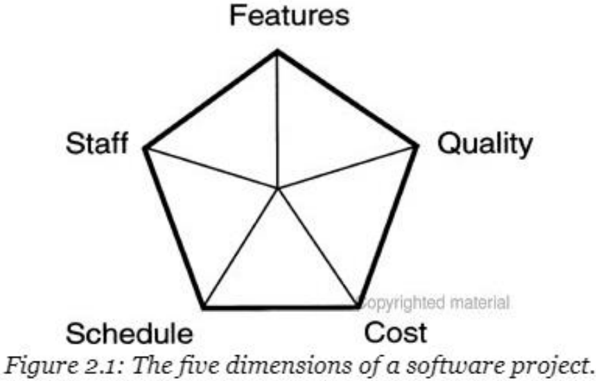
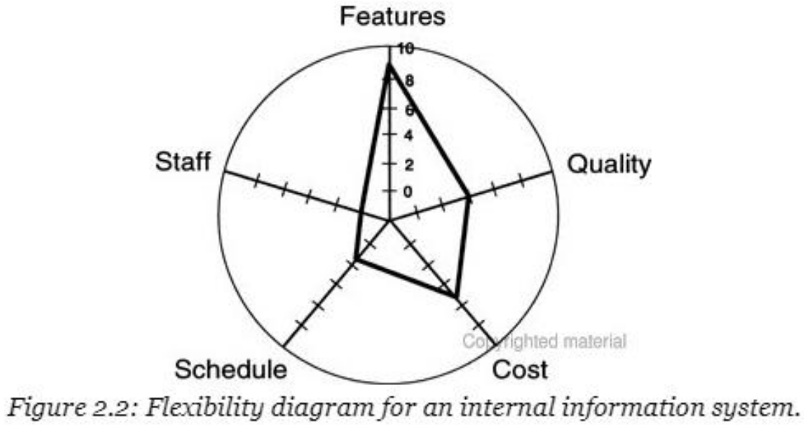
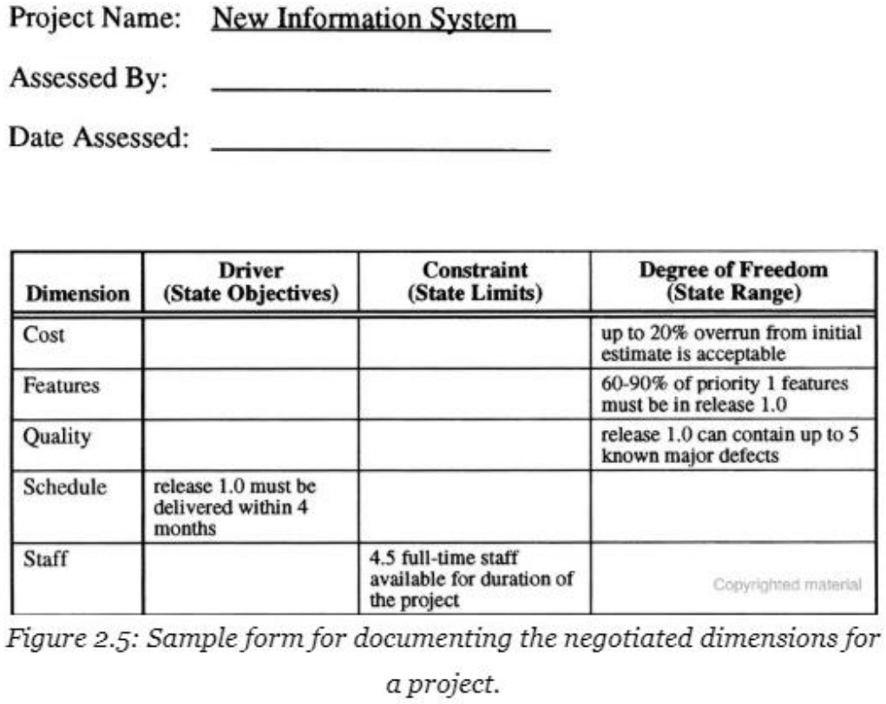
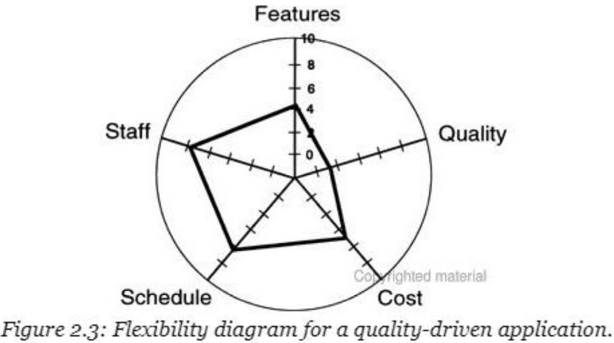
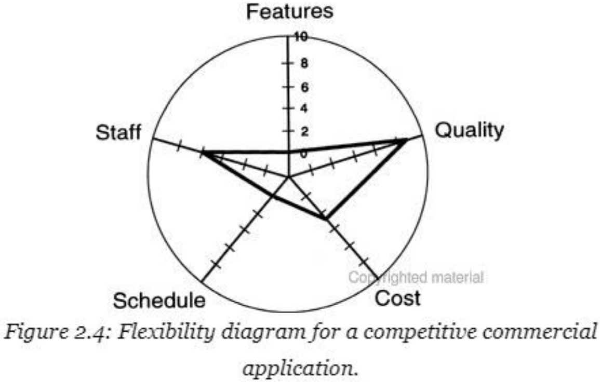

---
tags:
- flashcards/swe/teoria/1P
- flashcards/swe/teoria/U3
---

# Standing on principle

- Puede que algunas veces no valoren (sean _managers_, clientes o alguien que siente la presión del presupuesto y calendario distinto a nosotros) la práctica de calidad que solemos practicar y nos sugieren que tomemos atajos respecto a la misma.
- Debemos saber moderar este idealismo con la realidad de mantener nuestros trabajos, pero siempre hay que comenzar desde la posición de "la calidad lo primordial".
- Cuando sea que estas situaciones surjan, en donde se ponga en juego juicios de valor, decisiones éticas o una decisión entre "lo correcto" y "hacer la cosa que nos solicitaron hacer", recordemos: **Nunca permitir a nuestro jefe o cliente convencernos en hacer un mal trabajo**.

## Integridad e inteligencia: Con _Clientes_

### El cliente no siempre está en lo correcto, no obstante, el cliente siempre tiene la razón

- Usualmente, como desarrolladores, queremos incorporar toda feature solicitada por un cliente en las especificaciones de requerimientos, sin analizar antes qué tanto esfuerzo costará en implementarlo o si es realmente necesario para cumplir con los objetivos del cliente.
- La mayoría del valor que un analista de sistema añade al proceso de desarrollo de una aplicación, proviene de haber ponderado soluciones que satisfagan las necesidades del cliente.
- e.g., quizás es más simple comprar una calculadora física y pegarla al lado del monitor del usuario, que crear un programa que contenga una calculadora. Al final, el cliente quiso la función que cumple una calculadora, no hubo necesidad de ser construida dentro del SW.
- Moraleja:
	- **Ver más allá de la solicitud de una feature del cliente para encontrar las verdaderas necesidades subyacentes**.
	- **Buscar soluciones simples y baratas para la verdadera solución, no solamente la solución que el cliente inicialmente ha solicitado o aquél que se vea lindo**.

### Visión túnel

- Los clientes piensan en términos de qué funciones quieren personalmente usar en la aplicación, no aquellos que deberían ser incluidos debido a valores potenciales para otros usuarios.
- Puede que los analistas detecten varios lugares en donde la aplicación puede hacerse más general y útil sin mucho esfuerzo extra => Satisface también necesidades de otros usuarios.
- Moraleja:
	- **Ver más allá de intereses locales de los usuarios principales, con la finalidad de ver si es posible generalizar fácilmente una aplicación para satisfacer una necesidad más amplia**.
- Lo anterior puede ser empleado para identificar potenciales componentes reutilizables de la aplicación:
	- Toma más tiempo diseñar, implementar y verificar un componente reutilizable que programar una solución customizada para un proyecto.
	- El diseño para la reutilización es una inversión para proyectos futuros: No permitir que la resistencia del cliente y manager nos inhiba en tomar decisiones inteligentes y estratégicas.

### Cliente técnico

- A veces puede que nos encontremos con un cliente que posee un pasado técnico y por ende desea que le proveamos de mucho detalle técnico respecto al diseño de su aplicación.
- Este es el caso en donde **tener el conocimiento necesario se torna peligroso**.
- El líder del proyecto debería resistirse en permitir a dichos clientes en que se involucren técnicamente en el diseño e implementación (salvo que realmente sepa qué está haciendo).
- Es vital enfocar su energía en los requerimientos o involucrarlo en pruebas, pero no permitir que dirija los aspectos técnicos del proyecto.
- Moraleja:
	- **Establecer un límite claro respecto al expertise de SW del cliente. No permitir que nos intimide en tomar decisiones de diseño pobres**.

### Honestidad y compromiso

- Devs <-> Clientes: Relación de confianza y respeto mutuo.
- Clientes: Queremos que sean directos con requerimientos y restricciones.
- Devs: Esperan que seamos correctos con ellos y mantenerlos informados, incluso aunque no quieran escucharlo.
- e.g., si la entrega del proyecto fue pactada para octubre, pero nos dimos cuenta que nos atrasamos en septiembre y no le informamos al cliente, tuvimos que haber realizado una gestión de expectativas.
- Moraleja.
	- **Ser honesto y directo con clientes. Los _stakeholders_ del proyecto poseen el derecho de información certera, sean o no buenas noticias**.
- Decir que vamos a hacer algo pero luego nunca hacemos tiempo para el mismo => Falta de integridad personal.
- Existen varios motivos por los cuáles no se podrá cumplir una promesa, pero es irresponsable no notificar a aquellos afectados por nuestra decisión.
- Moraleja:
	- **Si nos comprometemos con algo, las otras personas involucradas esperan que lo hagamos. En caso de que algo cambie, debemos hacerles saber lo antes posible, para así poder pensar en una alternativa**.
- En caso de que un manager no se dé cuenta que el _backlog_ se está apilando, debemos comunicárselos, ya que no tienen forma de saber que es el caso. En caso de que quieran que sigamos con una nueva tarea, debe ser completamente aceptable realizar la contra pregunta: "¿Qué quiere que deje de hacer para generar el tiempo libre necesario?"

## Integridad e inteligencia: Con _Managers_

1. Explicarle nuestro método de estimación y con qué frecuencia su estimación es más pequeño que el nuestro:
	- El manager puede en realidad no tener una estimación, pero si tiene un objetivo.
	- Puede que nosotros tampoco tengamos una estimación, sino que una suposición.
	- Es más complicado debatir con alguien que ha basado su estimación sobre un proceso cuantitativo y analítico, que con alguien que ha tirado un número por tirar.
	- Datos y métricas históricas pueden ayudarnos a construir nuestro caso.
2. Si no podemos aportar una estimación precisa, debido a que no existen requerimientos escritos, ofrecer en su lugar una estimación más precisa luego de una exploración inicial del alcance del proyecto y requerimientos de usuarios en general.
3. Objetar que "la realización de una estimación a etapas iniciales del proyecto puede estar errado en un 80% o más".
	- Presentar un rango de estimaciones con sus probabilidades de ocurrencia: Mejor caso, caso más probable y peor caso.
	- **Presentar una única estimación al principio de un proyecto sella y establece expectativas que persistirán en la mente de las personas durante más tiempo, incluso luego de que los requerimientos y suposiciones originales hayan cambiado drásticamente**.
4. En caso de tener un **calendario agresivamente acelerado**, negociar como contrapropuesta:
	- **Un equipo grande**.
	- **Pocas features**.
	- **Entregas por etapas / graduales**.
	- **Calidad reducida**.
	Dejar en claro a los _stakeholders_ que entiendan estos _trade-offs_: No obtendrán algo por nada a cambio.
5. Rehacer las estimaciones con distintas suposiciones: Tamaño del proyecto, recursos u otros factores, con la finalidad de ver si podemos llegar parecidos a los objetivos cortos de nuestro manager. Comunicar claramente las suposiciones realizadas a cualquiera involucrado en la toma de decisiones.
6. Hacer una contraoferta: Mostrarle al manager qué fracción de las funcionalidades del sistema serán realísticamente entregadas en 6 meses.

Moraleja:
- **No comprometernos a calendarios ridículos e inalcanzables basados en objetivos y sueños, sino que realizar estimaciones realistas en base a un procedimiento**.

> [!IMPORTANT]
>
> - Esconder el alcance del proyecto del _project management_ es más irresponsable de nuestra parte que aceptar un calendario surrealista.
> - Justamente uno de los propósitos del _project planning_ es identificar todas las tareas a ser realizadas para garantizar el éxito del proyecto. Pretender que dichas tareas no se encuentran allí, no hará que desaparezcan de la nada (la "técnica del avestruz").

## Las 5 dimensiones de un proyecto de SW

Existen 5 dimensiones que debemos gestionar en un proyecto de SW:
1. Alcance (_features_).
2. Calidad.
3. Costo.
4. Calendario.
5. Staff.

- Estas dimensiones no poseen independencia.
- e.g., al agregar staff => El calendario puede acortarse (aunque no necesariamente) y el costo puede incrementar.
	- Un _trade-off_ más usual es acortar el calendario o añadir features => Y sacrificar calidad.
- Los _trade-offs_ entre estas 5 dimensiones alcanzan los objetivos claves del proyecto.

### Roles de las dimensiones

Cada una de estas 5 dimensiones puede tomar uno de los 3 posibles roles de cualquier proyecto:
- Driver:
	- **Objetivo (principal) clave del proyecto**.
	- e.g., un producto que debe ser entregado a tiempo para poder sacar provecho de la oportunidad de marketing, el calendario es un driver.
	- e.g., SW comerciales, tales como procesadores de texto y hojas de cálculo, usualmente son creados teniendo a las features (alcance) como el driver.
- Restricción (_Constraint_):
	- Es un **factor limitante que no se encuentra dentro del control del líder del proyecto**.
	- e.g., si un equipo de tamaño fijo e inmutable es asignado a un proyecto => El staff se convierte en una restricción.
	- e.g., el costo es una restricción de un proyecto que se desarrolla bajo un contrato de precio fijo.
	- e.g., la calidad es una restricción para un proyecto que desarrolla SW que ejecuta una pieza de equipamiento médico o bien un sistema de control de vuelo de un avión.
	- e.g., a veces es posible considerar el costo como una restricción o un driver, ya que podría ser tanto un objetivo principal como un factor limitante.
	- e.g., similarmente al anterior, es posible que un conjunto de features especificados sea el driver principal del proyecto, pero podríamos verlo como una restricción en caso de que el conjunto de features no sean negociables.
- Grado de libertad (Degree of freedom):
	- **Es cualquier dimensión del proyecto que no es ni siquiera un driver ni tampoco es una restricción**.
	- Son factores que el líder del proyecto puede ajustar y balancear hasta cierto punto, con la finalidad de alcanzar los objetivos generales del proyecto.
	- e.g., en proyectos de sistemas de información internos, los drivers son features y calidad, mientras que el staff es una restricción => El calendario y el costo se vuelven en grados de libertad.
		- Esto implica que las features demandadas por los clientes deben ser todas incluidas, pero el tiempo de entrega del producto puede atrasarse más que el estipulado.

> [!IMPORTANT]
>
> - No se trata de cuál de las 5 dimensiones terminan siendo drivers o restricciones, sino que las prioridades relativas de las dimensiones sean negociadas con antelación en conjunto con el equipo del proyecto, los clientes y la gerencia.
> - No todas las 5 dimensiones pueden ser drivers.
> - No todas las 5 dimensiones pueden ser restricciones.
> - Este proceso de negociación permite definir las reglas y límites de los proyectos.
> 	- Como en cualquier juego: Podemos jugar en base a un conjunto de reglas, pero estas reglas deben ser entendidas y aceptadas por los jugadores.
> - Moraleja:
> 	- **Los stakeholders, al inicio del proyecto, deben establecer los grados relativos de flexibilidad de 5 dimensiones de proyectos: Alcance, calidad, costo, calendario y staff**.

---

Describir el rol Driver.
?
- Es el objetivo (principal) clave del proyecto.
- e.g., un producto que debe ser entregado a tiempo para poder sacar provecho de la oportunidad de marketing, el calendario es un driver.
- e.g., SW comerciales, tales como procesadores de texto y hojas de cálculo, usualmente son creados teniendo a las features (alcance) como el driver.
<!--SR:!2025-05-09,1,230-->

Describir el rol Restricción.
?
- Es un factor limitante que no se encuentra dentro del control del líder del proyecto.
- e.g., si un equipo de tamaño fijo e inmutable es asignado a un proyecto => El staff se convierte en una restricción.
- e.g., el costo es una restricción de un proyecto que se desarrolla bajo un contrato de precio fijo.
- e.g., la calidad es una restricción para un proyecto que desarrolla SW que ejecuta una pieza de equipamiento médico o bien un sistema de control de vuelo de un avión.
- e.g., a veces es posible considerar el costo como una restricción o un driver, ya que podría ser tanto un factor limitante como un objetivo principal, respectivamente.
- e.g., análogo al anterior, es posible que un conjunto de features especificados sea el driver principal del proyecto, pero podríamos verlo como una restricción en caso de que el conjunto de features no sean negociables.
<!--SR:!2025-05-09,1,230-->

Describir el rol Grado de libertad.
?
- Es cualquier dimensión del proyecto que no es ni siquiera un driver ni tampoco es una restricción.
- Son factores que el líder del proyecto puede ajustar y balancear hasta cierto punto (respecto de las otras dimensiones), con la finalidad de alcanzar los objetivos generales del proyecto.
- e.g., en proyectos de sistemas de información internos, los drivers son features y calidad, mientras que el staff es una restricción => El calendario y el costo se vuelven en grados de libertad.
	- Esto implica que las features demandadas por los clientes deben ser todas incluidas, pero el tiempo de entrega del producto puede atrasarse más que el estipulado.
<!--SR:!2025-05-09,1,230-->

---

### Forma de clasificar las dimensiones

La clave para categorizar las dimensiones en las 3 categorías es pensar en la cantidad de flexibilidad que el líder del proyecto posee respecto a dicha dimensión:
- Driver: Ofrece baja flexibilidad.
- Restricción: Virtualmente no ofrece ninguna flexibilidad al líder del proyecto.
- Grado de libertad: Ofrece una latitud más amplia para balancear dicha dimensión respecto de las otras 4 restantes.

> [!NOTE]
>
> - Solemos darle importancia a un único aspecto driver (usualmente features o calendario) y no enfatizamos sobre los impactos de otras dimensiones. Este comportamiento suele contraer problemas en el futuro.
> - Clientes, managers y stakeholders deben aceptar que no es posible obtener todas las features deseadas, sin defectos, entregadas con alta velocidad, a un bajo costo y con el staff más reducido posible.

---

Un Driver ofrece ==1;;baja== flexibilidad.
<!--SR:!2025-05-09,1,230-->

Una restricción virtualmente ==1;;no ofrece ninguna== flexibilidad al líder del proyecto.
<!--SR:!2025-05-09,1,230-->

Un grado de libertad ofrece una latitud ==1;;más amplia== para balancear dicha dimensión respecto de las otras 4 restantes.
<!--SR:!2025-05-09,1,230-->

---

### Diagrama de Kiviat

- Es una forma gráfica de representar valores (en nuestro caso 5) mediante un polígono irregular sobre un conjunto de ejes normalizados.
- La posición en cada punto del eje indica el grado relativo de flexibilidad sobre dicha dimensión para un proyecto en particular.
- La forma de los polígonos proveen una indicación visual de los aspectos importantes de cada proyecto.

> [!IMPORTANT]
>
> En caso de reducir el punto en un eje hacia abajo, tal que se reduce la latitud que posee el líder el proyecto en dicha dimensión => Generalmente tendremos que ajustar las otras dimensiones para compensarlo: Todo tiene un precio.

> [!TIP]
>
> - El diagrama de flexibilidad facilita las negociaciones difíciles.
> - Permite establecer prioridades y objetivos del proyecto.

---

¿Qué es el diagrama de Kiviat y para qué sirve?
?
- El diagrama de Kiviat es una forma gráfica de representar valores (en nuestro caso 5 dimensiones) mediante un polígono irregular sobre un conjunto de ejes normalizados.
- Sirve para indicar el grado relativo de flexibilidad sobre dicha dimensión para un proyecto en particular, brindando una indicación visual de los aspectos importantes de cada proyecto.
<!--SR:!2025-05-09,1,230-->

---

#### Ejemplos

##### Proyecto 1: Sistema de información interno.

- Staff (Restriction): Restricto a un staff fijo => Valor 0 en su eje.
- Calendario (Driver): Motivado a cumplir un calendario (_driven to meet_) => Valor bajo en su eje.
- El proyecto posee cantidades variables de flexibilidad sobre las features incorporadas sobre el release inicial, la calidad del producto y la latitud para excesos de costo (DoFs) => Valores para estos grados de libertad son más altos en sus respectivos ejes.

##### Proyecto 2: Una aplicación _Quality-Driven_

- Calidad (Driver).
- El staff y calendario demuestra una gran flexibilidad.

##### Proyecto 3: Aplicación comercial competitiva

- Features y calendario (Restricción): Debe incluirse un conjunto de features si o si y debe ser entregado en base a un calendario estricto.
- Calidad (Grado de libertad): Cualquier cosa que resulte.

### Otra forma de aplicar el modelo de las 5 dimensiones

La idea es renegociar cuando el mundo cambia:
- e.g., si vienen nuevos requerimientos, preguntar a gestión qué debemos ajustar para acomodar esta solicitud:
	- ¿Diferir las otras features?
	- ¿El calendario puede atrasarse? ¿En qué cuantía?
	- ¿Podemos agregar staff o pagar horas extras para dar con el calendario?
	- ¿Podemos degradar la calidad? Ya que los procesos sólidos y prácticas de control de calidad son ignoradas por presión de entregas.
- Las respuestas son menos importantes que la discusión generada cuando los líderes de proyectos y desarrolladores se resisten a cambios inesperados en cualquiera de estas 5 dimensiones.
- Una característica tanto de la cultura de la SWE y procesos maduros de desarrollo de SW, es que la expectativas y compromisos son establecidos mediante la negociación.

# Culture Builders & Killers

## Culture Builder

- Propiciar un entorno en donde se proteja a los miembros del equipo de maquinación política, reuniones sin sentido y culpabilización sin sentido.
- Miembros del equipo deben saber que vamos a ayudarles a batallar sus batallas para que sean productivos en los proyectos correctos.
- Como manager:
	- Ser partícipe de la culpa cuando las cosas salen mal.
	- Tomar parte del crédito solamente cuando los proyectos son exitosos.
	- Nadie quiere trabajar para un manager que no se puede confiar ni respetar.

## Culture Killer

- Dar a nuestros subordinados la responsabilidad de entregar el proyecto, pero no darles la potestad de tomar acciones y adquirir los recursos que necesitan para que tengan éxito.
- El hecho de delegar cualquier clase de autoridad a los líderes del proyecto es percibido como una señal de debilidad.
- Algunos pueden quejarse de que las decisiones se están llevando a cabo en los niveles superiores del organigrama, por personas que no están lo suficientemente cerca al proyecto para poder tomar decisiones correctas, pero sabemos nosotros que si tenemos suficiente información para tomar las decisiones correctos.
