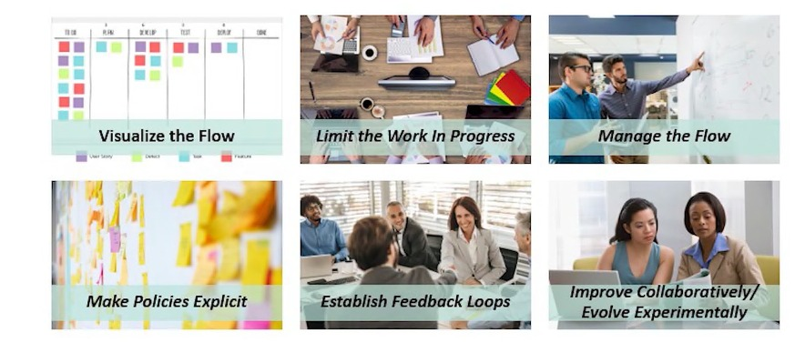
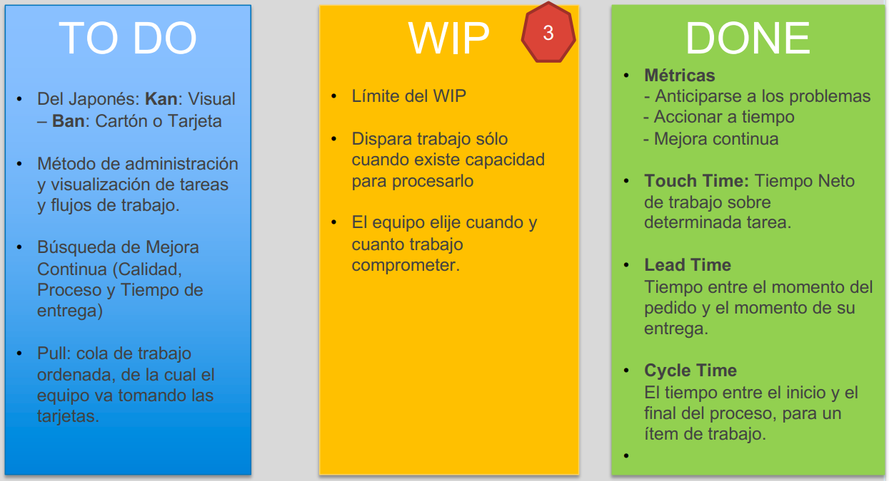
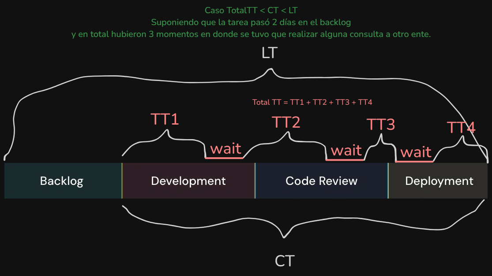
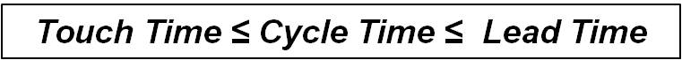
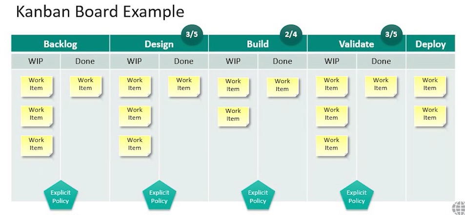

---
tags:
- flashcards/swe/teoria/1P
- flashcards/swe/teoria/U3
---

# Kanban

Kanban es una Administración Visual de Flujo de Trabajo que ayuda a realizar más con menos estrés / dolor.

Es un enfoque que viene de Lean, es una palabra Japonesa que significa "Tablero Visual".

Usamos Kanban cuando se pueden responder afirmativamente alguna de estas preguntas:
- ¿Parece que hay miles de tareas para realizar constantemente?
	- Ayuda a organizarse a la hora de tener varias cosas para hacer.
- ¿Siempre hay que cambiar de una tarea a otra perdiendo el foco y sin tener suficiente seguimiento?
	- Nos permite dar una seguimiento a las tareas.
- ¿Parece que siempre se trabaja sin parar y no se es productivo como quisiera ser?
	- Nos permite ser más efectivos y eficientes en lo que hacemos.
- ¿El equipo tiene problemas de comunicación provocando esfuerzos duplicados, defectos, retrabajo y más?
	- Permite bajar la incertidumbre de clientes (mayor visibilidad externa).
	- Es posible transmitir información con la simple visualización de un tablero.

---

(Control U3) ¿Qué es Kanban?
?
Kanban es una Administración Visual de Flujo de Trabajo que ayuda a realizar más con menos estrés / dolor. Es un enfoque que proviene de LEAN. Es una palabra Japonesa que significa "Tablero Visual".
<!--SR:!2025-05-09,1,230-->

---

## Conceptos básicos (prácticas) del Kanban

1. Visualizar el flujo de trabajo: Mediante el tablero.
2. Limitar el trabajo en progreso (WIP), es decir, cuánto trabajo podemos hacer simultáneamente.
	- Limitar el WIP:
		- Consiste en **acordar la cantidad de items** que pueden **trabajarse en paralelo por cada etapa del proceso**.
		- Esto es lo que marca la diferencia entre tener una "lista visual de TODO" y el tener un sistema Kanban.
		- Las columnas que posee un número de limitación del WIP es en donde trabaja el development team.
3. Medir y Administrar el Workflow.
	- El principal objetivo es identificar cuellos de botella / bloqueos en el flujo de trabajo y disparar acciones.
	- e.g. Lead Time.
	- e.g., el backlog o el deploy crece descontroladamente.
4. Definir políticas explícitas y mejora continua colaborativa y acumulativa.
	- Es la definición de "DONE" por el equipo en cuestión y es el criterio para poder pasar a "DONE" la tarjeta (WIP -> DONE), para que así sea _pull-eada_ por el siguiente en el flujo de trabajo.

> [!IMPORTANT]
>
> - Doble situación: Tablero visual + Flujo que lo acompaña.
> - No existe "velocity" en Kanban, ya que el flujo es en forma continuada. No existe el concepto de "empezar y terminar una iteración".

---

(Control U3) ¿Qué significa "limitar el WIP" en Kanban?
?
- Significa "cuánto trabajo podemos hacer simultáneamente".
- Consiste en **acordar la cantidad de items que pueden trabajarse en paralelo por cada etapa del proceso**.
- La práctica de "limitar el WIP" es lo que marca la diferencia entre tener una "lista visual de TODO" y el tener un sistema Kanban.
<!--SR:!2025-05-09,1,230-->

Enumerar y explicar los conceptos básicos del Kanban.
?
1. Visualizar el flujo de trabajo: Mediante el tablero.
2. Limitar el trabajo en progreso (WIP), es decir, cuánto trabajo podemos hacer simultáneamente.
	- Limitar el WIP:
		- Consiste en **acordar la cantidad de items** que pueden **trabajarse en paralelo por cada etapa del proceso**.
		- Esto es lo que marca la diferencia entre tener una "lista visual de TODO" y el tener un sistema Kanban.
		- Las columnas que posee un número de limitación del WIP es en donde trabaja el development team.
3. Medir y Administrar el Workflow.
	- El principal objetivo es detectar cuellos de botella en el flujo de trabajo que representan estancamiento / bloqueos para avanzar.
	- Permite identificarlos y disparar acciones.
	- e.g. Lead Time.
	- e.g., el backlog o el deploy crece descontroladamente.
4. Definir políticas explícitas y mejora continua colaborativa y acumulativa.
	- Es la definición de "DONE" por el equipo en cuestión y es el criterio para poder pasar a "DONE" la tarjeta (WIP -> DONE), para que así sea _pull_-eada por el siguiente en el flujo de trabajo.
<!--SR:!2025-05-09,1,230-->

---

## Tablero

Lo usual es partir el tablero en 3 columnas.

### TODO

Son todas las tareas habidas y por haber pendientes a hacer.

- Del Japonés: Kan: Visual - Ban: Cartón o Tarjeta.
- Método de administración, visualización de tareas y flujos de trabajo.
- Búsqueda de Mejora Continua: Calidad, Proceso y Tiempo de entrega.
- Pull:
	- Cola de trabajo ordenada, de la cual **el equipo va tomando las tarjetas**.
	- **No se inyectan tarjetas (Push)**.
- Priorización según método de priorización.
	- Si tomamos siempre lo más importante => Al ciclo ingresa lo más importante => Existe un buen "cascadeo" hacia las siguientes etapas.
- **No posee un límite tanto inferior ni superior**.
- Motivo de ser:
	- Revisarla y priorizarla todo el tiempo.
	- Aplica el principio de Pareto: El 20% del trabajo realizado resuelve el 80% de los problemas.

---

¿En qué consiste la columna TODO?
?
- Son todas las tareas habidas y por haber pendientes a hacer.
- Método de administración, visualización de tareas y flujos de trabajo.
- Búsqueda de Mejora Continua: Calidad, Proceso y Tiempo de entrega.
- Pull:
	- Cola de trabajo ordenada, de la cual **el equipo va tomando las tarjetas**.
	- **No se inyectan tarjetas (Push)**.
- Priorización según método de priorización.
	- Si tomamos siempre lo más importante => Al ciclo ingresa lo más importante => Existe un buen "cascadeo" hacia las siguientes etapas.
- **No posee un límite tanto inferior ni superior**.
- Motivo de ser:
	- Revisarla y priorizarla todo el tiempo.
	- Aplica el principio de Pareto: El 20% del trabajo realizado resuelve el 80% de los problemas.
<!--SR:!2025-05-09,1,230-->

---

### WIP

- Límite del WIP:
	- ¿Cuál es la **cantidad de tareas** puede un equipo trabajar en simultáneo?
	- e.g., un equipo de 2 personas podrían tener como límite 2, 3 o 4 tareas por ejemplo en simultáneo. En caso de querer añadir una 5° tarea a tomar obligatoriamente, debemos pasar una tarea a DONE o sacarla de la prioridad y enviarla al TODO.
- Dispara trabajo sólo cuando existe capacidad para procesarlo.
- El equipo elije cuando y cuanto trabajo comprometer.

> [!NOTE]
>
> - Se busca que las tareas sean compatibles una con las otras.
> - Otra forma de definir el límite es dándole valores a las tarjetas en base a su complejidad.
> 	- e.g., una simple vale 1 y una complicada vale 3. Si el equipo toma 10 puntos, podría tomar 3 complicadas y 1 simple.

---

¿En qué consiste la columna WIP?
?
- Límite del WIP: ¿Cuál es la **cantidad de tareas** puede un equipo trabajar en simultáneo?
	- e.g., un equipo de 2 personas podrían tener como límite 2, 3 o 4 tareas por ejemplo en simultáneo. En caso de querer añadir una 5° tarea a tomar obligatoriamente, debemos pasar una tarea a DONE o sacarla de la prioridad y enviarla al TODO.
- Dispara trabajo sólo cuando existe capacidad para procesarlo.
- El equipo elije cuando y cuanto trabajo comprometer.
<!--SR:!2025-05-09,1,230-->

---

### DONE

- Métricas:
	- Anticiparse a los problemas.
	- Accionar a tiempo.
	- Mejora continua.
	- Se busca tener métricas numéricas tal que no sean "estomacales".
- Touch Time:
	- Tiempo Neto de trabajo sobre determinada tarea.
	- Literalmente "cuánto tiempo que toqué a la tarea / cuánto tiempo le dediqué a la tarea".
- Lead Time:
	- Tiempo entre el momento del pedido y el momento de su entrega.
	- Desde el momento en que se carga la tarea en el TODO y pasa a DONE.
- Cycle Time:
	- El tiempo entre el inicio y el final del proceso, para un item de trabajo.

---

¿En qué consiste la columna DONE?
?
- Métricas:
	- Anticiparse a los problemas.
	- Accionar a tiempo.
	- Mejora continua.
	- Se busca tener métricas numéricas tal que no sean "estomacales".
- Touch Time:
	- Tiempo Neto de trabajo sobre determinada tarea.
	- Literalmente "cuánto tiempo que toqué a la tarea / cuánto tiempo le dediqué a la tarea".
- Lead Time:
	- Tiempo entre el momento del pedido y el momento de su entrega.
	- Desde el momento en que se carga la tarea en el TODO y pasa a DONE.
- Cycle Time:
	- El tiempo entre el inicio y el final del proceso, para un item de trabajo.
<!--SR:!2025-05-09,1,230-->

---

#### Ejemplos

##### Lead Time = Cycle Time = Touch Time

- Comenzamos la tarea ni bien ingresó al backlog (TODO -> WIP).
- A su vez la finalizamos ni bien la pasamos a WIP (WIP -> DONE).

##### Lead Time != Cycle Time = Touch Time

- La tarea permaneció durante 10 días en el TODO (TODO -> WIP).
- Finalizamos la tarea sin interrupciones (WIP -> DONE).

##### Lead Time != Cycle Time != Touch Time

- La tarea permaneció durante 10 días en el TODO (TODO -> WIP).
- En total se ha dedicado 10 días brutos a la tarea, siendo la mitad realmente dedicada en llevar la tarea a cabo (5 días) (WIP -> DONE).
- Lead Time es 20 días, Cycle Time 10 días y Touch Time 5 días.

## Ejemplos

- En este ejemplo la columna Backlog posee un "WIP" y estas tarjetas todavía el equipo de diseño no las puede tomar, ya que todavía están siendo pulidas.
- En este ejemplo el DONE de la columna anterior es el TODO de la siguiente.
- Implementa la metodología pull en cada una de las etapas.
- Ejemplos de uso de Kanban:
	- Dentro de un Sprint de Scrum para visualizar el trabajo del equipo.
	- Los requerimientos estén cambiando constantemente de prioridad.
	- En entornos de resolución de incidencias.
	- Ticketeras, entornos de brindar soporte.

