---
tags:
- flashcards/swe/teoria/1P
- flashcards/swe/teoria/U3
---

# Scrum

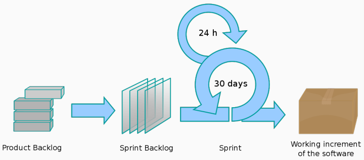

- Scrum es un marco de trabajo metodológico para la administración de proyectos que enfatiza en el trabajo en equipo, en el proceso iterativo hacia un objetivo bien definido.
- Comienza con una simple premisa: Comenzar con lo que puede ser visto o conocido.
- Luego, seguir el avance y modificar lo necesario.

> [!IMPORTANT]
>
> Existen 3 grandes divisiones:
> - Roles.
> - Ceremonias.
> - Artefactos.

---

¿Qué es un Scrum?
?
- Scrum es un marco de trabajo para la administración de proyectos que enfatiza en el trabajo en equipo, en el proceso iterativo hacia un objetivo bien definido.
- Comienza con una simple premisa: comenzar con lo que puede ser visto o conocido.
- Luego, seguir el avance y modificar lo necesario.
<!--SR:!2025-05-09,1,230-->

---

## Framework

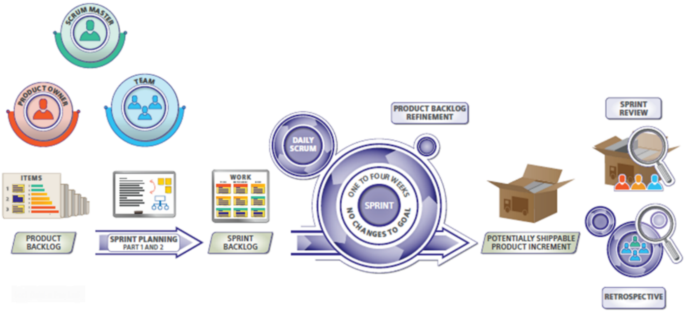

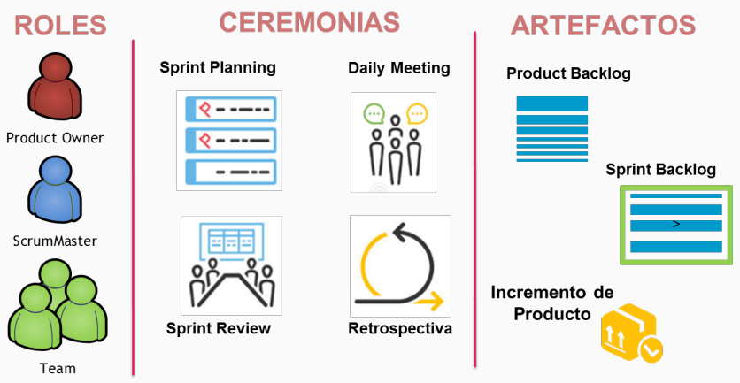

- Scrum es un **marco metodológico** pensado para **construir productos de forma incremental**, en una serie de periodos de tiempo llamados **Sprints**.
	- Es un framework: Nos brinda reglas (el _qué_) pero no nos dice _cómo_.
	- El marco de trabajo Scrum es incompleto de manera intencional y solo define las partes necesarias para implementar la teoría de Scrum.
- Un **Sprint** es un **período fijo de tiempo** (1~4 semanas). En cada Sprint el equipo Scrum construirá y entregará un **Incremento de Producto**.
- Cada incremento es una **versión mejorada** del producto que alcanza el **nivel de calidad requerido** y cumple con los **criterios de aceptación** establecidos.

---

Scrum es un ==1;;marco metodológico== pensado para construir productos de forma ==1;;incremental==, en una serie de periodos de tiempo llamados ==1;;Sprints==.
<!--SR:!2025-05-09,1,230-->

Scrum es un marco metodológico que nos brinda ==1;;reglas (el _qué_)== pero no nos dice ==1;;_cómo_==.
<!--SR:!2025-05-09,1,230-->

El marco de trabajo Scrum es ==1;;incompleto== de manera intencional y solo define ==1;;las partes necesarias== para implementar ==1;;la teoría de Scrum==.
<!--SR:!2025-05-09,1,230-->

¿En qué consiste un Sprint?::Es un período fijo de tiempo (1~4 semanas) y en este el equipo Scrum construirá y entregará un Incremento de Producto.
<!--SR:!2025-05-09,1,230-->

¿En qué consiste un "Incremento de Producto"?
?
Cada incremento es una versión mejorada del producto que:
- Alcanza el nivel de calidad requerido.
- Cumple con los criterios de aceptación establecidos.
<!--SR:!2025-05-09,1,230-->

---

## Valores

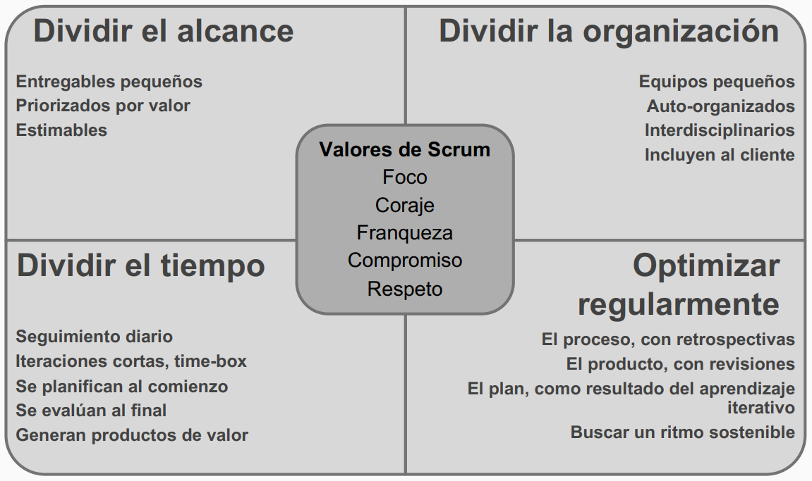

- Dividir el alcance:
	- Entregables pequeños.
	- Priorizados por valor.
	- Estimables.
	- Por este motivo tenemos equipo y roles.
- Dividir la organización:
	- Equipos pequeños.
	- Auto-organizados.
	- Interdisciplinarios.
	- Incluyen al cliente.
	- Por este motivo tenemos product backlog y sprint backlog.
- Dividir el tiempo:
	- Seguimiento diario.
	- Iteraciones cortas, time-box.
	- Se planifican al comienzo.
	- Se evalúan al final.
	- Generan productos de valor.
	- Por este motivo lo tenemos dividido en sprints.
- Optimizar regularmente:
	- El proceso, con retrospectivas.
	- El producto, con revisiones.
	- El plan, como resultado del aprendizaje iterativo.
	- Buscar un ritmo sostenible.
- Valores de Scrum:
	- Foco.
	- Coraje.
	- Franqueza.
	- Compromiso.
	- Respeto.

> [!IMPORTANT]
>
> Respecto a "optimizar regularmente":
> - Si recordamos de [[03-obl-a-leader-s-framework-for-decision-making-cynefin-+-opc-sobre-cynefin#Contextos Complejos El dominio de lo emergente (_Emergence_)|Cynefin, el contexto complejo]] tenía las prácticas emergentes. Estas prácticas emergentes tenían palabras que la acompañaban como "probar", "percibir" y "responder". Esta "prueba" es para optimizar el equipo, producto, etc.
> - Los marcos de trabajo ágiles vienen a proponer un "qué hacer" y no solamente para contextos complejos.
> - Scrum está siendo adoptado en muchos dominios que tienen un trabajo esencialmente complejo, más allá del desarrollo de productos de SW donde Scrum tiene sus raíces.

---

Nombrar los valores de Scrum y explicar cada uno en qué consiste.
?
- Dividir el alcance: Entregables pequeños, priorizados por valor y estimables.
- Dividir la organización: Equipos pequeños, auto-organizados, interdisciplinarios y que incluyan al cliente.
- Dividir el tiempo: Seguimiento diario, iteraciones cortas (_timeboxing_), se planifican al comienzo, se evalúan al final y generan productos de valor.
- Optimizar regularmente: El proceso (con [[03-obl-a-leader-s-framework-for-decision-making-cynefin-+-opc-sobre-cynefin#Contextos Complejos El dominio de lo emergente (_Emergence_)|retrospectivas]]), el producto (con [[#Sprint Review ("Demo")|revisiones]]), el plan (como resultado del [[#Retrospective|aprendizaje iterativo]]) y buscar un ritmo sostenible.
- Valores de Scrum: Foco, coraje, franqueza, compromiso y respeto.
<!--SR:!2025-05-09,1,230-->

---

## Roles

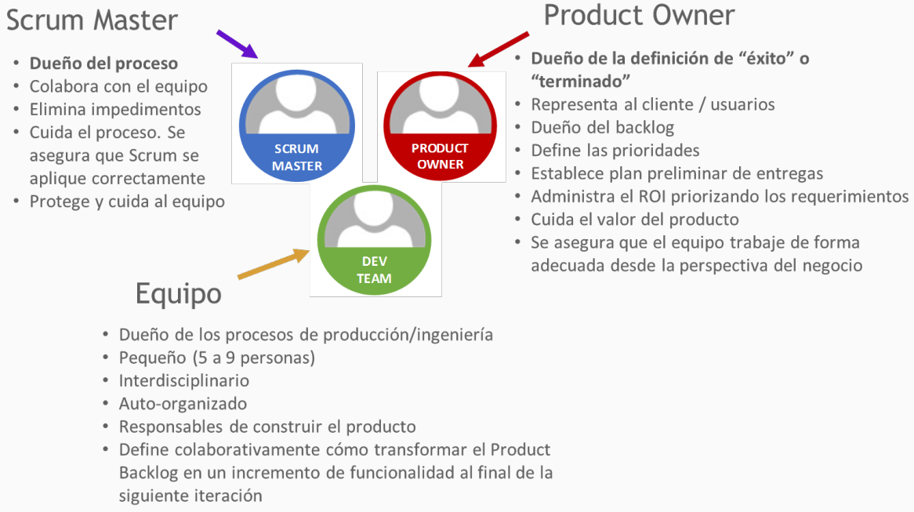

### Scrum Master ("Alguien más de proceso")

- **Dueño del proceso**.
- Colabora con el equipo.
- Elimina impedimentos.
- Cuida el proceso.
- Se asegura que Scrum se aplique correctamente.
- Protege y cuida al equipo (que nada salga por fuera de Scrum).

### Product Owner ("Alguien más de producto")

- **Dueño de la definición de "éxito" o "terminado"**.
- Representa al cliente / usuarios (representante del negocio en la mesa).
- Dueño del backlog.
- Define las prioridades:
	- De todo el backlog nos dice lo primero que tenemos que encarar.
- Establece plan preliminar de entregas.
- Administra el ROI priorizando los requerimientos.
- Cuida el valor del producto.
- Se asegura que el equipo trabaje de forma adecuada desde la perspectiva del negocio.
- Prioriza el "qué hacer".
- "El PO propone".

### Equipo ("Alguien más de ingeniería")

- Dueño de los procesos de producción / ingeniería.
- Pequeño (5 a 9 personas).
- Interdisciplinario.
- Auto-organizado.
- Responsables de construir el producto.
- Define colaborativamente cómo transformar el Product Backlog en un incremento de funcionalidad al final de la siguiente iteración.
- "El equipo dispone".
- Posterior a la propuesta del PO, son los que dicen qué va a entrar en cada sprint y negocian los elementos que entran o no para el sprint backlog.

---

(Control U3) Describa los roles de Scrum.
?
- Scrum Master ("Proceso")
	- **Dueño del proceso**.
	- Colabora con el equipo.
	- Elimina impedimentos.
	- Cuida el proceso.
	- Se asegura que Scrum se aplique correctamente.
	- Protege y cuida al equipo (que nada salga por fuera de Scrum).
- Product Owner ("Producto")
	- **Dueño de la definición de "éxito" o "terminado"**.
	- Representa al cliente / usuarios (representante del negocio en la mesa).
	- Dueño del backlog.
	- Define las prioridades: Prioriza el "qué hacer" ("¿Qué encarar primero?").
	- Establece plan preliminar de entregas.
	- Administra el ROI priorizando los requerimientos.
	- Cuida el valor del producto.
	- Se asegura que el equipo trabaje de forma adecuada desde la perspectiva del negocio.
	- "El PO propone".
- Equipo ("Ingeniería")
	- Dueño de los procesos de producción / ingeniería.
	- Pequeño (5~9 personas).
	- Interdisciplinario.
	- Auto-organizado.
	- Responsables de construir el producto.
	- Define colaborativamente cómo transformar el Product Backlog en un incremento de funcionalidad al final de la siguiente iteración.
	- "El equipo dispone".
	- Posterior a la propuesta del PO, son los que dicen qué va a entrar en cada sprint y negocian los elementos que entran o no para el sprint backlog.
<!--SR:!2025-05-09,1,230-->

---

## Ceremonias

> [!NOTE]
>
> El orden de los títulos de las ceremonias es en base a cómo aparecen dentro de un sprint.

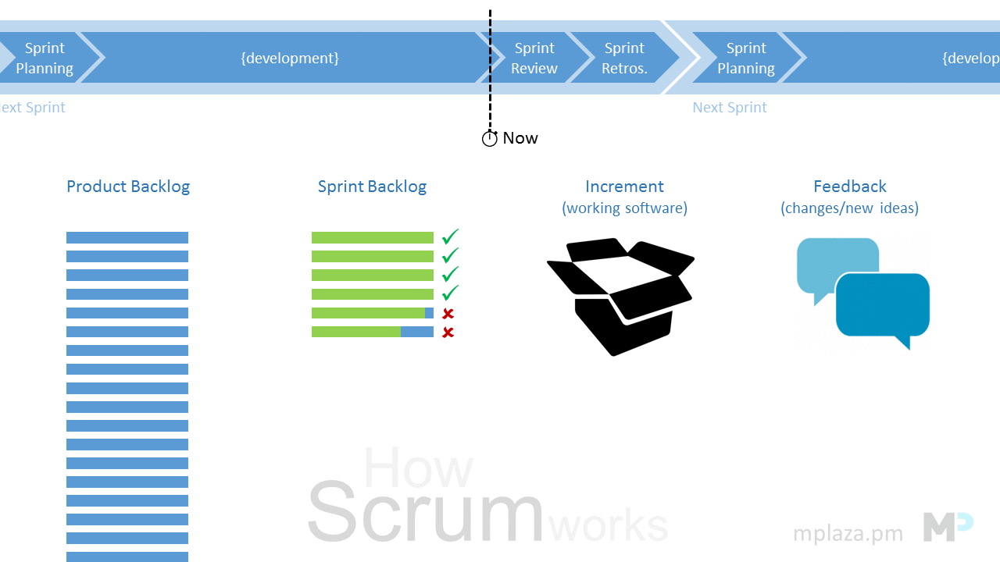

### Sprint Planning

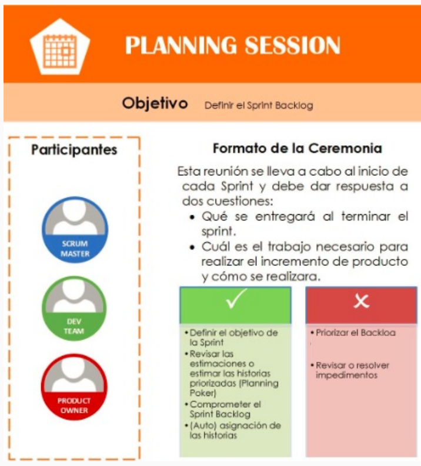

- Al finalizar la reunión:
	- Se compromete el Sprint Backlog.
	- Se asignan las USs comprometidas.
	- Se generan las tareas.
- Frecuencia:
	- 1 vez por Sprint.
	- Al inicio de cada Sprint.
- Duración:
	- Hasta 8hs máximo para un sprint de 1 mes, puede ser menos para Sprints más cortos.

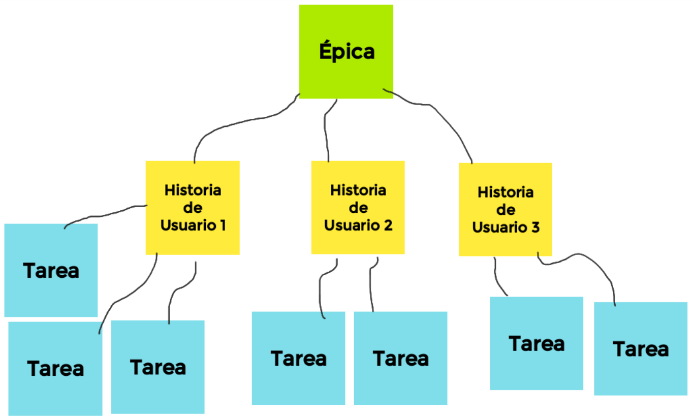

> [!NOTE]
>
> - La ceremonia genera el compromiso tanto del lado del equipo de lo que se estará construyendo y del lado del PO de avisar al negocio de lo que se estará llevando a cabo.
> - El Scrum Team puede refinar los elementos incluidos en el Product Backlog (en consenso con el PO) durante esta ceremonia, lo que aumenta la comprensión y la confianza.

### Daily Meeting

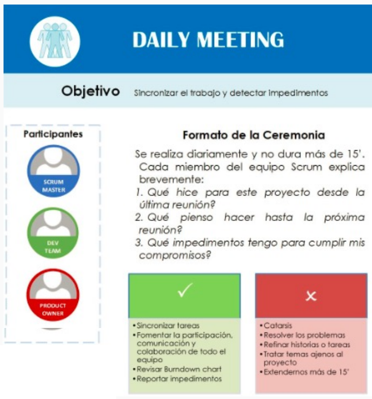

- Al finalizar la reunión:
	- El equipo intenta remover los impedimentos.
- Frecuencia:
	- 1 vez por día.
	- Al comenzar el día.
- Duración:
	- 10-15 minutos.

> [!NOTE]
>
> Se habla de:
> - Qué estuvo haciendo uno desde la última daily hasta la daily de hoy.
> - Qué impedimentos posee: Declararlos a la vista de todos, más no resolverlos.
> - Qué se hará desde la daily de hoy hasta la siguiente daily.
>
> En caso de haber impedimentos:
> - Interno: Se lo lleva el Development Team.
> - Externo: Se lo lleva el Scrum Master y hace el networking necesario.

### Sprint Review ("Demo")

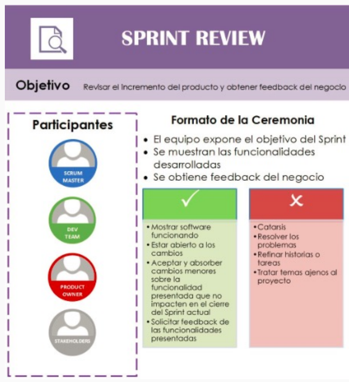

- Al finalizar la reunión:
	- Se aprueban las características presentadas.
- Frecuencia:
	- 1 vez por Sprint.
	- Al finalizar cada Sprint.
	- Penúltimo evento del Sprint.
- Duración:
	- 4hs máximo para un Sprint de 1 mes, puede ser menos para Sprints más cortos.

> [!NOTE]
>
> - Asisten los stakeholders externos al equipo.
> - Existen casos en que la sprint review es la última instancia previa al despliegue.
> 	- Sirve para discernir cuáles features terminaremos implementando o no.
> 	- Esto puede ser porque si bien la tarea fue implementada correctamente en base al criterio de aceptación, puede que haya habido una mala comunicación entre analistas y negocio, o bien el cliente se dio cuenta que podría causar algún problema si esto se implementa.
> - Lo antemencionado se condice con el "contexto complejo" de Cynefin: Probamos, percibimos y respondemos. De esta forma se retroalimenta y se reconfigura el Product Backlog (ver gif de ceremonias).
> - Nuestra forma de construir el producto es iterativo-incremental, pero los dueños del producto pueden decidir salir a producción cuando les corresponda: No siempre al lograr un incremento del producto implica que salgamos a producción consiguientemente.

### Retrospective

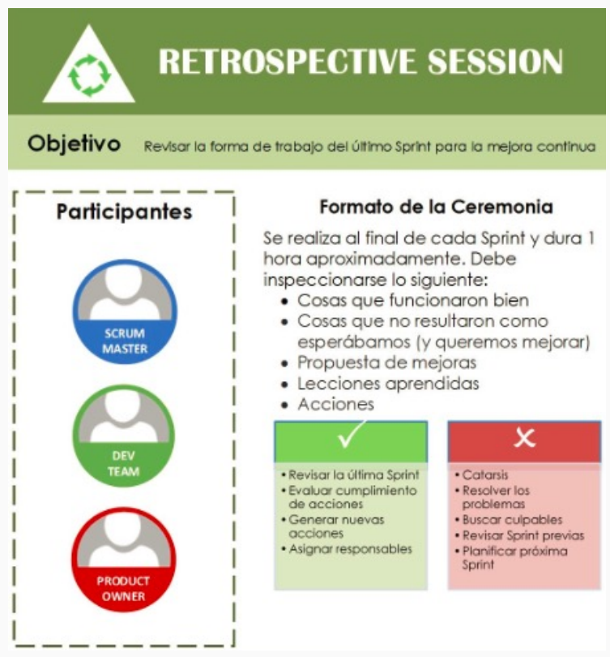

- Al finalizar la reunión:
	- Se obtienen las lecciones aprendidas y acciones para mejorar en el siguiente sprint. 
- Frecuencia:
	- 1 vez por Sprint.
	- Al finalizar cada Sprint.
- Duración:
	- 3hs para un Sprint de un mes, para Sprint más cortos pueden durar menos.

> [!NOTE]
>
> - Evaluamos cómo nos fue como equipo y en nuestra construcción del producto.
> - Se puede usar la retro para ajustar la velocity del equipo (Aunque no quiere decir que si no lo hacemos en esta instancia, no lo podamos hacerlo luego en una instancia personalizada para ello).

---

(Control U3) Describa las ceremonias de Scrum.
?
- Sprint Planning:
	- Objetivo:
		- Definir el Sprint Backlog (lo que se entregará al terminar el Sprint).
		- Asignar las USs (cómo realizarlas) comprometidas.
		- Generar las tareas (trabajo necesario para realizar el incremento).
	- Frecuencia: 1 vez por Sprint y al inicio de cada.
- Daily Meeting:
	- Objetivo:
		- Sincronizar el trabajo y detectar (o intentar remover) impedimentos.
		- Contar brevemente:
			- Qué estuvo haciendo uno desde la última daily hasta la daily de hoy.
			- Qué impedimentos posee: Declararlos a la vista de todos, más no resolverlos.
			- Qué se hará desde la daily de hoy hasta la siguiente daily.
		- Impedimento:
			- Es interno => Usualmente se lo lleva el Development Team.
			- Es externo => Usualmente se lo lleva el Scrum Master y hace el networking necesario.
	- Frecuencia: 1 vez por día y al inicio de cada.
- Sprint Review ("Demo"):
	- Objetivo:
		- Revisar el incremento del producto funcionando y obtener feedback del negocio.
		- Se aprueban las características presentadas.
		- Estar abierto a cambios menores sobre la funcionalidad presentada que no impacten en el cierre del Sprint actual.
		- Asisten los stakeholders externos al equipo.
	- Penúltimo evento del Sprint.
	- Frecuencia: 1 vez por Sprint, al final de cada.
	- Notas importantes:
		- Existen casos en que la sprint review es la última instancia previa al despliegue.
			- Sirve para discernir cuáles features terminaremos implementando o no.
			- Esto puede ser porque si bien la tarea fue implementada correctamente en base al criterio de aceptación, puede que haya habido una mala comunicación entre analistas y negocio, o bien el cliente se dio cuenta que podría causar algún problema si esto se implementa.
		- Lo antemencionado se condice con el "contexto complejo" de Cynefin: Probamos, percibimos y respondemos. De esta forma se retroalimenta y se reconfigura el Product Backlog.
		- Nuestra forma de construir el producto es iterativo-incremental, pero los dueños del producto pueden decidir salir a producción cuando les corresponda: No siempre al lograr un incremento del producto implica que salgamos a producción consiguientemente.
- Retrospective:
	- Objetivo:
		- Revisar la forma de trabajo del último Sprint para la mejor continua.
		- Se obtienen las lecciones aprendidas y acciones para mejorar en el siguiente sprint.
		- Determinar:
			- Lo que funcionó.
			- Lo que no funcionó y queremos mejorar.
			- Propuestas de mejora.
			- Lecciones aprendidas.
			- Acciones.
		- Es posible emplear la retro para ajustar la velocity del equipo.
		- Evaluamos cómo nos fue como equipo y en nuestra construcción del producto.
	- Frecuencia: 1 vez por Sprint, al final de cada.
<!--SR:!2025-05-09,1,230-->

---

## Artefactos

- Representan trabajo o valor.
- Diseñados para maximizar la transparencia de la información clave => Todas las personas que los inspeccionan tienen la misma base de adaptación.
- Cada artefacto posee un compromiso para garantizar que se proporcione información que mejore la transparencia y el enfoque frente al cual se pueda medir el progreso:
	- Para el Product Backlog: Es el Objetivo del Producto.
	- Para el Sprint Backlog: Es el Objetivo del Sprint.
	- Para el Increment: Es la Definición de Terminado.
- Estos compromisos existen para reforzar el empirismo y los valores de Scrum tanto para el Scrum Team como para sus interesados.

---

¿Qué es un artefacto y en qué consiste?
?
- Un artefacto representa trabajo o valor.
- Son diseñados para maximizar la transparencia de la información clave: Todas las personas que inspeccionen los mismos tendrán la misma base de adaptación.
- Cada artefacto posee el compromiso de proporcionar información que mejore la transparencia y el enfoque, tal que permita medir el progreso:
	- Para el Product Backlog: Es el Objetivo del Producto.
	- Para el Sprint Backlog: Es el Objetivo del Sprint.
	- Para el Increment: Es la Definición de Terminado.
- Estos compromisos son con la finalidad de reforzar el empirismo y los valores de Scrum, sea tanto para el Scrum Team como para sus interesados.
<!--SR:!2025-05-09,1,230-->

---

### Product Backlog

- Lista emergente y ordenada de lo que se necesita para mejorar el producto.
- Es la única fuente del trabajo realizado por el Scrum Team.
- Los elementos que se encuentren en el Product Backlog son considerados "preparados" para ser seleccionados durante el Sprint Planning.
- El grado de transparencia de un elemento es adquirido tras las actividades de refinamiento.
- Refinamiento del Product Backlog:
	- Acto de dividir y definir los elementos del Product Backlog en elementos más pequeños y precisos.
	- Es una actividad continua para agregar detalles: Descripción, orden y tamaño.
- Los responsables del dimensionamiento son los Devs que realizarán el trabajo.
- El PO puede influir en los Devs, ayudándolos a entender y a seleccionar sus mejores alternativas.

---

¿Qué es el Product Backlog?
?
- Es una lista emergente y ordenada de lo que se necesita para mejorar el producto.
- Es la única fuente del trabajo realizado por el Scrum Team.
- Los elementos que se encuentren en el Product Backlog son considerados "preparados" para ser seleccionados durante el Sprint Planning.
- Refinamiento del Product Backlog:
	- Acto de dividir y definir los elementos del Product Backlog en elementos más pequeños y precisos.
	- Es una actividad continua para agregar detalles: Descripción, orden y tamaño.
- Los responsables del dimensionamiento son los Devs que realizarán el trabajo.
- El PO puede influir en los Devs, ayudándolos a entender y a seleccionar sus mejores alternativas.
- Tiene como compromiso al Objetivo del Producto.
<!--SR:!2025-05-09,1,230-->

---

#### Compromiso: Objetivo del Producto

- Objetivo del Producto: Describe un estado futuro del producto que sirve como guía para las planificaciones del Scrum Team.
- El Objetivo del Producto se encuentra contenido dentro del Product Backlog.
- El Product Backlog emerge para definir "qué" cosas cumplen con el Objetivo del Producto.
- Un producto es un vehículo para entregar valor. Tiene un límite claro, personas interesadas, usuarios o clientes bien definidos.
- Un producto puede ser un servicio, un producto físico o algo más abstracto.
- El Objetivo del Producto es el objetivo a largo plazo del Scrum Team. Ellos deben cumplir (o abandonar) un objetivo antes de asumir el siguiente.

### Sprint Backlog

- Es una imagen visible y en tiempo real del trabajo que los Developers planean realizar durante el Sprint para lograr el Objetivo del Sprint.
- El Sprint Backlog es un plan realizado por y para los Developers.
- En consecuencia, el Sprint Backlog se actualiza a lo largo del Sprint.
- Compuesto por:
	- El Objetivo del Sprint (por qué).
	- El conjunto de elementos del Product Backlog seleccionados para el Sprint (qué).
	- Un plan de acción para entregar el Incremento (cómo).
- Debe tener suficientes detalles para que su progreso sea inspeccionable en las Dailies.

---

¿Qué es el Sprint Backlog?
?
- Es una imagen visible y en tiempo real del trabajo que los Developers planean realizar durante el Sprint para lograr el Objetivo del Sprint.
- El Sprint Backlog es un plan realizado por y para los Developers.
- En consecuencia, el Sprint Backlog se actualiza a lo largo del Sprint.
- Compuesto por:
	- El Objetivo del Sprint (por qué).
	- El conjunto de elementos del Product Backlog seleccionados para el Sprint (qué).
	- Un plan de acción para entregar el Incremento (cómo).
- Debe tener suficientes detalles para que su progreso sea inspeccionable en las Dailies.
- Tiene como compromiso al Objetivo del Sprint.
<!--SR:!2025-05-09,1,230-->

---

#### Compromiso: Objetivo del Sprint

- Es el único propósito del Sprint.
- Si bien el Objetivo del Sprint es un compromiso de los Developers, proporciona flexibilidad en términos del trabajo exacto necesario para lograrlo.
- El Objetivo del Sprint también crea coherencia y enfoque, lo que alienta al Scrum Team a trabajar en conjunto.
- El Objetivo del Sprint se crea durante la Planning y se agrega el mismo al Sprint Backlog.
- Si el trabajo resulta ser diferente de lo que esperaban, colaboran con el PO para negociar el alcance del Sprint Backlog dentro del Sprint, sin afectar el Objetivo del Sprint.

### Increment

- Es un peldaño más en concreto hacia el Objetivo del Producto.
- Cada Increment se suma a los Increments anteriores y se lo verifica minuciosamente, tal que se garantice que todos los Increments funcionen en conjunto.
- Para proporcionar valor, el Increment debe ser utilizable.
- Se pueden crear múltiples Increments dentro de un Sprint.
- La suma de los Increments se presenta en la Sprint Review, promoviendo el empirismo. Sin embargo, se puede entregar un Increment a los interesados antes del final del Sprint.
- La Sprint Review nunca debe considerarse como una instancia para entregar valor: El trabajo no puede considerarse como parte de un Increment, salvo que cumpla con la Definición de Terminado.

---

¿Qué es un Increment?
?
- Es un peldaño más en concreto hacia el Objetivo del Producto.
- Cada Increment se suma a los Increments anteriores y se lo verifica minuciosamente, tal que se garantice que todos los Increments funcionen en conjunto.
- Para proporcionar valor, el Increment debe ser utilizable.
- Se pueden crear múltiples Increments dentro de un Sprint.
- La suma de los Increments se presenta en la Sprint Review, promoviendo el empirismo. Sin embargo, se puede entregar un Increment a los interesados antes del final del Sprint.
- La Sprint Review nunca debe considerarse como una instancia para entregar valor: El trabajo no puede considerarse como parte de un Increment, salvo que cumpla con la Definición de Terminado.
<!--SR:!2025-05-09,1,230-->

---

#### Compromiso: Definición de Terminado

- Es una descripción formal del estado del Increment cuando se condice con las medidas de calidad requeridas para el producto.
- En el momento en que un elemento del Product Backlog cumple con la Definición de Terminado, nace un Increment.
- La Definición de Terminado crea transparencia al brindar a todos una misma concepción respecto a qué trabajo se completó como parte del Increment.
- Si un elemento del Product Backlog no cumple con la Definición de Terminado, no se puede publicarlo ni tampoco presentarlo en la Sprint Review. En su lugar, vuelve al Product Backlog para su consideración futura.
- Si la Definición de Terminado para un Increment es parte de los estándares de la organización, todos los Scrum Teams deben seguirla como mínimo.
- Si no es un estándar organizacional, el Scrum Team debe crear una Definición de Terminado apropiada para el producto.
- Los Developers deben adherirse a la Definición de Terminado. Si hay varios Scrum Teams trabajando juntos en un producto, deben definir y cumplir mutuamente la misma Definición de Terminado.

> [!IMPORTANT]
>
> - Respuesta "de libro": No es posible pasar de WIP -> TODO, ya que se ha comprometido dicha tarea para el sprint. En todo caso se caerá del sprint y se lo priorizará más adelante en otro sprint.
> - En la vida real si es posible, pero tratamos de que no haya un pasaje de WIP -> TODO.
> - En los sprints suele haber un "colchón":
> 	- e.g., si sabemos que podemos hacer 20 puntos => Podríamos estipular en hacer 15 y guardarnos 5 para una emergencia.

## Prácticas para pronosticar el progreso

Existen varias prácticas para pronosticar el progreso, tales como:
- Trabajo pendiente: _burn-downs_.
- Trabajo completado: _burn-ups_.
- Flujos acumulativos: _cumulative flows_.

Si bien han demostrado su utilidad, no reemplazan la importancia del empirismo. En [[03-obl-a-leader-s-framework-for-decision-making-cynefin-+-opc-sobre-cynefin#Contextos Complejos El dominio de lo emergente (_Emergence_)|entornos complejos]], se desconoce lo que sucederá. **Solo lo que ya ha sucedido se puede utilizar para la toma de decisiones con miras al futuro**.
