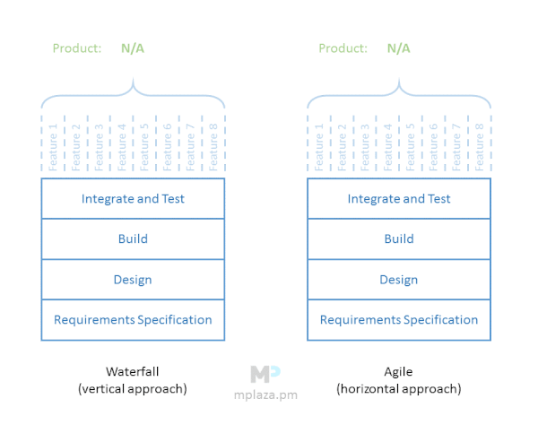
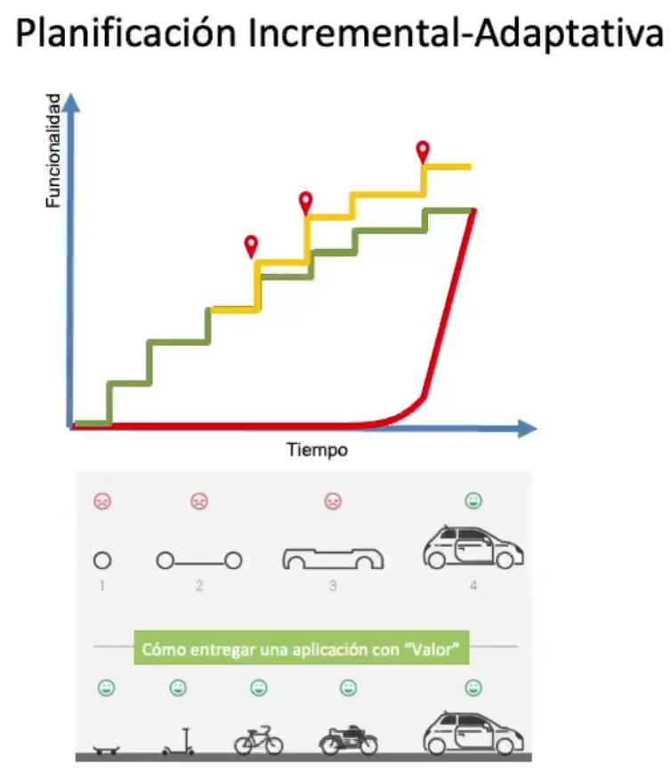

---
tags:
- flashcards/swe/teoria/1P
- flashcards/swe/teoria/U3
---

# Agile Vs. Cascada

La diferencia se encuentra entre partir horizontal o verticalmente el producto.

- Horizontal:
	- Partimos el producto en varias features.
	- Cada feature pasa por todas las etapas.
- A final de cuentas el producto es el mismo, independientemente elijamos cascada o agile.
- La diferencia está en que el producto es usable para que un stakeholder lo pruebe: Mayor visibilidad externa.

## Planificación Incremental-Adaptativa

### Primer gráfico

Permite diferenciar un enfoque cascada Vs. un enfoque adaptativo:
- Cascada:
	- Rojo: En las etapas iniciales se hace el análisis, diseño, construcción, pruebas, y al final de todo se entrega el valor.
- Scrum:
	- Verde:
		- Debido al corte horizontal, la entrega de valor se hace mucho más antes en el desarrollo.
		- Los escalones se van achicando a medida que vamos avanzando en el tiempo:
			- Se entregan las funcionalidades más importantes primero, aquellas que entreguen mayor valor al cliente.
		- Este es el caso cuando no hay loops de retroalimentación: Terminamos en el mismo lugar en que hubiésemos terminado con cascada.
	- Amarillo:
		- Posee loops de retroalimentación, tal que el alcance final comienza a modificarse.
		- El producto se adapta a los ciclos de retroalimentación que hubieron a lo largo del proceso.

### Segundo gráfico

Denota el producto mínimo viable.

- Cascada: Arriba. El producto no es usable hasta su forma final.
- Adaptativo-Incremental: Abajo. El producto es usable ante cada iteración e incremento.

---

¿Cuál es la diferencia entre el enfoque Agile Vs. el enfoque en Cascada?
?
- La diferencia se encuentra respecto al eje empleado para partir las funcionalidades del producto.
	- Agile:
		- Opta por diseccionar las funcionalidades del producto en forma horizontal:
			- Partimos el producto en varias features.
			- Cada feature pasa por todas las etapas.
		- Posee un enfoque iterativo-incremental y adaptativo.
		- La entrega de valor se hace mucho más antes en el desarrollo (mayor visibilidad externa).
		- Permite entregar las funcionalidades más importantes primero, aquellas que entreguen mayor valor al cliente.
		- Permite que tengamos loops de retroalimentación, tal que el alcance final comienza a modificarse. El producto se adapta a los ciclos de retroalimentación que hubieron a lo largo del proceso.
	- Cascada:
		- Opta por diseccionar las funcionalidades del producto en forma vertical:
			- En las etapas iniciales se hace el análisis, diseño, construcción, pruebas, y al final de todo se entrega el valor.
- A final de cuentas el producto es el mismo, independientemente elijamos cascada o agile.
- La diferencia está en que el producto es usable para que un stakeholder lo pruebe: Mayor visibilidad externa.
<!--SR:!2025-05-09,1,230-->

---
