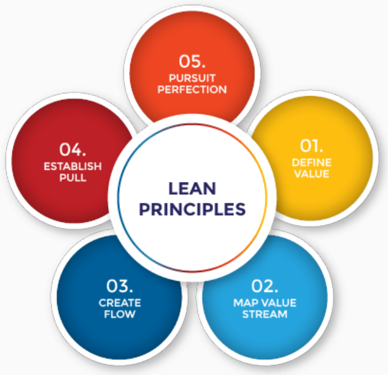
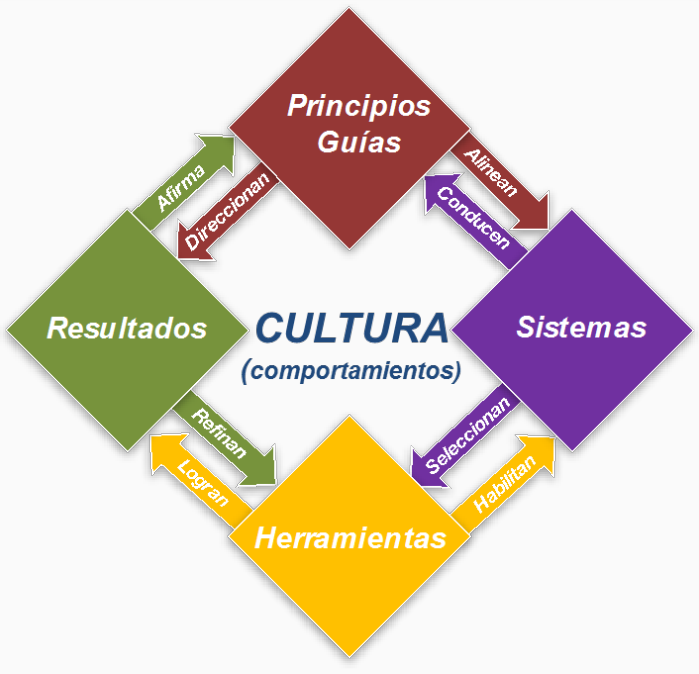
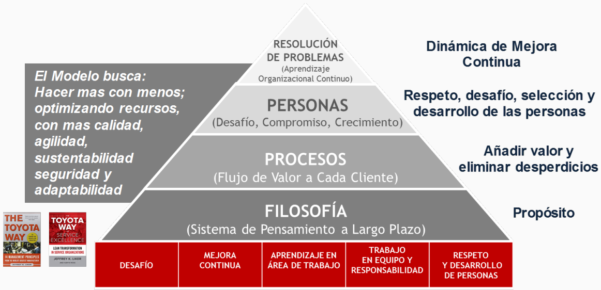
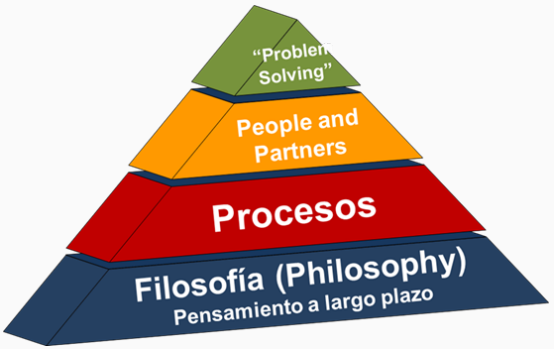

---
tags:
- flashcards/swe/teoria/1P
- flashcards/swe/teoria/U3
---

> [!NOTE]
>
> Más filosófico. Acompaña a los otros 2 approaches.

# LEAN

- Lean es una filosofía y un enfoque.
- Hace hincapié en la **eliminación de residuos o de no valor añadido al trabajo**, a través de un **enfoque en la mejora continua** para agilizar las operaciones.
- Lean se centra en ofrecer una mayor calidad, reducir el tiempo de ciclo y reducir los costos.

> [!NOTE]
>
> "Eliminación de residuos o de no valor añadido al trabajo": Se vio esto en la [[05-visiones-de-la-calidad#Visión de la manufactura|visión de la manufactura]].

---

¿Qué es LEAN y en qué consiste?
?
- Lean es una filosofía y un enfoque.
- Hace hincapié en la **eliminación de residuos o de no valor añadido al trabajo**, a través de un **enfoque en la mejora continua** para agilizar las operaciones.
- Lean se centra en ofrecer una mayor calidad, reducir el tiempo de ciclo y reducir los costos.
<!--SR:!2025-05-10,1,230-->

LEAN se relaciona con la visión de calidad ==1;;de la manufactura==.
<!--SR:!2025-05-10,1,230-->

---

## Gestión LEAN

El Modelo de gestión LEAN:

- Busca: **Guiar y reforzar** los principios LEAN de manera efectiva en toda la organización.
- Mediante: El uso de **distintas herramientas y sistemas** con sus **rutinas de trabajo**.
- Generando: Los comportamientos necesarios que conduzcan a los **resultados deseados**.
- Creando así:
	- Una cultura de **MEJORA CONTINUA de creación de VALOR al CLIENTE**.
	- Desarrollo de las **PERSONAS**.

> [!NOTE]
> 
> - Las flechas son los que generan la mejora continua.
> - Las personas son claves y por ello están en el centro.

---

¿En qué consiste la gestión LEAN?
?
- Busca: **Guiar y reforzar** los principios LEAN de manera efectiva en toda la organización.
- Mediante: El uso de **distintas herramientas y sistemas** con sus **rutinas de trabajo**.
- Generando: Los comportamientos necesarios que conduzcan a los **resultados deseados**.
- Creando así:
	- Una cultura de **MEJORA CONTINUA de creación de VALOR al CLIENTE**.
	- Desarrollo de las **PERSONAS**.
<!--SR:!2025-05-10,1,230-->

---

## Filosofía LEAN

Sistema de Gestión LEAN: 4Ps Ejes y 14 Principios de Gestión.

### Objetivo del modelo

- Hacer más con menos.
- Optimizando recursos.
- Con más calidad, agilidad, sustentabilidad, seguridad y adaptabilidad.

---

¿Cuáles son los objetivos del modelo LEAN?
?
- Hacer más con menos.
- Optimizando recursos.
- Con más calidad, agilidad, sustentabilidad, seguridad y adaptabilidad.
<!--SR:!2025-05-10,1,230-->

---

### 4Ps dentro de los ejes de LEAN

- Philosophy: Sistema de pensamiento a largo plazo.
	- Propósito.
	- ¿Cómo lo encaro?
- Processes: Flujo de valor a cada cliente.
	- Añadir valor y eliminar desperdicios.
	- Repasamos cada uno de los procesos y detalles, vemos dónde hay dolor y desperdicios.
- People: Desafío, compromiso, crecimiento.
	- Respeto, desafío, selección y desarrollo de las personas.
	- Repasamos a las personas que participan en el proceso, vemos dónde y cómo lo pueden hacerlo mejor.
- Problem solving: Aprendizaje organizacional continuo.
	- Dinámica de mejora continua.

Basados en los cimientos:

- Desafío.
- Mejora continua.
- Aprendizaje en área de trabajo.
- Trabajo en equipo y responsabilidad.
- Respeto y desarrollo de personas.

> [!NOTE]
>
> Todo se basa en "la forma de hacerlo mejor".

---

Nombrar los 4Ps ejes de LEAN y explicarlas.
?
- Philosophy: Sistema de pensamiento a largo plazo.
	- Propósito.
	- ¿Cómo lo encaro?
- Processes: Flujo de valor a cada cliente.
	- Añadir valor y eliminar desperdicios.
	- Repasamos cada uno de los procesos y detalles, vemos dónde hay dolor y desperdicios.
- People: Desafío, compromiso, crecimiento.
	- Respeto, desafío, selección y desarrollo de las personas.
	- Repasamos a las personas que participan en el proceso, vemos dónde y cómo lo pueden hacerlo mejor.
- Problem solving: Aprendizaje organizacional continuo.
	- Dinámica de mejora continua.
<!--SR:!2025-05-10,1,230-->

¿Cuáles son los cimientos de LEAN?
?
Basados en los cimientos:
- Desafío.
- Mejora continua.
- Aprendizaje en área de trabajo.
- Trabajo en equipo y responsabilidad.
- Respeto y desarrollo de personas.
<!--SR:!2025-05-10,1,230-->

---

## Principios del modelo LEAN

### Philosophy

1. Gestionar basado en una filosofía (propósito) de largo plazo.
	- e.g., si hacemos autos => Pensar cómo es la mejor forma de hacer autos y no remedios.

---

Explicar los principios asociados al eje Philosophy.
?
1. Gestionar basado en una filosofía (propósito) de largo plazo.
	- e.g., si hacemos autos => Pensar cómo es la mejor forma de hacer autos y no remedios.
<!--SR:!2025-05-10,1,230-->

---

### Procesos

2. Crear flujos de procesos continuos para evidenciar problemas.
	- No hacer la "gran avestruz".
3. Usar sistemas de procesos "PULL" para evitar la sobreproducción.
	- Kanban: PULL.
4. Nivelar la carga de trabajo: HEIJUNKA.
	- Heijunka: Equilibrar la carga de trabajo para obtener un flujo constante de producción, eliminando desperdicios y mejorando la eficiencia.
		- e.g., todos laburando al mismo %, no que hayan 4 laburando al 100% y 2 al 20%.
		- e.g., no pasar a testing las tareas con solamente 2 días de sprint.
	- Kanban: Identificación de cuellos de botella.
5. Generar una práctica y cultura de "parar" para resolver problemas y asegurar la calidad.
6. Estandarizar; base fundacional de la mejora continua y el empoderamiento de las personas.
	- No reinventar la rueda.
7. Utilizar controles visuales para evidenciar los problemas.
	- Kanban: Identificación de cuellos de botella.
8. Recurrir únicamente a tecnología confiable y correctamente testeada para servir a las personas y a los procesos.
	- No experimentar en el proceso, sino que probar la tecnología, testearla, entender bien cómo funciona y luego implementarla.

---

Explicar los principios asociados al eje Processes.
?
2. Crear flujos de procesos continuos para evidenciar problemas.
	- No hacer la "gran avestruz".
3. Usar sistemas de procesos "PULL" para evitar la sobreproducción.
	- Kanban.
4. Nivelar la carga de trabajo: HEIJUNKA.
	- Heijunka: Equilibrar la carga de trabajo para obtener un flujo constante de producción, eliminando desperdicios y mejorando la eficiencia.
		- e.g., todos laburando al mismo %, no que hayan 4 laburando al 100% y 2 al 20%.
		- e.g., no pasar a testing las tareas con solamente 2 días de sprint.
	- Kanban.
5. Generar una práctica y cultura de "parar" para resolver problemas y asegurar la calidad.
6. Estandarizar; base fundacional de la mejora continua y el empoderamiento de las personas.
	- No reinventar la rueda.
7. Utilizar controles visuales para evidenciar los problemas.
	- Kanban: Identificación de cuellos de botella.
8. Recurrir únicamente a tecnología confiable y correctamente testeada para servir a las personas y a los procesos.
	- No experimentar en el proceso, sino que probar la tecnología, testearla, entender bien cómo funciona y luego implementarla.
<!--SR:!2025-05-10,1,230-->

---

### People and Partners (colegas)

9. Desarrollar líderes que entiendan el trabajo, vivan la filosofía y se la enseñen a otros.
	- Para que sepan nuestra filosofía, nuestra forma de trabajar y nuestra procesos.
10. Desarrollar personas y equipos excepcionales que sigan la filosofía de su organización.
	- Por este motivo buscamos la mejora continua.
11. Respetar a tu red de contratistas y proveedores desafiándolos y ayudándolos a mejorar.
	- **Value stream (cadena de valor)**:
		- No es posible "ahorcar" a uno para el beneficio circunstancial del momento y "cagar" al que sigue.
		- e.g., si somos Ford y "apretamos" (sea porque no le pagamos, estipulamos un calendario no realista, etc.) a nuestro proveedor de cauchos => Nos quedamos sin ruedas y al final no tenemos autos.
		- e.g., no es posible contratar a una consulta, no pagarle por 4 meses => Eventualmente no nos querrá como cliente y se irá, dejándonos el lío.
		- e.g., en contextos de alta inflación, los bancos proactivamente ajustan los precios a proveedores sin que lo pidan, ya que son parte de la cadena de valor (tenemos que mantenerlos contentos, sino se nos van).

---

Explicar los principios asociados al eje People and Partners.
?
9. Desarrollar líderes que entiendan el trabajo, vivan la filosofía y se la enseñen a otros.
	- Para que sepan nuestra filosofía, nuestra forma de trabajar y nuestra procesos.
10. Desarrollar personas y equipos excepcionales que sigan la filosofía de su organización.
	- Por este motivo buscamos la mejora continua.
11. Respetar a tu red de contratistas y proveedores desafiándolos y ayudándolos a mejorar.
	- **Value stream (cadena de valor)**:
		- No es posible "ahorcar" a uno para el beneficio circunstancial del momento y "cagar" al que sigue.
		- e.g., si somos Ford y "apretamos" (sea porque no le pagamos, estipulamos un calendario no realista, etc.) a nuestro proveedor de cauchos => Nos quedamos sin ruedas y al final no tenemos autos.
		- e.g., no es posible contratar a una consulta, no pagarle por 4 meses => Eventualmente no nos querrá como cliente y se irá, dejándonos el lío.
		- e.g., en contextos de alta inflación, los bancos proactivamente ajustan los precios a proveedores sin que lo pidan, ya que son parte de la cadena de valor (tenemos que mantenerlos contentos, sino se nos van).
<!--SR:!2025-05-10,1,230-->

---

### Problem Solving

12. Ve y observa por ti mismo para comprender profundamente la situación (GENCHI GENBUTSU).
	- ¿Dónde estamos parados?
13. Tomar decisiones por consenso, teniendo en cuenta todas las opciones (NEMAWASHI), e implementar ágilmente.
14. Propiciar el proceso de convertirse en una organización que aprende a través de la reflexión (HANSEI) y la mejora continua (KAIZEN).
	- Espacios de reflexión y mejor continua.

---

Explicar los principios asociados al eje Problem Solving.
?
12. Ve y observa por ti mismo para comprender profundamente la situación (GENCHI GENBUTSU).
	- ¿Dónde estamos parados?
13. Tomar decisiones por consenso, teniendo en cuenta todas las opciones (NEMAWASHI), e implementar ágilmente.
14. Propiciar el proceso de convertirse en una organización que aprende a través de la reflexión (HANSEI) y la mejora continua (KAIZEN).
	- Espacios de reflexión y mejor continua.
<!--SR:!2025-05-10,1,230-->

---

> [!NOTE]
>
> - El CMMI contempla el aprendizaje y desarrollo de la gente.
> - La mejora continua se ve tanto en Scrum como en CMMI, también en Kanban.
> - Temas repetitivos respecto a "calidad". Lo tomamos como filosofía y lo aplicamos a nuestro proceso de desarrollo.
> - Tener presente estos principios para desarrollar SW profesionalmente.
