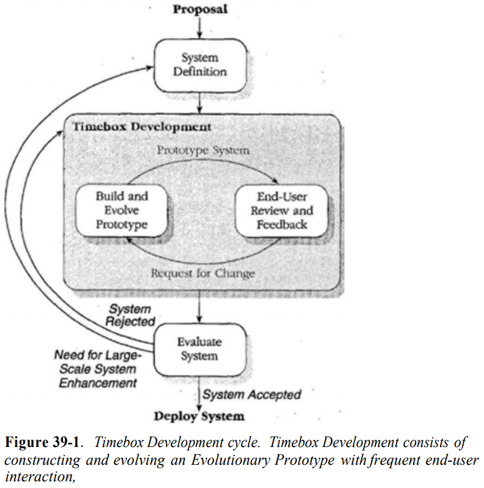
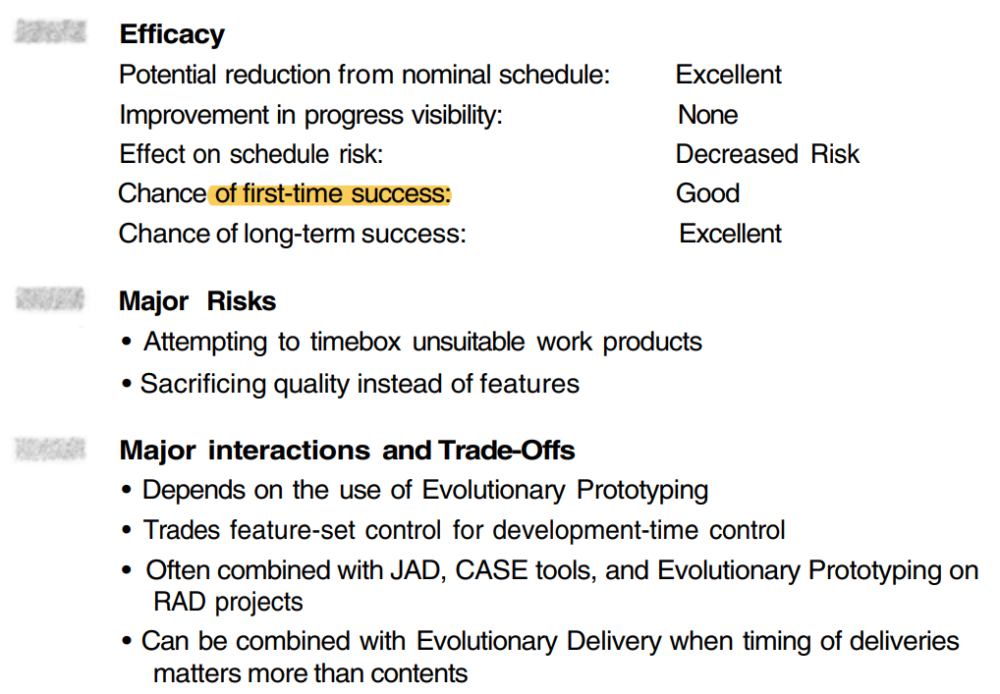

---
tags:
- flashcards/swe/teoria/1P
- flashcards/swe/teoria/U3
---

> [!NOTE]
>
> El autor hace una observación respecto a:
> - Cuántas tareas logramos completar el día previo a irnos de vacaciones.
> - Cuántas tareas dejamos de hacer o lo hacemos en menor medida el día previo a irnos de vacaciones.

# _Timebox Development_

- Analogía:
	- Aprovechamos la sensación de urgencia para preparar las vacaciones, solo que en su lugar lo hacemos para prepararnos a trabajar arduamente.
	- Produce varios resultados que permiten el desarrollo veloz.
- Permite especificar una cantidad máxima de tiempo en que estaremos construyendo un SW.
- Es posible construir cualquier alcance o tipo de sistema deseado, siempre y cuando restrinjamos dicho desarrollo a una cantidad de tiempo fija e inamovible.
- Redefinir el producto tal que quepa en el calendario >>> Redefinir el calendario tal que quepa el proyecto.

> [!NOTE]
>
> - Nace a partir de un compromiso de entrega.
> - Al hacer los números, pareciera que no se llega y hay que ajustar tiempos. El grueso del tiempo se ajusta en la etapa de construcción.

---

Nombrar los beneficios del _timebox development_ y explicar cada una.
?
- Prioriza el calendario:
	- **Calendario obligatoriamente fijo e inamovible**.
	- Enfatiza que el calendario es la dimensión más importante.
	- Límite de tiempo ("_timebox_"): Es tan importante que prima por sobre cualquier otra dimensión.
	- e.g., si el alcance del proyecto conflictúa con el límite de tiempo => Reducir scope.
- Evita el problema 90-90:
	- En varios proyectos se llega el punto en donde se completó el 90% y se mantienen en dicho punto durante meses o incluso años.
	- El estancamiento del proyecto consume muchos recursos.
	- En vez de optar por la construcción de una 1° versión funcionalmente completa:
		- Es más eficiente lograr una versión básica funcional (MVP).
		- Aprender de la experiencia.
		- Construir una 2° versión a posteriori.
- Clarifica las prioridades en features:
	- Proyectos consumen grandes cantidades de tiempo ponderando features que poseen poco impacto sobre la utilidad del producto.
		- "¿Pasar las próximas 4 semanas implementando impresión a color, o es suficiente blanco y negro?"
		- "¿El botón debe ser más ancho en 1 o 2 píxeles?"
		- "¿La aplicación debe volver a abrir un archivo en la última ubicación en donde fue cerrada o simplemente al principio?"
	- Features de mayor impacto (primeras en la lista) >>> Features de baja o moderada prioridad.
- Limita el _gold-plating_ del desarrollador:
	- Dentro de lo especificado, es posible implementar una feature mediante varias formas.
	- Usualmente existen versiones de una feature luego de haberlas implementado por 2 días, 2 semanas y 2 meses.
	- Ausencia del establecimiento de un _timebox_ => La elección de la implementación es dejada en manos de los desarrolladores, tal que la misma se basa en sus propios objetivos de calidad, usabilidad o nivel de interés, respecto al diseño e implementación de una feature.
	- El _timeboxing_ deja en claro la versión de la feature deseada en base la cantidad de días especificados.
- Controla el _feature creep_:
	- Feature Creep: Usualmente es una función del tiempo y en promedio se manifiesta 1% de las veces en cada mes sobre proyectos.
	- _Timebox_ permite controlarlo de 2 formas: Al reducir el ciclo de desarrollo:
		1. Se reduce la cantidad de personas que presionan por nuevas features.
		2. Se reduce la cantidad variaciones del mercado o de los entornos operacionales (sistemas de cómputo en donde el SW será deployado) y, por consiguiente, se reduce la cantidad de modificaciones del SW relacionados a éstos.
- Ayuda a motivar a los desarrolladores y usuarios finales:
	- Nos gusta sentir que el trabajo que hacemos es importante.
	- Una sensación de urgencia:
		- Puede contribuir a dicha sensación de importancia.
		- Puede ser un fuerte motivador.
<!--SR:!2025-05-11,1,230-->

---

## Prioriza el calendario

- **Calendario obligatoriamente fijo e inamovible**.
- Enfatiza que el calendario es la dimensión más importante.
- Límite de tiempo ("_timebox_"): Es tan importante que prima por sobre cualquier otra dimensión.
- e.g., si el alcance del proyecto conflictúa con el límite de tiempo => Reducir scope.

## Evita el problema 90-90

- En varios proyectos se llega el punto en donde se completó el 90% y se mantienen en dicho punto durante meses o incluso años.
- El estancamiento del proyecto consume muchos recursos.
- En vez de optar por la construcción de una 1° versión funcionalmente completa:
	- Es más eficiente lograr una versión básica funcional (MVP).
	- Aprender de la experiencia.
	- Construir una 2° versión a posteriori.

## Clarifica las prioridades en features

- Proyectos consumen grandes cantidades de tiempo ponderando features que poseen poco impacto sobre la utilidad del producto.
	- "¿Pasar las próximas 4 semanas implementando impresión a color, o es suficiente blanco y negro?"
	- "¿El botón debe ser más ancho en 1 o 2 píxeles?"
	- "¿La aplicación debe volver a abrir un archivo en la última ubicación en donde fue cerrada o simplemente al principio?"
- Features de mayor impacto (primeras en la lista) >>> Features de baja o moderada prioridad.

## Limita el _gold-plating_ del desarrollador

- Dentro de lo especificado, es posible implementar una feature mediante varias formas.
- Usualmente existen versiones de una feature luego de haberlas implementado por 2 días, 2 semanas y 2 meses.
- Ausencia del establecimiento de un _timebox_ => La elección de la implementación es dejada en manos de los desarrolladores, tal que la misma se basa en sus propios objetivos de calidad, usabilidad o nivel de interés, respecto al diseño e implementación de una feature.
- El _timeboxing_ deja en claro la versión de la feature deseada en base la cantidad de días especificados.

## Controla el _[[08-obl-paper-classic-mistakes#Feature creep (Exceso de features/Funcionalidad que fluye)|feature creep]]_

- Feature Creep: Usualmente es una función del tiempo y en promedio se manifiesta 1% de las veces en cada mes sobre proyectos.
- _Timebox_ permite controlarlo de 2 formas: Al reducir el ciclo de desarrollo:
	1. Se reduce la cantidad de personas que presionan por nuevas features.
	2. Se reduce la cantidad variaciones del mercado o de los entornos operacionales (sistemas de cómputo en donde el SW será deployado) y, por consiguiente, se reduce la cantidad de modificaciones del SW relacionados a éstos.

## Ayuda a motivar a los desarrolladores y usuarios finales

- Nos gusta sentir que el trabajo que hacemos es importante.
- Una sensación de urgencia:
	- Puede contribuir a dicha sensación de importancia.
	- Puede ser un fuerte motivador.

# Empleo del _Timebox Development_

- El _timebox development_ es una práctica de la fase de **construcción** del SW.
- Primero se implementan las funciones más importantes, mientras que las menos esenciales conforme lo permita el tiempo.
- El sistema crece como una cebolla: Las funciones esenciales en el núcleo y las demás en las capas exteriores.
- La construcción en _timebox development_ consiste en el desarrollo de un prototipo y evolucionarla al sistema funcional final.
- Usualmente incluye alto involucramiento de usuarios finales y revisiones continuas del sistema en desarrollo.
- Duración del _timebox development_: 60~120 días.
	- Períodos más cortos: Usualmente no alcanzan para desarrollar un sistema significativo.
	- Períodos más largos: No generan la sensación de urgencia necesaria.
	- Si el proyecto es muy grande para que quepa en 120 días => Es subdividido en varios proyectos _timebox_, tal que cada uno de éstos sean desarrollables en 120 días.

- Posterior a la fase de construcción, el sistema es evaluado y es posible elegir una de las siguientes 3 opciones:
	1. Aceptar el sistema y ponerla en producción.
	2. Rechazar el sistema, ya que es considerado una falla en la construcción.
		- e.g., puede que sea por calidad insuficiente o que el equipo de desarrollo no haya podido implementar la mínima cantidad de funcionalidades necesarias que conformen el núcleo del sistema.
		- En este caso la organización puede llevar a cabo un nuevo esfuerzo de _timebox development_.
	3. Rechazar el sistema, ya que no satisface las necesidades de la organización que lo ha construido.
		- e.g., una conclusión válida del _timebox development_ es que el equipo haya desarrollado el sistema núcleo, identificado previo al inicio del _timebox development_, pero los usuarios finales concluyen que dicho sistema no es lo que querían.
		- En este caso el trabajo comienza nuevamente en la etapa de _definición del sistema_.
- Personas que evalúan el sistema ("Evaluate System") son:
	- Sponsor ejecutivo.
	- 1 o más usuarios claves.
	- QA o representante de mantenimiento.
	- Puede que también estén involucrados personal de suporte técnico y auditoría.
- Más allá del resultado, es crucial entender que **para garantizar el éxito a largo plazo del _timeboxing_, el _timebox_ no puede ser extendido**.
	- **La fecha fin del _timebox_ no es una _fecha de vencimiento_, sino que es una _fecha de entrega_**.
	- Cualquier cosa completada por el equipo al final del _timebox_, será lo que se pondrá en operación, o en su defecto será rechazada.
	- En caso de que la organización posea un histórico de haber extendido las fechas de entrega del _timeboxing_ => Desarrolladores tomarán a la ligera la fecha de entrega y se perderá gran parte del valor de la práctica.

---

Explicar las 3 posibilidades del _timebox development_ posterior a la fase de construcción.
?
El sistema es evaluado y es posible elegir una de las siguientes 3 opciones:
1. Aceptar el sistema y ponerla en producción.
2. Rechazar el sistema, ya que es considerado una falla en la construcción.
	- e.g., puede que sea por calidad insuficiente o que el equipo de desarrollo no haya podido implementar la mínima cantidad de funcionalidades necesarias que conformen el núcleo del sistema.
	- En este caso la organización puede llevar a cabo un nuevo esfuerzo de _timebox development_.
3. Rechazar el sistema, ya que no satisface las necesidades de la organización que lo ha construido.
	- e.g., una conclusión válida del _timebox development_ es que el equipo haya desarrollado el sistema núcleo, identificado previo al inicio del _timebox development_, pero los usuarios finales concluyen que dicho sistema no es lo que querían.
	- En este caso el trabajo comienza nuevamente en la etapa de _definición del sistema_.
<!--SR:!2025-05-11,1,230-->

Más allá del resultado, es crucial entender que para garantizar el éxito a largo plazo del _timeboxing_, el _timebox_ ==1;;no puede ser extendido==.
<!--SR:!2025-05-11,1,230-->

---

## Criterios de entrada para el _Timebox Development_

Esta práctica no es la adecuada para cualquier tipo de desarrollo. Las siguientes son directrices para poder discernir si es adecuado para nuestro proyecto.

### Lista priorizada de features

- Los usuarios finales o clientes deben tener una lista priorizada de las features del sistema, para así permitir a los desarrolladores discernir cuáles son las esenciales y cuáles son las opcionales ("nice to have").
- Deben tener definido un conjunto reducido de features principales que estemos seguros que podamos implementarlos dentro del marco del tiempo del _timebox_.
- En caso de que la priorización no pueda ser realizada => El _timebox development_ no es adecuado para el sistema en cuestión.

### Estimaciones de calendarios realistas creadas por el equipo _timebox_

- El equipo de construcción debe estimar cuánto tiempo necesitan (usualmente 60~120 días) y cuántas funcionalidades creen que pueden implementar dentro de dicho período.
- Es esencial que el equipo cree sus propias estimaciones.
- _Timeboxing_ es una práctica ambiciosa: No será exitosa si los desarrolladores se enfrentan a una combinación imposible calendario y funcionalidad.

### Tipo de proyecto adecuado

- El _timeboxing_ es el más adecuado para una empresa que desarrolla sus propios sistemas (in-house business SW).
- Es una práctica de prototipado evolucionaria y debe ser construida con:
	- Lenguajes de rápido desarrollo (RDL).
	- Herramientas CASE: Diversas aplicaciones informáticas destinadas a aumentar el balance en el desarrollo de SW, reduciendo el costo de las mismas en términos de tiempo y de dinero.
	- Otras herramientas que soporten generación de código extremadamente rápida.
- Aquellas aplicaciones que dependan altamente de una codificación manual personalizada, usualmente no son los proyectos apropiados para el _timebox development_.
- Previo al inicio del proyecto _timebox_: Verificar que podamos construir el proyecto con el conjunto de herramientas y personal ya disponibles.

### Involucramiento suficiente del usuario final

- Al igual que cualquier otra actividad basada en prototipado:
	- El éxito del _timebox development_ yace en buen feedback por parte del usuario final.
- En caso de no poder obtener el nivel adecuado de involucramiento por parte del usuario final => Mejor no usar _timebox_.

## El equipo _Timebox_

- Consiste de 1~5 personas.
- El "equipo completo": Incluye también a los usuarios finales designados para ayudar al equipo de construcción.
- Deben ser altamente calificados en desarrollar sistemas mediante el SW de desarrollo rápido empleado. No existe tiempo para aprender una nueva tecnología en un proyecto _timebox_.
- Deben ser altamente motivados: La urgencia creada por la práctica + habilidad de lograr el nivel de productividad.
- James Martin recomienda lo siguiente para la motivación en un proyecto _timebox_: Decirle a los desarrolladores que:
	- Serán juzgados por si logran crear o no un sistema que es al final del día aceptado. Mencionar que la mayoría de los esfuerzos _timebox_ son exitosos y que no se deberían sentirse orgullosos por ser partícipe de los casos de fracaso inusuales de la práctica.
	- El éxito será recompensado y que sus esfuerzos son visibles por la gerencia alta. Cumplir con la recompensa.
	- En caso de que sean exitosos, se hará una celebración de victoria grande. Cumplir con la celebración.
	- PD: No emplear los consejos de Martin sin primero pensar cómo las cuestiones de "motivación" se aplican a nuestro contexto en particular.

## Variaciones del _Timebox Development_

- La práctica es usualmente empleada sobre las fases de diseño y construcción de sistemas de negocios.
- Usualmente no es adecuado para desarrollar productos SW enlatados, debido a la gran cantidad de tiempo que conlleva.
- La práctica puede ser empleada como una estrategia para desarrollar partes de un sistema SW:
	- e.g., prototipos de UI o prototipos desechables de un proyecto de SW enlatado.
- Los _timeboxes_ para prototipos son mucho más cortos que el tiempo recomendado para los sistemas de información (en el orden de 6~12 en vez de 60~120 días).
- El equipo de desarrollo debe definir un _timebox_ que les haga sentido para un prototipo en específico que estén construyendo.
- Es posible emplear el _timeboxing_ en una variedad de actividades de implementación:
	- e.g., construcción de SW, generación de pantallas de ayuda, documentación de usuario, prototipo desechables, desarrollo de capacitaciones, etc.

# Gestión de riesgos del _Timebox Development_

Al siguiente son algunos de los problemas con el _timeboxing_.

---

¿Cuáles son los 2 errores más comunes al adoptar _timebox development_?
?
- Adoptar el _timeboxing_ para productos de trabajo no adecuados.
- Sacrificar calidad en vez de _features_.
<!--SR:!2025-05-11,1,230-->

---

## Adoptar el _timeboxing_ para productos de trabajo no adecuados

- No se recomienda emplear el _timeboxing_ para actividades iniciales de la cadena alimenticia:
	- e.g., planificación del proyecto, análisis de requerimientos o diseño.
	- Esto es porque el trabajo de dichas actividades poseen grandes implicaciones a posteriori:
		- e.g., un PM intenta achicar el tiempo invertido sobre las actividades iniciales => Se termina entregando SW más tarde debido a que un error de $100, que pudo haberse evitado en la etapa de análisis de requerimientos, terminó costando $20000 en etapas posteriores.
	- El "tiempo ahorrado" en etapas iniciales del proyecto usualmente es un falso ahorro.
- Es recomendado emplear el _timeboxing_ al final de la cadena alimenticia, ya que la penalidad por "baja calidad" se encuentra limitada en tirar el trabajo del _timebox_ y comenzar nuevamente, permaneciendo inafectado los otros trabajos.

## Sacrificar calidad en vez de _features_

- No se recomienda emplear el _timeboxing_ si los clientes no se comprometen a la práctica de acortar el alcance, en vez de la calidad.
- Los desarrolladores ya poseen suficiente trabajo en lograr objetivos que conflictúan entre sí. Si el cliente insiste respecto a un calendario surrealista, alta calidad y varios features => No se logrará ninguno de los 3 objetivos y la calidad flaqueará.
- Una vez que la calidad comienza flaquear => El calendario flaquea también. El equipo produce SW todo el alcance estipulado para la fecha de entrega, pero la calidad es tan pobre que costará más tiempo en llevar al SW a un nivel de calidad aceptable.
- El verdadero _timeboxing_ hace que el SW sea aceptado o descartado en la fecha de entrega. Esto implica que el nivel de calidad debe ser el aceptable en todo momento y que el éxito del _timeboxing_ depende en limitar el alcance ante un calendario surrealista, no su calidad.

# Efectos secundarios del _Timebox Development_

- La influencia se encuentra limitada a acortar el calendario de desarrollo.
- Usualmente no posee ninguna influencia (+ o -) sobre la calidad, usabilidad, funcionalidad u otros atributos del producto.

# Conclusiones del _Timebox Development_

- Produce una productividad extraordinaria.
- Conlleva pocos riesgos: La evaluación del sistema y su posible rechazo es una parte explícita de la práctica.
- Las claves para ser exitosos ante la adopción del _timeboxing_ son:
	- Emplearlo solamente en proyecto que puedan ser completados dentro del límite de tiempo (usualmente de 60~120 días).
	- Asegurarnos que:
		- Usuarios finales y gerencia hayan negocien un conjunto indispensable de funcionalidades, tal que el equipo de construcción crea que es posible implementarlo dentro del límite de tiempo.
		- Las funcionalidades sean priorizadas y que, en caso de ser necesario, algunas puedan ser desestimadas del producto final para poder lograr con el calendario.
		- El equipo esté dispuesto para un proyecto _timebox_ muy ambicioso. Proveer cualquier soporte emocional necesario.
	- Mantener un nivel alto de calidad a lo largo del _timebox_.
	- En caso de ser necesario, acortar funcionalidades para lograr con la fecha de entrega. No atrasar la fecha de entrega del _timebox_.
	- Más adecuado para una empresa que desarrolla sus propios sistemas (in-house business SW).
	- También, es adecuado para emplearse sobre partes específicas de:
		- Proyectos de SW personalizado.
		- Proyectos de SW enlatado.

---

(Control U3) ¿Qué es _Timebox Development_ y que pre-requisitos tiene para aplicar?
?
- El _timebox development_:
	- Es una práctica de la fase de **construcción** del SW.
	- Es una práctica que consta de redefinir el producto tal que quepa en el calendario **fijo e inamovible** (**cota inferior y superior**), por sobre redefinir el calendario tal que quepa el proyecto.
	- La construcción consiste en el desarrollo de un prototipo y evolucionarla a la forma funcional final del sistema.
	- Prioriza el calendario en un proyecto de desarrollo de SW (aunque se aclara que no hay que confundirnos en sacrificar calidad en vez del alcance).
	- Hace uso de la sensación de urgencia para preparar las vacaciones, solo que en su lugar lo hacemos para prepararnos a trabajar arduamente.
- Pre-requisitos:
	- Asegurarse que el proyecto pueda ser completado dentro del límite de tiempo (usualmente de 60~120 días).
		- Períodos más cortos: Usualmente no alcanzan para desarrollar un sistema significativo.
		- Períodos más largos: No generan la sensación de urgencia necesaria.
		- Si el proyecto es muy grande para que quepa en 120 días => Es subdividido en varios proyectos _timebox_, tal que cada uno de éstos sean desarrollables en 120 días.
	- Asegurarse que usuarios finales y gerencia hayan negociado un **conjunto indispensable de funcionalidades bien en claras y estimadas**, tal que el equipo de construcción crea que es posible implementarlo dentro del límite de tiempo.
		- Comprometer dicho conjunto indispensable: Es inadmisible que esté mal definido este conjunto.
		- Esto hay que hacerlo sin perder usabilidad ni tampoco calidad.
	- Asegurarse que las estimaciones de calendarios considerados realistas sean creadas por el equipo.
	- Asegurarse que las funcionalidades sean priorizadas y que, en caso de ser necesario, algunas puedan ser desestimadas del producto final para poder lograr con el calendario.
	- Asegurarse que el equipo esté dispuesto para un proyecto _timebox_ muy ambicioso. Proveer cualquier soporte emocional necesario.
		- El equipo debe ser lo suficientemente "senior". No se estará aprendiendo nuevas cosas, sino que se estará tratando de solventar el problema en cuestión.
		- Las personas involucradas no lo hacen por el amor al arte: Probablemente quieren una retribución debido al esfuerzo extra durante este período, bonos, promociones, etc.
	- Asegurarse que el tipo de proyecto sea el adecuado:
		- Más adecuado para una empresa que desarrolla sus propios sistemas (_in-house business SW_).
		- También, es adecuado para emplearse sobre partes específicas de:
			- Proyectos de SW personalizado.
			- Proyectos de SW enlatado.
		- Emplearlo sobre la etapa de construcción:
			- Las etapas iniciales (planificación del proyecto, análisis de requerimientos o diseño) pueden contraer grandes implicaciones a posteriori, al querer lograr un "falso ahorro de tiempo".
			- La penalidad por "baja calidad" sobre las actividades de construcción o posteriores son bajos, ya que simplemente consta de descartar el trabajo del _timebox_ y comenzar nuevamente, manteniendo inafectado los demás trabajos.
			- También, puede que las actividades de etapas iniciales recaigan en un _classic mistake_ como el _analysis paralysis_, constantemente analizando en vez de construir y avanzar (el tiempo acotado no se presta para esto).
	- Asegurarse que el usuario final garantice involucramiento suficiente por su parte.
	- Asegurarse de un nivel alto de calidad a lo largo del _timebox_.
		- No sacrificar calidad en pos de tener un feature nuevo.
	- Eventualmente, asegurarse de acortar funcionalidades para lograr con la fecha de entrega y tener como prohibido atrasar la fecha de entrega del _timebox_.
<!--SR:!2025-05-11,1,230-->

V o F. El _timebox development_ usualmente incluye revisiones continuas del sistema en desarrollo.::V.
<!--SR:!2025-05-11,1,230-->

V o F. El _timebox development_ permite estimar el calendario del proyecto.::F. El _timebox development_ es una práctica en donde primero se establece el calendario, haciendo que el producto calce en dicho calendario. No se realiza una estimación, sino que se **establece** un calendario.
<!--SR:!2025-05-11,1,230-->

---
