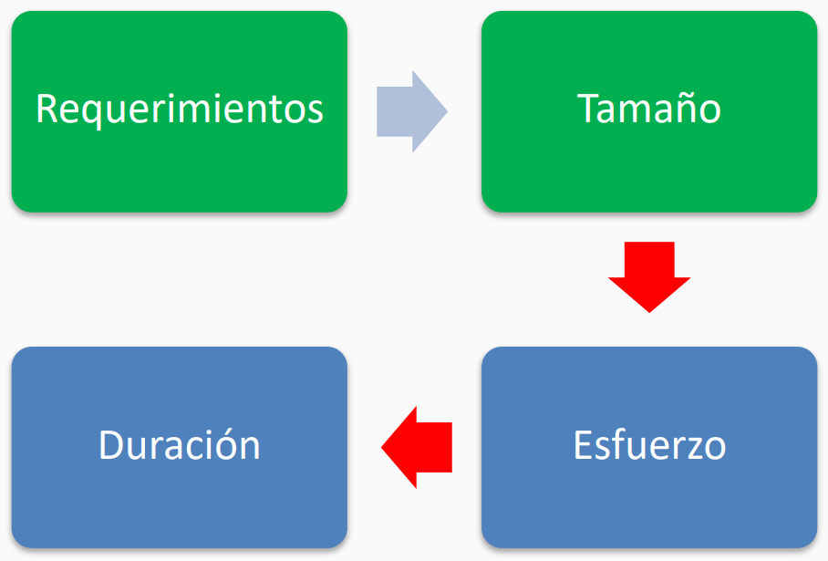
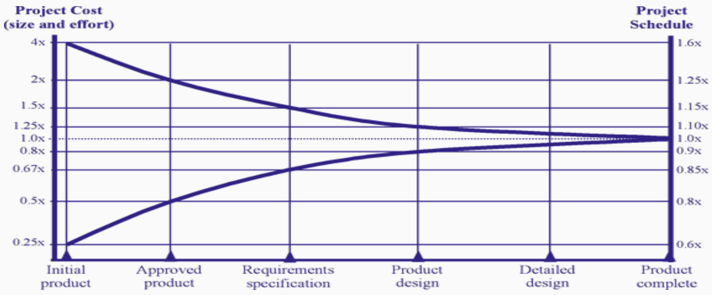
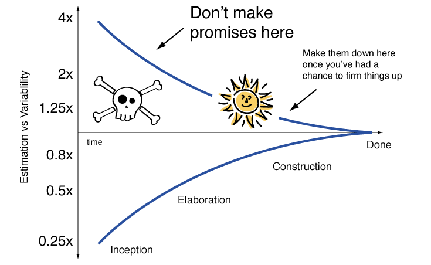
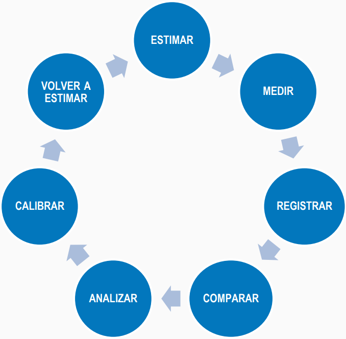

---
tags:
- flashcards/swe/teoria/1P
- flashcards/swe/teoria/U4
---

> [!IMPORTANT]
>
> DISCLAIMER: Se usa muy a la ligera "Tiempo" como si fuese un sinónimo de "Esfuerzo". Debería considerarse en cada caso si "Tiempo" significa "Esfuerzo" o bien significa "Duración". PREGUNTAR EN EL PARCIAL SI APARECE ALGO CON "Tiempo".

# Fundamentos de estimaciones

> No se busca ser perfectos estimando, sino que poder tener un conjunto de herramientas para mejorar el proceso de estimación.

## ¿Qué preguntas nos hacemos al estimar?

- La mayoría de las veces nos preguntamos:
	- ¿Cuánto **tiempo** vamos a tardar en desarrollar el proyecto?
	- ¿Cuántas **horas/personas** se necesitan para desarrollarlo?
	- ¿Cuánto **va a costar** el proyecto?
- Son pocas las veces que nos preguntamos: ¿Cuál es el **tamaño** de lo que tenemos que construir?
	- ¡¡¡Esta pregunta debería ser la primera para poder pasar a las anteriores!!!
		- Debe ser la primera pregunta ya que **es una forma de medir las cosas sin asociarlo a un ser humano**.
			- e.g., la persona que está estimando tiene un mal día y esto lo sesga en la estimación.
		- Pasa a ser algo intangible: No importa quién lo tome siempre será la misma cantidad.
	- La realidad parece indicarnos que el tamaño se calcula informalmente y solo formalizamos el esfuerzo, ventana y costo.
	- Debemos ser lo mas rigurosos posibles con la estimación del tamaño => Nos da una estimación más fiable.

## El proceso de estimar (normalmente)

1. Requerimientos.
2. Tamaño: Qué tan complejo es hacer algo.
3. Esfuerzo.
4. Duración.
5. Costo.

- Rectángulos verdes: Variables del proceso de estimación que son **independientes del contexto**:
	- Siempre representan y valen lo mismo para cualquier particularización que se aplique en los pasos siguientes.
	- No se asocian a las personas, ni tampoco a los procesos que siguen dichas personas.
	- Requerimiento: Es un requerimiento y punto, no importa en qué formato lo recibamos.
	- Tamaño: Es algo que no tiene que ver con las personas que lo vayan a llevar a cabo, ni tampoco el contexto.
- Rectángulos azules: Variables del proceso de estimación que son **dependientes del contexto**:
	- Asociados a la situación-contexto del momento: Se asocian a las personas y los procesos que siguen dichas personas.
	- Esfuerzo:
		- Todavía no son relevantes las personas, los procesos, ni tampoco la forma en que se ejecutarán las tareas.
		- Será el mismo, pero la duración probablemente cambie.
		- Transformación del tamaño a horas hombres.
	- Duración:
		- Se aplica la calendarización sobre el esfuerzo, en base a ciertas reglas y se particulariza para un cierto contexto: El equipo, los procesos que siguen y el ámbito en el cuál estará inmerso dicho esfuerzo (e.g., horas laborales, ausencia programada, etc.).
		- e.g., no es lo mismo calendarizar con un equipo que no conocemos Vs. somos siempre las mismas personas con las que trabajamos juntos.
		- Que calendarizar un equipo que se arma y desarma cada vez que se crea un proyecto, e.g., consultora.
	- Costo: Es una consecuencia de tener claro el esfuerzo, la duración, el equipo, etc.
- e.g., podemos encomendar a 2 empresas distintas el mismo trabajo, aportándoles como input los mismos requerimientos y tamaño:
	- Conversión Requerimientos -> Tamaño: Independientes de las personas y procesos que sigan.
	- Cada equipo luego nos hacen sus estimaciones de esfuerzo y duración, en base a las personas del equipo y los procesos que sigan. Tranquilamente podrían ser distintos.
		- Conversión Tamaño -> Esfuerzo: Evaluarlas en Horas-Hombre.
		- Conversión Esfuerzo -> Duración: Poseen varios factores a tener presentes:
			- e.g., si es un proyecto de 1 año, ponerle al menos 15 días más de vacaciones a todo el mundo.
			- e.g., si es un proyecto con personas que varios son estudiantes, ponerle 10 días más por días de estudio.

---

(Control U4) El tiempo (esfuerzo) y la duración de los proyectos, ¿se relacionan linealmente o exponencialmente?
?
- Sea cual fuere el contexto en el que estemos inmersos, sigue siendo imposible establecer una linealidad entre tiempo (esfuerzo) y duración.
- Existen diversos factores que entran en juego (Pensar en las [[06.1-ley-de-brooks#En contra la Ley de Brooks Condiciones para que agregar más gente no sea un problema|condiciones para que la Ley de Brooks no sea un inconveniente]]).
- Estos factores hacen que, dado un esfuerzo, se tienda que haya un mayor crecimiento sobre la duración en comparación al esfuerzo.
- Estos factores inciden sobre las personas y procesos.
<!--SR:!2025-05-11,1,230-->

Describir el proceso de estimación y sus elementos incidentes.
?
1. Requerimientos.
2. Tamaño: Qué tan complejo es hacer algo.
3. Esfuerzo.
4. Duración.
5. Costo.
- Rectángulos verdes: Variables del proceso de estimación que son **independientes del contexto**:
	- Siempre representan y valen lo mismo para cualquier particularización que se aplique en los pasos siguientes.
	- No se asocian a las personas, ni tampoco a los procesos que siguen dichas personas.
	- Requerimiento: Es un requerimiento y punto, no importa en qué formato lo recibamos.
	- Tamaño: Es algo que no tiene que ver con las personas que lo vayan a llevar a cabo, ni tampoco el contexto.
- Rectángulos azules: Variables del proceso de estimación que son **dependientes del contexto**:
	- Asociados a la situación-contexto del momento: Se asocian a las personas y los procesos que siguen dichas personas.
	- Esfuerzo:
		- Todavía no son relevantes las personas, los procesos, ni tampoco la forma en que se ejecutarán las tareas.
		- Será el mismo, pero la duración probablemente cambie.
		- Transformación del tamaño a horas hombres.
	- Duración:
		- Se aplica la calendarización sobre el esfuerzo, en base a ciertas reglas y se particulariza para un cierto contexto: El equipo, los procesos que siguen y el ámbito en el cuál estará inmerso dicho esfuerzo (e.g., horas laborales, ausencia programada, etc.).
		- e.g., no es lo mismo calendarizar con un equipo que no conocemos Vs. somos siempre las mismas personas con las que trabajamos juntos.
		- Que calendarizar un equipo que se arma y desarma cada vez que se crea un proyecto, e.g., consultora.
	- Costo: Es una consecuencia de tener clara la duración, el equipo, etc.
- e.g., podemos encomendar a 2 empresas distintas el mismo trabajo, aportándoles como input los mismos requerimientos y tamaño:
	- Conversión Requerimientos -> Tamaño: Independientes de las personas y procesos que sigan.
	- Cada equipo luego nos hacen sus estimaciones de esfuerzo y duración, en base a las personas del equipo y los procesos que sigan. Tranquilamente podrían ser distintos.
		- Conversión Tamaño -> Esfuerzo: Evaluarlas en Horas-Hombre.
		- Conversión Esfuerzo -> Duración: Poseen varios factores a tener presentes:
			- e.g., si es un proyecto de 1 año, ponerle al menos 15 días más de vacaciones a todo el mundo.
			- e.g., si es un proyecto con personas que varios son estudiantes, ponerle 10 días más por días de estudio.
<!--SR:!2025-05-11,1,230-->

---

### ¿Qué es "esfuerzo"?

- Cantidad de horas-hombres ininterrumpidas de persona capacitada para resolver una tarea de principio a fin.
- e.g. 24 horas (ininterrumpidas) de construcción.
	- Si arrancamos ahora a la 19:30 -> lo terminamos mañana a la 19:30.
	- No obstante, esto no ocurre en la vida real (por favor no).
- La unidad usual empleada habitualmente para "esfuerzo": Horas-Hombre (HH).

---

#exam-question 

¿Qué es "esfuerzo"?
?
- Cantidad de horas-hombres ininterrumpidas de persona capacitada para resolver una tarea de principio a fin.
- e.g. 24 horas (ininterrumpidas) de construcción.
	- Si arrancamos ahora a la 19:30 -> lo terminamos mañana a la 19:30.
	- No obstante, esto no ocurre en la vida real (por favor no).
- La unidad usual empleada habitualmente para "esfuerzo": Horas-Hombre (HH).
<!--SR:!2025-05-11,1,230-->

---

### ¿Qué es "duración"?

- La duración es la calendarización de un esfuerzo mediante reglas.
	- e.g., calendario del país de origen del staff, seniority, etc.
	- e.g., una de esas reglas puede ser la nueva tecnología, esto lo sabemos cuando conocemos al equipo.
- El "esfuerzo" se transforma en duración cuando consideramos los hechos:
	- "En Argentina todos trabajan 8 horas por día".
	- "La gente debe dormir".
	- "La gente debe comer".
- Por ende (ejemplo):
	- El esfuerzo: 24 horas.
	- La duración: 3 días.
- La unidad usual empleada habitualmente para "duración": Depende el tamaño, pero usualmente: Días, semanas, meses, una calendarización.
- Las herramientas más populares son: Gantt, MS Project, herramientas símiles para planificación de proyectos, etc.
- La calendarización puede implicar una curva de aprendizaje.

---

#exam-question 

¿Qué es "duración"?
?
- La duración es la calendarización de un esfuerzo mediante reglas.
	- e.g., calendario del país de origen del staff, seniority, etc.
	- e.g., una de esas reglas puede ser la nueva tecnología, esto lo sabemos cuando conocemos al equipo.
- El "esfuerzo" se transforma en duración cuando consideramos los hechos:
	- "En Argentina todos trabajan 8 horas por día".
	- "La gente debe dormir".
	- "La gente debe comer".
- Por ende (ejemplo):
	- El esfuerzo: 24 horas.
	- La duración: 3 días.
- La unidad usual empleada habitualmente para "duración": Depende el tamaño, pero usualmente: Días, semanas, meses, una calendarización.
- Las herramientas más populares son: Gantt, MS Project, herramientas símiles para planificación de proyectos, etc.
- La calendarización puede implicar una curva de aprendizaje.
<!--SR:!2025-05-11,1,230-->

---

## ¿Por qué fallan las estimaciones?

- Optimismo.
- Estimaciones informales ("estomacales").
- No hay historia.
- Mala definición del alcance.
- Novedad / Falta de Experiencia.
- Complejidad del problema a resolver.
- No se estima el tamaño.
- Porque la estimación fue buena pero cuando empieza el proyecto:
	- Mala administración de los requerimientos.
	- No hay seguimiento y control.
	- Se confunde progreso con esfuerzo.

> [!NOTE]
>
> - En el [[02-cynefin#Contexto Complicado|entorno complicado]], las estimaciones deberían ser más precisas que en los [[02-cynefin#Contexto Complejo|entornos complejos]].
> - Para cualquier contexto: Una estimación puede ser más precisa en comparación a otro contexto, no obstante, sigue siendo imposible establecer una linealidad entre esfuerzo (Tiempo) y duración.

---
¿Por qué fallan las estimaciones?
?
- Optimismo.
- Estimaciones informales ("estomacales").
- No hay historia.
- Mala definición del alcance.
- Novedad / Falta de Experiencia.
- Complejidad del problema a resolver.
- No se estima el tamaño.
- Porque la estimación fue buena pero cuando empieza el proyecto:
	- Mala administración de los requerimientos.
	- No hay seguimiento y control.
	- Se confunde progreso con esfuerzo.
<!--SR:!2025-05-11,1,230-->

---

## "Nivel (cono) de incertidumbre"

- El "cono de la incertidumbre" define niveles estadísticos predecibles de la incertidumbre de las estimaciones en cada etapa del proyecto.
- Cuanto más refinada la definición, mas exacta será la estimación.

> [!NOTE]
>
> - En las etapas iniciales podemos estar errados en exceso por 4 y por defecto 1/4.
> 	- e.g., si estimamos que el costo será $100 => La precisión de la estimación es:
> 		- \[100 \* 0.25; 100 \* 4] $ = \[25; 400] $
> 	- e.g., si estimamos que el tiempo será de 10 días => La precisión de la estimación es:
> 		- \[10 \* 0.6; 10 \* 1.6] días = \[6; 16] días
> - Esta característica las tienen todos los proyectos:
> 	- Poseen un tiempo mínimo y en menos de dicho tiempo es imposible hacerlo.
> 	- El tiempo máximo puede estirarse bastante.
> 	- Posee una distribución t de student: Se alarga hacia arriba, el mínimo (abajo) se encuentra cerca y el máximo (arriba) se encuentra bastante lejos.

> [!NOTE]
>
> - Es importante tener en cuenta que nos referimos a un proyecto que posee como duración total 1 año y consta de varios sprints.
> - Sabemos la duración de un proyecto exactamente justo antes de terminar el proyecto. Nada nos garantiza que la fecha fin suceda.
> - e.g., el cono de la incertidumbre también se emplea cuando usamos Scrum:
> 	- Definimos qué entrará en las próximas 2 semanas y empleamos un cierto método de estimación.
> 	- Este método de estimación se va calibrando y a medida que avanzan los sprints, vamos teniendo menos incertidumbre y adquiriendo más certezas de cómo usar los _Story Points_ para estimar.

---

(Control U4) ¿Qué es el cono de la incertidumbre y para qué sirve?
?
- El "cono de la incertidumbre" es una representación gráfica de la evolución de la precisión de las estimaciones a lo largo del tiempo.
- Sirve para definir niveles estadísticos predecibles de la incertidumbre de las estimaciones en cada etapa del proyecto.
	- Al inicio de un proyecto, las estimaciones pueden variar ampliamente.
		- e.g., un rango de 4x por arriba o por abajo del valor real.
	- Conforme el proyecto progresa, se adquiere mayor conocimiento, se clarifican requisitos y se reduce la incertidumbre, estrechando el rango de las estimaciones.
- Sirve para la gestión de expectativas: Permite planificar de forma más realista y tomar mejores decisiones respecto a compromisos y planes.
- Sirve para la toma de decisiones de estimaciones: Informa cuándo es razonable esperar mayor precisión en las estimaciones y cuándo es necesario ser más flexible.
- Cuanto más refinada la definición (requerimientos), mas exacta será la estimación.
<!--SR:!2025-05-11,1,230-->

---

## Tips para estimar

- Diferenciar entre [[08-obl-paper-classic-mistakes#Confusing estimates with targets (Confundir estimaciones con objetivos)|estimaciones, objetivos y compromisos]].
	- e.g.:
		- Objetivo: "Queremos llegar a una cierta fecha con una cierta aplicación y que no nos salga más de X $ presupuesto".
		- Estimación: Luego nos vamos con el equipo de desarrollo y al hacer las cuentas nos dicen que no es posible para dicha fecha. Nos estiman que en realidad se podrá para 2 meses más adelante.
		- Compromisos: Sucede luego una serie de negociaciones racionales (con base en estimaciones y sustento) y se llega a un punto intermedio: Dentro de 1 mes. Al darnos la mano, esto hace que se genere un compromiso.
	- Pueden ser 3 cosas distintas: Una para objetivo, una para estimación y una de compromiso. Puede ser que se esté negociando cualquier dimensión.
	- Esto es teniendo presente el cono de la incertidumbre: Si los requerimientos son super claro, dominamos la tecnología, el dominio del problema => La incertidumbre debería ser baja (Pero en general esto no sucede).
- Asociar a las estimaciones un % de confiabilidad.
- Es recomendable presentar las estimaciones como [[#"Nivel (cono) de incertidumbre"|rangos]] en lugar de un único valor.
- **Siempre presentar junto con la estimación, los supuestos que se tuvieron en cuenta para llegar a la misma**.
	- e.g., "La estimación es de X tiempo, suponiendo que los requerimientos lo tenemos cerrado en Y fecha".
- Tener presente la **Ley de Parkinson**: "Toda tarea se expande hasta ocupar el tiempo que tiene asignado", o bien "Cuanto más tiempo tienes para realizar una tarea, más tiempo tardas en completarla".
	- Tratar que la estimación ocupe lo que tenga que ocupar, ni más ni menos.
	- "Ponerle un colchón, pero no tanto un colchón doble".
	- Blanquear los colchones con el usuario: "Nuestra estimación es de 2 meses, tenemos un resguardo de 1 semana. Si las cosas van bien, podemos entregarlo una semana antes".
- Tener presente el **Síndrome del Estudiante**:
	- Las personas aplazan la realización de una actividad para la cual aparentemente tienen suficiente tiempo para realizar. "No hay prisa, así que empieza en el último minuto".
	- El síndrome del estudiante está relacionada con la ley de Parkinson.
- Considerar todas las actividades relacionadas al desarrollo de SW, no solamente codificación y testing (análisis, diseño, actividades de SCM, testing, etc.). "No todo es tirar código".
- No asumir que solo por el paso del tiempo y de las fases de un proyecto se avanza con menor incertidumbre en las estimaciones ([[#"Nivel (cono) de incertidumbre"|Cono de la incertidumbre]]).
	- Los resultados no suceden por el simple pasaje del tiempo, sino que debe haber un resultado con el pasaje de dicho tiempo y debemos asegurarnos de esto.
- **Recolectar datos históricos para tener como referencia**.

> [!TIP]
>
> - Los clientes son muy buenos en apretarnos, pedir compromiso de nuestra parte y que le demos una fecha. Pero cuando le pedimos definiciones sobre lo que hay que hacer, pedir detalles de algo, no son buenos ni tampoco rápidos.
> - La pelea de toda la vida: ¿Cuándo nos dejarán de definir y mover requerimientos a mansalva, tal que haya un "cierre e inamovilidad" de requerimientos? De esta manera podemos dar al cliente una fecha exacta. En caso de que no haya lugar a esto, debemos proponer un calendario flexible.

---

(Control U4) Definir Ley de Parkinson y Síndrome del Estudiante. ¿Cómo afectan a las estimaciones?
?
- **Ley de Parkinson**:
	- "Toda tarea se expande hasta ocupar el tiempo que tiene asignado", o bien "Cuanto más tiempo tienes para realizar una tarea, más tiempo tardas en completarla".
	- Formas en que afecta a la estimación:
		- Si se asigna más tiempo del necesario, las personas pueden extender el trabajo innecesariamente, desperdiciando recursos y tiempo.
- **Síndrome del Estudiante**:
	- Las personas aplazan la realización de una actividad para la cual aparentemente tienen suficiente tiempo para realizar. Está relacionada con la ley de Parkinson.
	- Formas en que afecta a la estimación:
		- Al dejar el trabajo para último momento, se reduce el margen para imprevistos, aumentando el riesgo de errores, estrés y retrasos.
- Ambos:
	- Impacta negativamente en la precisión y eficiencia de las estimaciones.
	- Estimaciones poco realistas y a una gestión ineficiente del tiempo.
<!--SR:!2025-05-11,1,230-->

Nombrar los tips para estimar y explicarlas.
?
- Diferenciar entre estimaciones, objetivos y compromisos.
	- e.g.:
		- Objetivo: "Queremos llegar a una cierta fecha con una cierta aplicación y que no nos salga más de X $ presupuesto".
		- Estimación: Luego nos vamos con el equipo de desarrollo y al hacer las cuentas nos dicen que no es posible para dicha fecha. Nos estiman que en realidad se podrá para 2 meses más adelante.
		- Compromisos: Sucede luego una serie de negociaciones racionales (con base en estimaciones y sustento) y se llega a un punto intermedio: Dentro de 1 mes. Al darnos la mano, esto hace que se genere un compromiso.
	- Pueden ser 3 cosas distintas: Una para objetivo, una para estimación y una de compromiso. Puede ser que se esté negociando cualquier dimensión.
	- Esto es teniendo presente el cono de la incertidumbre: Si los requerimientos son super claro, dominamos la tecnología, el dominio del problema => La incertidumbre debería ser baja (Pero en general esto no sucede).
- Asociar a las estimaciones un % de confiabilidad.
- Es recomendable presentar las estimaciones como rangos en lugar de un único valor.
- **Siempre presentar junto con la estimación, los supuestos que se tuvieron en cuenta para llegar a la misma**.
	- e.g., "La estimación es de X tiempo, suponiendo que los requerimientos lo tenemos cerrado en Y fecha".
- Tener presente la **Ley de Parkinson**: "Toda tarea se expande hasta ocupar el tiempo que tiene asignado", o bien "Cuanto más tiempo tienes para realizar una tarea, más tiempo tardas en completarla".
	- Tratar que la estimación ocupe lo que tenga que ocupar, ni más ni menos.
	- "Ponerle un colchón, pero no tanto un colchón doble".
	- Blanquear los colchones con el usuario: "Nuestra estimación es de 2 meses, tenemos un resguardo de 1 semana. Si las cosas van bien, podemos entregarlo una semana antes".
- Tener presente el **Síndrome del Estudiante**:
	- Las personas aplazan la realización de una actividad para la cual aparentemente tienen suficiente tiempo para realizar. "No hay prisa, así que empieza en el último minuto".
	- El síndrome del estudiante está relacionada con la ley de Parkinson.
- Considerar todas las actividades relacionadas al desarrollo de SW, no solamente codificación y testing (análisis, diseño, actividades de SCM, testing, etc.). "No todo es tirar código".
- No asumir que solo por el paso del tiempo y de las fases de un proyecto se avanza con menor incertidumbre en las estimaciones (Cono de la incertidumbre).
	- Los resultados no suceden por el simple pasaje del tiempo, sino que debe haber un resultado con el pasaje de dicho tiempo y debemos asegurarnos de esto.
- **Recolectar datos históricos para tener como referencia**.
<!--SR:!2025-05-11,1,230-->

---

## Estimaciones creíbles

- Las estimaciones las hacen las personas, no herramientas ni modelos.
	- Se necesitan juicios razonables y compromisos con los objetivos organizacionales que no se pueden delegar a modelos automáticos.
	- e.g., en proyectos con varias personas involucradas probablemente la estimación se agrande, mientras que en proyectos con pocas personas involucradas probablemente la estimación sea mínimo o nulo.
	- Las herramientas pueden ayudar, pero el contexto, los parámetros, supuestos lo pone cada persona. Las estimaciones luego pueden ser ajustadas y re-estimadas a demanda.
- Las estimaciones se basan en comparaciones.
	- Cuando las personas estiman buscan similitudes y diferencias con proyectos previos.
- Para que la gente pueda estimar necesitamos **historia** de proyectos pasados para poder comparar.
	- Las estimaciones se pueden mejorar colectivamente juntando historia.
- Un método creíble debe ser de caja blanca.
	- Que todos puedan ver de qué se trata.

---

V o F. Las estimaciones las hacen las personas, no herramientas ni modelos.::V
<!--SR:!2025-05-11,1,230-->

V o F. Las estimaciones se basan en comparaciones.::V. Cuando las personas estiman buscan similitudes y diferencias con proyectos previos.
<!--SR:!2025-05-11,1,230-->

V o F. Para que la gente pueda estimar necesitamos **historia** de proyectos pasados para poder comparar.::V. Las estimaciones se pueden mejorar colectivamente juntando historia.
<!--SR:!2025-05-11,1,230-->

¿Qué quiere decir que "un método creíble debe ser de caja blanca"?::Quiere decir que todos puedan ver de qué se trata.
<!--SR:!2025-05-11,1,230-->

---

## Ciclo (dorado) de estimación

El ciclo de estimación es una herramienta que, sin importar el método que elijamos para estimar, nos permite comprender si nuestro proceso de estimación es bueno y en caso de no serlo cómo hacer para que si lo sea.

- **Estimar**: Comenzar por estimar el tamaño para derivar el esfuerzo y el costo.
	- Estimamos un proyecto, concluimos que nos da X cantidad de días/semanas.
- **Medir**: Mientras evoluciona el proyecto, medir el tamaño, el esfuerzo y costo incurrido.
	- Medimos el resultado.
	- Medimos tamaño, esfuerzo y costo (las 3 variables) (\*)
		- $$Costo = P * Q$$
			- e.g., si la hora vale $10 para un dev y la estimación es de 24 horas => $$Costo = $10/1h * 24h = $240$$
- **Registrar**: Dejar claras las mediciones tomadas.
	- Registramos tamaño, esfuerzo y costo (las 3 variables) (\*)
- **Comparar**: Estimaciones (iniciales) Vs. Reales (resultados).
- **Analizar**: Razones de desvíos, supuestos que quizás variaron, temas no contemplados, etc.
- **Calibrar**: Ajustar c/u de las variables y parámetros que intervienen en el proceso de estimación.
	- Si estimación dio similar a real => No hay nada para calibrar.
	- De lo contrario se calibra ya que es un caso que demuestra que no está del todo bien, por exceso o por defecto.
- **Volver a estimar**:
	- El mismo proyecto: Pero ahora con mas información que antes.
	- Nuevos proyectos: Pero ahora con el proceso ajustado por la "calibración".
	- Con nuevos supuestos y herramientas calibradas.

> [!NOTE]
>
> - Posteriormente, podemos elegir cualquier método de estimación y seguir este ciclo dorado.
> - Muchas veces "el mal funcionamiento" de la calibración no proviene de que el método de estimación funcione mal, sino que proviene de estar arrancándolo recién a implementar.
> - Una vez calibrado, los métodos no suelen desviarse mucho, salvo que pasen cosas como:
> 	- Agregación de una nueva tarea.
> 	- Cambio de proceso.
> 	- Cambio de todo el equipo.
> 	- Cosas de la misma índole.

---

(Control U4) ¿Qué variables se estiman en un proyecto de desarrollo? ¿Cuál debería ser el orden a seguir?
?
- Las variables estimadas son: Tamaño, esfuerzo, duración y costo.
- El orden a seguir es:
	1. Tamaño.
	2. Esfuerzo.
	3. Duración.
	4. Costo: Es una consecuencia de tener clara la duración, el equipo, etc.
<!--SR:!2025-05-11,1,230-->

(Control U4) ¿Qué pasos se debería seguir para implementar un método de estimación en una organización?
?
1. **Estimar**: Comenzar por estimar el tamaño para derivar el esfuerzo y el costo.
2. **Medir**: Mientras evoluciona el proyecto, medir el tamaño, el esfuerzo y costo incurrido.
3. **Registrar**: Dejar claras las mediciones tomadas.
4. **Comparar**: Estimaciones (iniciales) Vs. Reales (resultados).
5. **Analizar**: Razones de desvíos, supuestos que quizás variaron, temas no contemplados, etc.
6. **Calibrar**: Ajustar c/u de las variables y parámetros que intervienen en el proceso de estimación.
7. **Volver a estimar**:
	- El mismo proyecto: Pero ahora con mas información que antes.
	- Nuevos proyectos: Pero ahora con el proceso ajustado por la "calibración".
	- Con nuevos supuestos y herramientas calibradas.
<!--SR:!2025-05-11,1,230-->

V o F. El ciclo de estimación se encuentra asociado a un único método de estimación.::F. El ciclo de estimación es una herramienta que, sin importar el método que elijamos para estimar, nos permite comprender si nuestro proceso de estimación es bueno y en caso de no serlo cómo hacer para que si lo sea.
<!--SR:!2025-05-11,1,230-->

---

## ¿Cuándo se llevan a cabo las estimaciones?

- Las estimaciones se realizan en varias instancias del proyecto:
	1. Estimación de nivel 0: Realizada cuando llegan los requerimientos y no existen muchas definiciones. Usualmente empleada para priorizar.
	2. Estimaciones al inicio de las iteraciones: Más detallada.
	3. Al finalizar el sprint y en la _retrospective_:
		- e.g., "Comprometimos 20 puntos pero entregamos 15". La diferencia de 5 pudieron haber sido por varios motivos =>Calibración del método.
		- No es obligatorio que en las _retrospectives_ sean las únicas instancias para estimar en Scrum. Pueden haber instancias _ad-hoc_ dedicadas para la re-estimación / calibración del método.

---

¿En qué instancias se pueden llevar a cabo las estimaciones en un proyecto?
?
- Las estimaciones se realizan en varias instancias del proyecto:
	1. Estimación de nivel 0: Realizada cuando llegan los requerimientos y no existen muchas definiciones. Usualmente empleada para priorizar.
	2. Estimaciones al inicio de las iteraciones: Más detallada.
	3. Al finalizar el sprint y en la _retrospective_:
		- e.g., "Comprometimos 20 puntos pero entregamos 15". La diferencia de 5 pudieron haber sido por varios motivos =>Calibración del método.
		- No es obligatorio que en las _retrospectives_ sean las únicas instancias para estimar en Scrum. Pueden haber instancias _ad-hoc_ dedicadas para la re-estimación / calibración del método.
<!--SR:!2025-05-11,1,230-->

---
