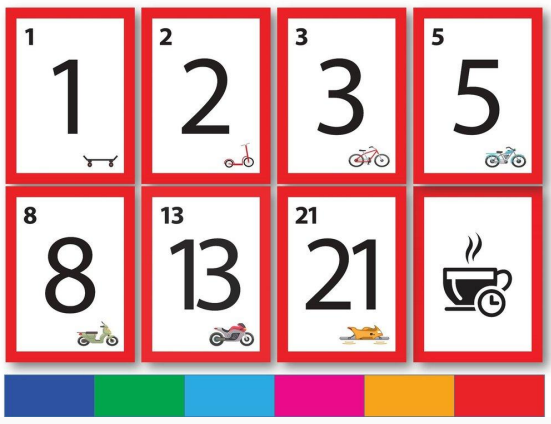

---
tags:
- flashcards/swe/teoria/1P
- flashcards/swe/teoria/U4
---

# Planning Poker

> [!NOTE]
>
> Planning Poker es considerado un método de estimación Agile.

- Variación del método **Wideband Delphi** con algunas diferencias para adaptarse a los proyectos actuales con métricas similares a las de los métodos sofisticados.
- Se estiman **tamaños de tareas relativos entre sí** (tomando alguna como modelo).
- La estimación en SP ("Tamaño") puede variar entre proyectos, pero el tiempo "no".
	- El tiempo NO es una variable estimada en Planning Poker: Lo que para un equipo pueden ser 5 puntos para otro pueden ser 13, pero finalmente la tarea se hace en X horas que no varían (cada equipo transforma SP -> HH según sus criterios y eso siempre es lo mismo para un mismo equipo).
- Muy buena para:
	- Proyectos ongoing: Poseen varias tareas y un objetivo específico. Pero no poseen un _deadline_, continúan para siempre.
	- Desarrollo incremental a largo plazo.
- No tanto para:
	- Primeras estimaciones.
	- Desarrollos de 0-100% en corto tiempo.
	- Situaciones en donde no se tenga una tarea de referencia (Para aplicar el método debe existir una tarea de referencia). En este caso podemos iniciar con una estimación arbitraria e iterar por el [[01-conceptos-de-estimaciones-de-sw#Ciclo (dorado) de estimación|ciclo dorado de estimación]].
- Se encuentra basado en el consenso, es gamificado. Empleado para estimar el tamaño relativo de los objetivos en el desarrollo de SW.

> [!IMPORTANT]
>
> - Es considerado un buen "primer acercamiento":
> 	- Debido a que siempre existe una "primera vez", teniendo presente que Planning Poker posee varias ventajas y es muy sencillo su implementación, sería el 1° método en intentar adoptarlo para establecer un tamaño.
> 	- De alguna forma así nos "animamos a equivocarnos".
> 	- De igual manera esto no deja de ser una Estimación y no hemos garantizado nada todavía.
> - En cambio, aplicar algún método paramétrico para comenzar a medir "Tamaño" es más complejo y probablemente tengamos que tener varias pasadas por el ciclo dorado antes de que nuestra estimación sea aceptable.

---

(Control U4) Describa el método de estimación de Planning Poker.
?
- Variación del método **Wideband Delphi** con algunas diferencias para adaptarse a los proyectos actuales con métricas similares a las de los métodos sofisticados.
- Se estiman **tamaños de tareas relativos entre sí** (tomando alguna como modelo).
- La estimación en SP ("Tamaño") puede variar entre proyectos, pero el tiempo ("Esfuerzo") "no".
	- El tiempo NO es una variable estimada en Planning Poker: Lo que para un equipo pueden ser 5 puntos para otro pueden ser 13, pero finalmente la tarea se hace en X horas que no varían (cada equipo transformaría SP -> HH, según la tasa de cambio que hayan establecido en cada equipo).
- Muy buena para:
	- Proyectos ongoing: Poseen varias tareas y un objetivo específico. Pero no poseen un _deadline_, continúan para siempre.
	- Desarrollo incremental a largo plazo.
- No tanto para:
	- Primeras estimaciones.
	- Desarrollos de 0-100% en corto tiempo.
	- Situaciones en donde no se tenga una tarea de referencia (Para aplicar el método debe existir una tarea de referencia). En este caso podemos iniciar con una estimación arbitraria e iterar por el ciclo dorado de estimación.
- Se encuentra basado en el consenso, es gamificado. Empleado para estimar el tamaño relativo de los objetivos en el desarrollo de SW.

---

## Reglas

- Participantes: Todo el **equipo** tiene que participar de la estimación (#compromiso).
- _Timebox_: Fijar la cantidad de tiempo que se va a dedicar para estimar y cumplirlo (1 hora aproximadamente).
- Priorizar: Todas las **User Stories** (requerimientos) tienen que estar priorizadas (por PO) y leídas previamente por el equipo para conocer lo que se está estimando.
- Escala (Unidad): Se miden las User Stories en **Story Points** que siguen la escala (usualmente) de la sucesión de Fibonacci modificada: 0, 1/2, 1, 2, 3, 5, 8, 13, 20, 40, 100, ∞, ?, (café).
- Tarea pivote: Definir una User Story pivote y darle un tamaño en Story Points. 5 u 8 SP son buenos candidatos. Puede ser una User Story actual o una anterior que sea significativa y todos la conocen o un caso general. Pueden ser varias de diferentes tamaños.
- Definición de "Terminado":
	- Dar la definición de terminado de una User Story.
	- Es el acuerdo que posee el equipo a la hora de determinar si una tarea se encuentra "Terminada" o no.
	- ¿Solo desarrollo?, ¿incluye testing?, ¿deploy a staging?, ¿UAT?, ¿producción?
	- Cada tarea tiene escrita su definición de terminado.
	- Al "Terminar" una historia, se dice que "hemos quemado dichos puntos".
		- e.g., si una historia es de 3 puntos => "Hemos quemado 3 puntos".
	- Todos los puntos quemados por el equipo es lo que se conoce por Velocity.
- Velocity: Definir la velocidad del equipo (basada en sprints anteriores) para saber el número mínimo de SP que necesito estimar para completar un sprint.
	- La Velocity es una KPI (grupal y no individual) que permite medir la cantidad de trabajo que un equipo puede llevar a cabo durante un sprint (capacidad del equipo). No solamente permite calibrar la velocidad del equipo, sino que también ofrece una proyección potencial del resultado que producirán.
	- Para calcularlo, un SM debe realizar la sumatoria de todos los puntos de todas las historias de usuario entregadas por el equipo de desarrollo al final del sprint.
	- E.g.
		- Story A: 3 Puntos.
		- Story B: 5 Puntos.
		- Story C: 8 Puntos.
		- El equipo es capaz de completar las historias A y C en su completitud durante el sprint, pero solo llega a completar el 80% de la historia B, por lo que no se la puede calificarla como "Terminada" => Solamente los puntos de las historias A y C serán tenidas en cuenta para el cálculo de la Velocity del presente sprint. Esto quiere decir que la Velocity del equipo para este sprint fue de 11.
- Otros tamaños:
	- Fibonacci: 0, 1, 2, 3, 5, 8, 13, 21, 34, 55, 89.
	- Modified Fibonacci: 0, 1/2, 1, 2, 3, 5, 8, 13, 20, 40, 100, ∞, café.
	- T-shirt Sizes: XXS, XS, SM, MED, LARGE, XL, XXL.
		- Empleado más para etapas en donde no existe una claridad taxativa con números.
	- The Power of 2: 0, 2, 4, 8, 16, 32, 64...
		- Similar a T-shirt Sizes.

---

¿Qué es la Velocity de un equipo?
?
La Velocity es una KPI (grupal y no individual) que permite medir la cantidad de trabajo que un equipo puede llevar a cabo durante un sprint (capacidad del equipo). No solamente permite calibrar la velocidad del equipo, sino que también ofrece una proyección potencial del resultado que producirán.

¿Cuáles son las reglas de Planning Poker?
?
- Participantes: Todo el **equipo** tiene que participar de la estimación (#compromiso).
- _Timebox_: Fijar la cantidad de tiempo que se va a dedicar para estimar y cumplirlo (1 hora aproximadamente).
- Priorizar: Todas las **User Stories** (requerimientos) tienen que estar priorizadas (por PO) y leídas previamente por el equipo para conocer lo que se está estimando.
- Escala (Unidad): Se miden las User Stories en **Story Points** que siguen la escala (usualmente) de la sucesión de Fibonacci modificada: 0, 1/2, 1, 2, 3, 5, 8, 13, 20, 40, 100, ∞, ?, (café).
- Tarea pivote: Definir una User Story pivote y darle un tamaño en Story Points. 5 u 8 SP son buenos candidatos. Puede ser una User Story actual o una anterior que sea significativa y todos la conocen o un caso general. Pueden ser varias de diferentes tamaños.
- Definición de "Terminado":
	- Dar la definición de terminado de una User Story.
	- Es el acuerdo que posee el equipo a la hora de determinar si una tarea se encuentra "Terminada" o no.
	- ¿Solo desarrollo?, ¿incluye testing?, ¿deploy a staging?, ¿UAT?, ¿producción?
	- Cada tarea tiene escrita su definición de terminado.
	- Al "Terminar" una historia, se dice que "hemos quemado dichos puntos".
		- e.g., si una historia es de 3 puntos => "Hemos quemado 3 puntos".
	- Todos los puntos quemados por el equipo es lo que se conoce por Velocity.
- Velocity: Definir la velocidad del equipo (basada en sprints anteriores) para saber el número mínimo de SP que necesito estimar para completar un sprint.
	- La Velocity es una KPI (grupal y no individual) que permite medir la cantidad de trabajo que un equipo puede llevar a cabo durante un sprint (capacidad del equipo). No solamente permite calibrar la velocidad del equipo, sino que también ofrece una proyección potencial del resultado que producirán.
	- Para calcularlo, un SM debe realizar la sumatoria de todos los puntos de todas las historias de usuario entregadas por el equipo de desarrollo al final del sprint.
	- E.g.
		- Story A: 3 Puntos.
		- Story B: 5 Puntos.
		- Story C: 8 Puntos.
		- El equipo es capaz de completar las historias A y C en su completitud durante el sprint, pero solo llega a completar el 80% de la historia B, por lo que no se la puede calificarla como "Terminada" => Solamente los puntos de las historias A y C serán tenidas en cuenta para el cálculo de la Velocity del presente sprint. Esto quiere decir que la Velocity del equipo para este sprint fue de 11.
- Otros tamaños:
	- Fibonacci: 0, 1, 2, 3, 5, 8, 13, 21, 34, 55, 89.
	- Modified Fibonacci: 0, 1/2, 1, 2, 3, 5, 8, 13, 20, 40, 100, ∞, café.
	- T-shirt Sizes: XXS, XS, SM, MED, LARGE, XL, XXL.
		- Empleado más para etapas en donde no existe una claridad taxativa con números.
	- The Power of 2: 0, 2, 4, 8, 16, 32, 64...
		- Similar a T-shirt Sizes.

---

## Dinámica para la estimación: Ejecución en la vida real

**Hasta que se llegue a la cantidad de SP que marca la Velocity para un sprint**:

1. El Moderador plantea la User Story a todo el equipo:
	- El PO es quien se encarga de presentar las historias priorizadas y leídas por todo el equipo. Se busca exponer todas las características que se desea obtener desde la perspectiva de negocio.
	- Se presenta especificando "Qué" es lo que se tiene que obtener, no el "Cómo".
2. El equipo realiza las preguntas necesarias para que no queden dudas respecto al resultado a obtener. El PO las esclarece.
3. Se toma la US de referencia, conocida por la mayoría de los integrantes. Si no hay ningún requerimiento conocido por la mayoría, entonces se toma un requerimiento que a simple vista parezca sencillo de realizar.
4. Cada integrante propone una estimación sin saber la de los demás (para evitar el efecto ancla, ya que muchas veces lo que sucede es que la persona que más sabe, condiciona la estimación del resto). Dar vuelta las cartas todos al mismo tiempo:
	- Si todos las cartas tienen el mismo valor, entonces se puede considerar que la estimación es unánime y al requerimiento se le asigna el mismo número.
	- Si las cartas tienen distinto valor, se revisan cuáles son el valor más alto y el valor más bajo.
		- Cada una de las personas que eligieron estos valores, tienen que explicar el criterio de haber elegido estos valores. Cada uno tiene que convencer al resto de los miembros del equipo a que estimen con el mismo número (2 minutos máximo).
5. Una vez expuestos los criterios, se vuelve a estimar hasta que el equipo logre un consenso.
6. Se continúa con la siguiente User Story.

> [!NOTE]
>
> No se recomienda hacer más de 2 rondas de estimación para la misma User Story.

---

V o F. En Planning Poker se estiman las tareas hasta que se llegue a la cantidad de SP que marca la Velocity para un sprint.::V.

---

## Final de la estimación

- Al finalizar la estimación, se pueden visualizar todas las tareas junto a estimaciones y comparar entre ellas para ajustarlas. [[10-obl-timebox-development#Estimaciones de calendarios realistas creadas por el equipo _timebox_|Fue algo consensuado entre todos]].
- Teniendo en cuenta la **Velocity** del equipo y las **prioridades**, se planifica el siguiente Sprint.
- Ventajas:
	- **Como se estima en tamaño, si cambia el equipo, las tareas no se modifican sino que se modifica la Velocity de cada sprint**. Feriados, exámenes, ausencias programadas bajan la Velocity.
	- Al ser corto el sprint, se corrigen los desvíos cada 2 semanas (promedio).
	- Poco tiempo perdido en la planning.
	- Las estimaciones basadas en debates en grupo, son más precisas que estimaciones individuales.
- Posteriormente, el pasaje de Tamaño -> Esfuerzo es de Story Points -> Horas-Hombre.
	- e.g., si cada Story Point equivale a 2 Horas-Hombre y el Tamaño de una tarea es 13 SPs => El Esfuerzo estimado son 26 Horas-Hombre.

---

V o F. En Planning Poker se planifica el siguiente Sprint teniendo en cuenta la Velocity del equipo y las prioridades::V.

---
