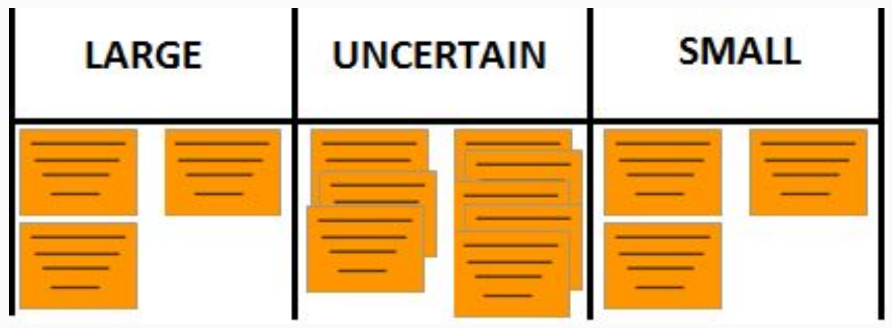

---
tags:
- flashcards/swe/teoria/1P
- flashcards/swe/teoria/U4
---

# Métodos Rudimentarios Agile que no se trataron en clases

> [!NOTE]
>
> Planning Poker es considerado un método de estimación Agile.

## T-Shirt Sizes

> [!NOTE]
>
> Es un método de estimación Agile.

- Esta técnica es la forma para relativizar el tamaño de los requerimientos.
- Se definen 5 niveles de tamaño: X-Small, Small, Medium, Large y X-Large.
- Los equipos se enfocan a comparar el tamaño de una tarea respecto de la otra, en vez de estimar el tiempo requerido para completar dicha tarea. Mediante la estimación relativa, los equipos definen el esfuerzo a necesario, sin caer en la práctica de querer predecir un marco de tiempo específico, el cual puede ser complicado en proyectos y planificación Agile.
	- Nos interesan entender cómo los requerimientos se comparan entre sí de una forma general sin necesidad de tener una precisión granular.
- Cada equipo puede tomar distintas consideraciones sobre la estimación de los requerimientos.
	- e.g., ¿qué relación entre el X-Small y el X-Large? ¿Existe alguna relación numérica?
- Lo importante es que cada equipo tenga siempre la misma concepción del tamaño de las camisetas, respecto al esfuerzo o complejidad, a la hora de comparar los requerimientos.
- Esta técnica permite que los requerimientos se puedan clasificar rápidamente por lo que es recomendable para los equipos nuevos. Eventualmente cada tamaño de camiseta va a tener un número asociado para dar correctamente una estimación concreta.

## Puntos de Votación (Dot Voting)

Esta técnica permite que los integrantes del equipo voten los requerimientos teniendo en cuenta la importancia (o complejidad) de cada uno de los requerimientos. Luego, el equipo puede determinar el tamaño de cada uno de los requerimientos.

1. Los requerimientos se colocan uno al lado del otro y son visibles para todo el equipo.
2. Cada uno de los integrantes del equipo tiene 4 o 5 puntos para repartir entre los requerimientos. Uno a uno los integrantes del equipo votan los requerimientos teniendo en cuenta los que son más complejos.
3. Una vez que todos votaron las historias se clasifican en:
	- Baja Complejidad.
	- Media Complejidad.
	- Alta Complejidad.
	- e.g., podemos clasificar a los requerimientos que tienen más de 6 puntos que son complejos, los que tienen hasta 2 son menos complejos y los que tienen más de 2 y menos de 6 son de mediana complejidad.
4. Una vez que tenemos estos grupos, el equipo analiza cada grupo para definir nuevamente la complejidad de los mismos. Se comparan entre sí y se les da un orden.
	- Es como que se realiza un orden de complejidad para cada uno de los 3 subgrupos de complejidad.
5. Una vez que tenemos la lista organizada en base a la complejidad, el equipo puede estimar en horas cada uno de los items que de la lista sabiendo que el orden ya definido implica el orden de complejidad. Los items más complejos tienen más horas que los items menos complejos.

## Sistema de Cubetas (The Bucket System)

Esta técnica nos permite organizar rápidamente los requerimientos en categorías (buckets).

1. En un ambiente físico, dividir en las siguientes categorías para luego organizar los requerimientos a estimar. Se puede usar la Serie de Fibonacci.
2. Colocar en la columna del 8 un requerimiento aleatorio. Este requerimiento será el requerimiento base con el cual vamos a comparar el resto de los requerimientos.
3. Discutir dentro del equipo cuál es la columna donde tendría que ir ese requerimiento. A medida que avanzamos con las estimaciones, usamos esta Story como referencia.
4. Comenzar a comparar cada uno de los requerimientos con los requerimientos previos y agruparlos. Si es necesario cambiar algún requerimiento estimado anteriormente se puede cambiar. La estimación se realiza con tantos cambios sean necesarios hasta que todo el equipo esté de acuerdo con los valores.
5. Al finalizar, dentro de cada columna podemos organizar que los items de arriba hacia abajo definiendo prioridad o tamaño dentro de cada.

## Grande/Indeciso/Pequeño (Large/Uncertain/Small)

- Esta técnica es una simplificación del Bucket System.
- Solamente vamos a tener 3 categorías: Large, Uncertain, Small.

1. En un ambiente físico, dividir en 3 categorías para luego organizar los requerimientos a estimar.
2. Cada uno de los requerimientos se colocan en uno de los 3 valores. Los que rápidamente se identifican como pequeños y grandes, van a los extremos. Cuando exista una duda sobre el tamaño del resto, dejarlo en el medio.
3. Discutir dentro del equipo cada uno de los requerimientos que se encuentran en el medio (uncertain).
4. Los requerimientos pueden moverse a alguno de los extremos o simplemente quedarse en el medio.
5. Cuando todos los requerimientos han sido categorizados, se les asigna un valor a cada uno de los requerimientos.
