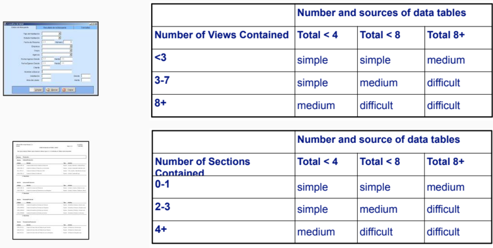
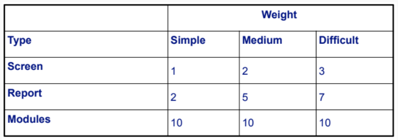

---
tags:
- flashcards/swe/teoria/1P
- flashcards/swe/teoria/U4
---

# Objects Ponts

> [!NOTE]
>
> Es más abstracto que FPs.

- Los "objetos" contemplan pantallas, reportes & módulos:
	- No está relacionado necesariamente con objetos de OOP.
	- Nos referimos a "objetos" como cosas.
	- El método original contempla solo estos 3 tipos de objetos:
		- Implementaciones _ad-hoc_ del método consideran otros tipos de componentes como (stored procedures, clases, scripts SQL, etc.).
		- Schivo aclaró en clase que desde la perspectiva holística, estos "objetos" pueden ser reuniones, entidades externas con las que tengamos que interactuar, etc.
- Se asigna a cada componente un peso de acuerdo a su clasificación por complejidad.
	- e.g., no es lo mismo una pantalla con 1 botón que con 70 botones.
- Considera como factor de ajuste el porcentaje de reúso de código.
	- El factor de reúso "corrige".
- Cada objeto es clasificado de acuerdo a su nivel de complejidad en:
	- Simple.
	- Medio.
	- Difícil.
	
- Luego se le brinda un peso a cada nivel de complejidad (teniendo directa proporción con el esfuerzo que requiere la implementación de cada uno).
	
- Finalmente sumando la cantidad de objetos de cada complejidad con sus respectivos pesos nos da como resultado los OPs.
	- e.g., si tenemos 2 pantallas simples y 1 compleja + 5 reportes medios + 8 módulos fáciles => $$2 * 1 + 1 * 3 + 5 * 5 + 8 * 10 = 110 OPs$$ ("Unadjusted Object Points")
- Teniendo en cuenta el reúso:
	- $$NOP (NewOP) = OP * [ ( 100 - \%Reúso ) / 100 ]$$ ("Adjusted Object Points")
- El % de reúso puede ser definido taxativamente como: LoC que no vuelvo a escribir nuevamente para dicha función, stored procedure, etc. Regla de 3 simples.
- Posteriormente, el pasaje de Tamaño -> Esfuerzo es: AOP -> Horas-Hombre

> [!IMPORTANT]
>
> - El método debe ser empleado sobre proyectos que ya conozcamos, ya que tenemos que poder diferenciar la complejidad del objeto en simple, medio y difícil.
> - Si el proyecto fuese nuevo o estuviese en etapas tempranas, no tendría la posibilidad de hacer esto y no se tendrá mucho % de reúso.
> - Es posible realizar una customización del % de reúso por cada tipo de objeto distinto, ya que al final es lo mismo que considerar el % de reúso de todo el código.

---

¿En qué consiste el método de estimación Object Points?
?
- Los "objetos" contemplan pantallas, reportes & módulos:
	- No está relacionado necesariamente con objetos de OOP.
	- Nos referimos a "objetos" como cosas.
	- El método original contempla solo estos 3 tipos de objetos:
		- Implementaciones _ad-hoc_ del método consideran otros tipos de componentes como (stored procedures, clases, scripts SQL, etc.).
		- Schivo aclaró en clase que desde la perspectiva holística, estos "objetos" pueden ser reuniones, entidades externas con las que tengamos que interactuar, etc.
- Se asigna a cada componente un peso de acuerdo a su clasificación por complejidad.
	- e.g., no es lo mismo una pantalla con 1 botón que con 70 botones.
- Considera como factor de ajuste el porcentaje de reúso de código.
	- El factor de reúso "corrige".
- Cada objeto es clasificado de acuerdo a su nivel de complejidad en:
	- Simple.
	- Medio.
	- Difícil.
	
- Luego se le brinda un peso a cada nivel de complejidad (teniendo directa proporción con el esfuerzo que requiere la implementación de cada uno).
	
- Finalmente sumando la cantidad de objetos de cada complejidad con sus respectivos pesos nos da como resultado los OPs.
	- e.g., si tenemos 2 pantallas simples y 1 compleja + 5 reportes medios + 8 módulos fáciles => $$2 * 1 + 1 * 3 + 5 * 5 + 8 * 10 = 110 OPs$$ ("Unadjusted Object Points")
- Teniendo en cuenta el reúso:
	- $$NOP (NewOP) = OP * [ ( 100 - \%Reúso ) / 100 ]$$ ("Adjusted Object Points")
- El % de reúso puede ser definido taxativamente como: LoC que no vuelvo a escribir nuevamente para dicha función, stored procedure, etc. Regla de 3 simples.
- Posteriormente, el pasaje de Tamaño -> Esfuerzo es: AOP -> Horas-Hombre

V o F. El método debe ser empleado sobre proyectos que ya conozcamos, ya que tenemos que poder diferenciar la complejidad del objeto en simple, medio y difícil.::V.

V o F. Si el proyecto fuese nuevo o estuviese en etapas tempranas, no se tendrá mucho % de reúso.::V.

---
