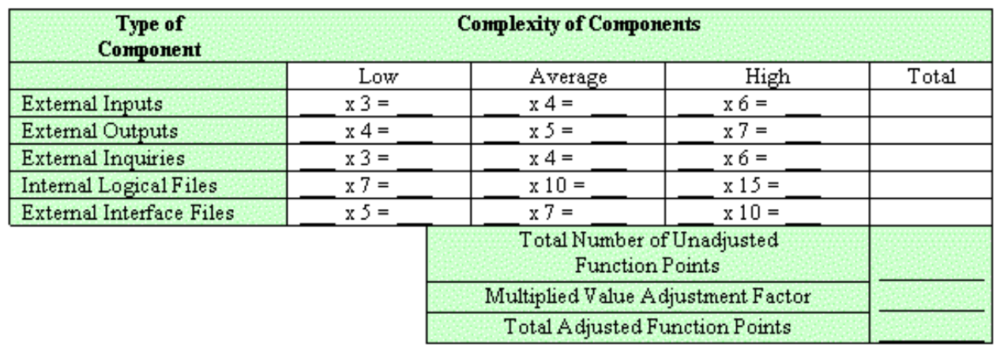

---
tags:
- flashcards/swe/teoria/1P
- flashcards/swe/teoria/U4
---

# Function Points

- Mide el tamaño del SW en base a las funcionalidades capturadas en los requerimientos.
	- Es una medida de la funcionalidad que entregamos al usuario (las FPs).
	- Los puntos de funciones son una unidad de medida del SW (al igual que Celsius una unidad de temperatura, kilómetros una unidad de distancia, etc.).
- Usa el modelo lógico o conceptual para trabajar.
	- "Modelo lógico": Modelo del sistema elaborado como resultado de la etapa de análisis, previo a la transformación al "modelo físico" del sistema en la etapa de diseño.
- En general son aceptados en la industria a pesar de su complejidad y antigüedad.
- Hay muchas heurísticas en el mercado basadas en FPs.
- Los FPs son independientes de la tecnología (Justamente, emplea el modelo lógico).
- Requieren un análisis de requerimientos avanzado.
	- Debe ser realizado por personal entrenado y con experiencia.
	- En caso de que sea llevado a cabo por personal no entrenado => Es razonable asumir que el análisis será llevado a cabo en forma incorrecta.

> [!NOTE]
>
> - Permite clasificar los componentes de un sistema.
> - Segrega el sistema en componentes más pequeños: Mejor análisis.
> - Punto crítico y mayor ventaja del análisis de puntos de función:
> 	- **Miden los sistemas desde la perspectiva funcional y es agnóstico a la tecnología**.
> 	- Independiente del lenguaje, método de desarrollo o plataforma HW empleado: **FPs de un sistema siempre se mantienen constantes**.
> 	- Única variable: **Cantidad de esfuerzo requerido para entregar un conjunto de puntos de función** => El análisis de puntos de función puede ser empleado para determinar si una herramienta, un entorno, un lenguaje es más productivo en comparación a otros, dentro de la organización o cross-organización.
> 		- Esto es posible ya que es agnóstico a las tecnologías (Modelo lógico) => Lo único variable es el modelo físico (Tecnologías).

---

¿En qué consiste el método de estimación Function Points?
?
- Mide el tamaño del SW en base a las funcionalidades capturadas en los requerimientos.
- Usa el modelo lógico o conceptual para trabajar.
	- "Modelo lógico": Modelo del sistema elaborado como resultado de la etapa de análisis, previo a la transformación al "modelo físico" del sistema en la etapa de diseño.
- En general son aceptados en la industria a pesar de su complejidad y antigüedad.
- Hay muchas heurísticas en el mercado basadas en FPs.
- Los FPs son independientes de la tecnología (Justamente, emplea el modelo lógico).
- Requieren un análisis de requerimientos avanzado.
	- Debe ser realizado por personal entrenado y con experiencia.
	- En caso de que sea llevado a cabo por personal no entrenado => Es razonable asumir que el análisis será llevado a cabo en forma incorrecta.
- Permite clasificar los componentes de un sistema.
- Segrega el sistema en componentes más pequeños: Mejor análisis.
- Punto crítico y mayor ventaja del análisis de puntos de función:
	- **Miden los sistemas desde la perspectiva funcional y es agnóstico a la tecnología**.
	- Independiente del lenguaje, método de desarrollo o plataforma HW empleado: **FPs de un sistema siempre se mantienen constantes**.
	- Única variable: **Cantidad de esfuerzo requerido para entregar un conjunto de puntos de función** => El análisis de puntos de función puede ser empleado para determinar si una herramienta, un entorno, un lenguaje es más productivo en comparación a otros, dentro de la organización o cross-organización.
		- Esto es posible ya que es agnóstico a las tecnologías (Modelo lógico) => Lo único variable es el modelo físico (Tecnologías).

---

## Elementos del sistema

Los sistemas son divididos en 5 grandes clases y características generales del sistema:

- Las primeras 3 clases o componentes son External Inputs (EI), External Outputs (EO) & External Inquires (EQ):
	- Cada uno de estos componentes realiza una transacción contra un archivo, por lo que son conocidos como "transacciones".
- Las siguientes 2 clases o componentes son Internal Logical Files (ILF) & External Interface Files (EIF):
	- Cada uno de estos componentes es en donde se encuentran almacenado los datos y son combinados para formar información que sea lógica.
- Las características generales del sistema evalúan la funcionalidad general del sistema.
- Previo a la clasificación de componentes, debido a que es usual interactuar con otros sistemas de computación, debe de dibujarse un límite alrededor de cada sistema para que sea medible.
	- Indica el límite entre la aplicación siendo medida con aplicaciones externas.
- Este límite debe ser establecido desde la perspectiva del usuario.
- Una vez establecido el límite, los componentes pueden ser clasificados, rankeados y contados.

---

¿Cómo se le conocen a las 3 clases EI, EO & EQ?
?
Debido a que cada uno de estos componentes realiza una transacción contra un archivo, son conocidos como "transacciones".

¿En qué consisten los ILFs & EIFs?
?
Cada uno de estos componentes es en donde se encuentran almacenado los datos y son combinados para formar información que sea lógica.

V o F. Previo a la clasificación de componentes, debido a que es usual interactuar con otros sistemas de computación, debe de dibujarse un límite alrededor de cada sistema para que sea medible.::V

V o F. El límite establecido debe ser desde la perspectiva del usuario.::V. Posterior al establecimiento del límite, los componentes pueden ser clasificados, rankeados y contados.

---

### External Inputs (EI)

(Un simple External Input que actualiza 2 Internal Logic Files).

- Proceso elemental de la aplicación: Los datos cruzan el límite del sistema: Afuera -> Adentro.
- Este dato puede:
	- Provenir de un formulario u otra aplicación.
	- Ser empleado para mantener 1 o más Internal Logic Files.
	- Ser tanto:
		- Información de control: No necesita actualizar ningún Internal Logic File.
		- Información de negocio.

> [!NOTE]
>
> - Responde a la pregunta: ¿Cómo nos ingresa información desde afuera?
> - Viene por una UI, sensor, etc.

---

¿En qué consisten los External Inputs?
?
- Proceso elemental de la aplicación: Los datos cruzan el límite del sistema: Afuera -> Adentro.
- Este dato puede:
	- Provenir de un formulario u otra aplicación.
	- Ser empleado para mantener 1 o más Internal Logic Files.
	- Ser tanto:
		- Información de control: No necesita actualizar ningún Internal Logic File.
		- Información de negocio.

---

### External Outputs (EO)

(Un External Output con referencias a 2 archivos, posee una información derivada (verde) que ha sido derivada de los Internal Logic Files).

- Proceso elemental de la aplicación: Los datos cruzan el límite del sistema: Adentro -> Afuera.
- Puede actualizar un Internal Logic File.
- Resultado: Dato enviado a otras aplicaciones genera un reporte o archivos de salida.
	- Estos son creados a partir de 1 o más Internal Logic Files y External Interface Files.
- Dicho procesamiento de información debe contener al menos una fórmula matemática o cálculo, o crear datos derivados.
- Un External Output puede también mantener uno o más Internal Logic Files y/o alterar el comportamiento del sistema.

> [!NOTE]
>
> Responde a la pregunta: ¿Cómo egresamos información hacia afuera?

---

¿En qué consisten los External Outputs?
?
- Proceso elemental de la aplicación: Los datos cruzan el límite del sistema: Adentro -> Afuera.
- Puede actualizar un Internal Logic File.
- Resultado: Dato enviado a otras aplicaciones genera un reporte o archivos de salida.
	- Estos son creados a partir de 1 o más Internal Logic Files y External Interface Files.
- Dicho procesamiento de información debe contener al menos una fórmula matemática o cálculo, o crear datos derivados.
- Un External Output puede también mantener uno o más Internal Logic Files y/o alterar el comportamiento del sistema.

---

### External Inquiry (EQ)

(Una External Inquiry con 2 Internal Logic Files y sin ningún dato derivado).

- Proceso elemental con ambos componentes de entrada y salida. Resulta en una consulta de datos de 1 o más Internal Logic Files y External Interface Files.
- Proceso elemental de la aplicación: Envía datos o información de control fuera de los límites del sistema.
- El proceso elemental NO posee fórmulas matemáticas ni cálculos. Y no crea datos derivados.
- Una EQ no mantiene ILFs durante su procesamiento, ni altera el comportamiento del sistema.

> [!NOTE]
>
> La diferencia entre una salida y una consulta es que, en general:
> - En la consulta no se procesa información para enviarla. Es decir, no estamos haciendo procesos internos, sino que la consulta sale de abrir una tabla y mostrarla. Es algo más sencillo, no conlleva cálculos matemáticos, ni tampoco procesos, etc.

---

¿En qué consisten los External Inquiries?
?
- Proceso elemental con ambos componentes de entrada y salida. Resulta en una consulta de datos de 1 o más Internal Logic Files y External Interface Files.
- Proceso elemental de la aplicación: Envía datos o información de control fuera de los límites del sistema.
- El proceso elemental NO posee fórmulas matemáticas ni cálculos. Y no crea datos derivados.
- Una EQ no mantiene ILFs durante su procesamiento, ni altera el comportamiento del sistema.

¿En qué se diferencia un External Inquiry de un External Output?
?
- Ambos son procesos elementales:
	- EO: Datos cruzan el límite del sistema desde adentro hacia afuera.
	- EQ: Posee a ambos componentes de E/S. Envía datos o información de control fuera de los límites del sistema.
- Manutención ILFs y alteración comportamiento del sistema:
	- EO: Puede mantener 1 o más ILFs y/o alterar el comportamiento del sistema.
	- EQ: No mantiene ILFs durante su procesamiento, tampoco altera el comportamiento del sistema.
- Fórmulas matemáticas/cálculos y creación de datos derivados:
	- EO: Debe contener al menos una fórmula matemática/cálculo, o crear datos derivados.
		- SI se procesa información para enviarla.
	- EQ: NO posee fórmulas matemáticas ni cálculos, tampoco crea datos derivados.
		- NO se procesa información para enviarla (Algo más simple que una EO, no conlleva procesos internos).
- Resultado:
	- EO: Dato enviado a otras aplicaciones genera un reporte o archivos de salida. Creados a partir de 1 o más ILFs y EIFs.
	- EQ: Resulta en una consulta de datos de 1 o más ILFs y EIFs.

---

### Internal Logical Files (ILF)

- Lectura: Grupo de datos lógicos relacionados, identificable por el usuario, que residen en su totalidad dentro de los límites de la aplicación y es mantenido mediante External Inputs.
- PPT: Grupo de datos lógicos de información o de control, identificables por el usuario, mantenidos a través de procesos elementales de la aplicación dentro de los límites de la misma.

> [!NOTE]
>
> A diferencia de un archivo de interface externa, un archivo lógico interno lo actualizamos nosotros.

---

¿En qué consisten los Internal Logical Files?
?
- Grupo de datos lógicos de información o de control.
- Identificables por el usuario.
- Mantenidos a través de procesos elementales de la aplicación dentro de los límites de la misma.

---

### External Interface Files (EIF)

- Lectura: Grupo de datos lógicos relacionados, identificable por el usuario, que es empleado con fines de referenciación exclusivamente. El dato reside en su totalidad fuera de la aplicación y es mantenido por otra aplicación. Un External Interface File es un Internal Logical File para otra aplicación.
- PPT: Grupo de datos lógicos de información o de control, identificables por el usuario, referenciados por la aplicación pero mantenidos a través de procesos elementales de una aplicación diferente.
- PPT: Diferencia: Los EIF no son mantenidos por la aplicación.

> [!NOTE]
>
> Responde a la pregunta: ¿Cómo nos conectamos contra lo de afuera?

---

¿En qué consisten los External Interface Files?
?
- Grupo de datos lógicos de información o de control.
- Identificables por el usuario.
- Referenciados por la aplicación pero mantenidos a través de procesos elementales de una aplicación diferente.
- Diferencia con ILF: Los EIF no son mantenidos por la aplicación.

---

## Unadjusted Function Points (UFP) (Total Number of Unadjusted Function Points)

> [!NOTE]
>
> Es similar a Object Points, se clasifica en low, medium, high, dependiendo de la cantidad.

- Luego de que los componentes hayan sido clasificados en alguna las 5 clases posibles, se asigna un ranking de Alto, Bajo o Promedio.

## Calcular el Technical Complexity Factor (TCF) (Multiplied Value Adjustment Factor)

> [!NOTE]
>
> - Ahora pasamos a ajustarlos y se llaman "Unadjusted Function Points". Análogos a UOP ("Unadjusted Object Points").
> - Para poder ajustarlos existen 14 items. Al ajustarlo por estos 14 factores de complejidad técnica, obtenemos la estimación del tamaño en la versión ajustada ("Adjusted Function Points").

$$TCF = 0.65 + (sum de factores) / 100$$

- "Sum de factores": Compuesto por los 14 factores y son los "no ajustados".
	- Estos pueden variar en un +- 35%.
	- Si todos los 14 factores de ajuste fueran 0 => $$TCF = 0.65 + 0 / 100 = 0.65$$
		- Es decir, tendríamos el 65% de nuestra estimación: O sea que un -35%.
	- Si todos los 14 factores de ajuste fueran 5 => $$TCF = 0.65 + 70 / 100 = 1.35$$
		- Es decir, que lo terminamos ampliando en un 35%.
	- El rango para la suma de factores es:
		- $$[0; 70], en los naturales$$
- Hay 14 factores de complejidad técnica. Cada uno se evalúa de acuerdo al grado de influencia (0~5). El mismo se lo determina realizando preguntas:
	- Data communications.
	- Performance.
	- Heavily used configuration.
	- Transaction rate.
	- Online data entry.
	- End user efficiency.
	- Online update.
	- Complex processing.
	- Reusability.
	- Installation ease.
	- Operations ease.
	- Multiple sites.
	- Facilitate change.
	- Distributed functions.
- El TCF también se conoce como el CGS, Características Generales del Sistema.

## Cálculo de puntos de función ajustado (Total Adjusted Function Points)

$$Puntos de función netos = NFP = Puntos de función ajustado = AFP = UFP * TCF$$

## Conversión de NFP/AFP a LoC

En base a estándares del Mercado, 1 NFP/AFP equivale a:

> [!IMPORTANT]
>
> El ejemplo es con LoC para dar un caso tangible. De Function Points (o de cualquiera de los XX points vistos en los métodos paramétricos) se debe pasar a "Esfuerzo" y seguir los [[01-conceptos-de-estimaciones-de-sw#El proceso de estimar (normalmente)|pasos del proceso de estimación]] porque lo que tenemos, como salida de un método de estimación, es "Tamaño".

> [!NOTE]
>
> - La tabla se lee: "1AFP en Java equivale entre 40 y 80 líneas de código".
> - Es posible pasar de AFP -> LoC y luego de LoC -> Esfuerzo.
> - Es posible pasar directamente de AFP -> Esfuerzo, sin considerar los LoCs.

---

(Control U4) Describa las entradas y salidas del método de estimación de Function Point.
?
- Entradas:
	- EI:
		- Proceso elemental de la aplicación: Los datos cruzan el límite del sistema: Afuera -> Adentro.
		- Este dato puede:
			- Provenir de un formulario u otra aplicación.
			- Ser empleado para mantener 1 o más Internal Logic Files.
			- Ser tanto:
				- Información de control: No necesita actualizar ningún Internal Logic File.
				- Información de negocio.
- Salidas:
	- EO:
		- Proceso elemental de la aplicación: Los datos cruzan el límite del sistema: Adentro -> Afuera.
		- Puede actualizar un Internal Logic File.
		- Resultado: Dato enviado a otras aplicaciones genera un reporte o archivos de salida.
			- Estos son creados a partir de 1 o más Internal Logic Files y External Interface Files.
		- Dicho procesamiento de información debe contener al menos una fórmula matemática o cálculo, o crear datos derivados.
		- Un External Output puede también mantener uno o más Internal Logic Files y/o alterar el comportamiento del sistema.
- Entradas y Salidas:
	- EQ:
		- Proceso elemental con ambos componentes de entrada y salida. Resulta en una consulta de datos de 1 o más Internal Logic Files y External Interface Files.
		- Proceso elemental de la aplicación: Envía datos o información de control fuera de los límites del sistema.
		- El proceso elemental NO posee fórmulas matemáticas ni cálculos. Y no crea datos derivados.
		- Una EQ no mantiene ILFs durante su procesamiento, ni altera el comportamiento del sistema.

¿En qué se diferencia un External Inquiry de un External Output?
?
- Ambos son procesos elementales:
	- EO: Datos cruzan el límite del sistema desde adentro hacia afuera.
	- EQ: Posee a ambos componentes de E/S. Envía datos o información de control fuera de los límites del sistema.
- Manutención ILFs y alteración comportamiento del sistema:
	- EO: Puede mantener 1 o más ILFs y/o alterar el comportamiento del sistema.
	- EQ: No mantiene ILFs durante su procesamiento, tampoco altera el comportamiento del sistema.
- Fórmulas matemáticas/cálculos y creación de datos derivados:
	- EO: Debe contener al menos una fórmula matemática/cálculo, o crear datos derivados.
		- SI se procesa información para enviarla.
	- EQ: NO posee fórmulas matemáticas ni cálculos, tampoco crea datos derivados.
		- NO se procesa información para enviarla (Algo más simple que una EO, no conlleva procesos internos).
- Resultado:
	- EO: Dato enviado a otras aplicaciones genera un reporte o archivos de salida. Creados a partir de 1 o más ILFs y EIFs.
	- EQ: Resulta en una consulta de datos de 1 o más ILFs y EIFs.

¿En qué consisten los Internal Logical Files?
?
- Grupo de datos lógicos de información o de control.
- Identificables por el usuario.
- Mantenidos a través de procesos elementales de la aplicación dentro de los límites de la misma.

¿En qué consisten los External Interface Files?
?
- Grupo de datos lógicos de información o de control.
- Identificables por el usuario.
- Referenciados por la aplicación pero mantenidos a través de procesos elementales de una aplicación diferente.
- Diferencia con ILF: Los EIF no son mantenidos por la aplicación.

---

## Ejemplo

- FTR (File Type Reference): Número combinado de referencias o actualizaciones a Internal Logic Files + referencias a External Interface Files.
- DET (Data Element Type): Es un campo único, reconocible por el usuario y no recursivo en un ILF o EIF.
- RET (Record Element Type): Es un subgrupo de elementos de datos reconocible por el usuario dentro de un ILF o EIF.
- Las transacciones (EI, EO, EQ): Su ranking es en función del número de FTRs y DETs.
- Para archivos ILFs y EIFs: Su ranking es en función de los RETs y DETs.

Dadas las siguientes tablas.

Tabla EI:

Tabla EO y EQ compartida:

Tabla valores de transacciones:

> [!NOTES]
>
> En este caso, las EQ son calificadas (Bajo, Promedio o Alto) como una EO, pero son puntuadas como una EI.

Tabla elementos de dato:

Tabla valores de elementos de dato:

La cuenta de cada nivel de complejidad y tipo de componente, puede ser ingresado a una tabla como el siguiente:

$$
\begin{align*}
AFP = UFP * TCF =>
AFP = UFP * [0.65 + \frac{\sum\limits_{i=1}^{14}C_i}{100}] => \\
=> AFP = UFP * [\frac{65}{100} + \frac{\sum\limits_{i=1}^{14}C_i}{100}] =>
AFP = UFP * \frac{65 + \sum\limits_{i=1}^{14}C_i}{100}
\end{align*}
$$
