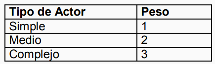
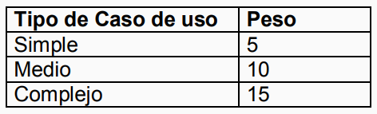
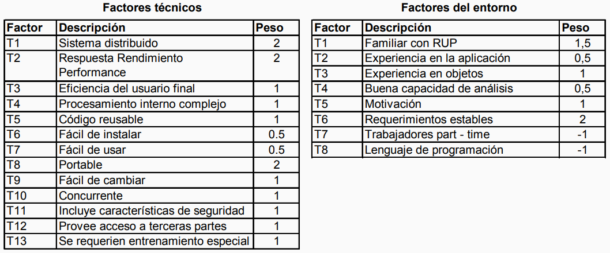

---
tags:
- flashcards/swe/teoria/1P
- flashcards/swe/teoria/U4
---

# Use Case Points

- En este caso mide casos de uso.
- El número de Use Case Points depende de:
	- Cantidad y complejidad de los casos de uso.
	- Cantidad y complejidad de los actores intervinientes en el sistema.
	- Factores técnicos y ambientales.
- La combinación de estimaciones de expertos y estimaciones basadas en métodos puede ser beneficiosa cuando los estimadores carecen de experiencia respecto al dominio y tecnología de la aplicación.
- El método requiere que sea posible contar el número de transacciones en cada caso de uso. Una transacción es un evento que ocurre entre el actor y el sistema.
- Basado en el método de Function Points.
- Elementos del sistema:
	- Transacciones de Casos de Uso.
	- Actores:
		- Actores Simples:
			- Son sistemas externos, son muy predecibles, todo sistema con interfaz de aplicación bien definida.
		- Actores Promedio:
			- Dispositivos de Hardware. Requieren más esfuerzo controlarlos, son más propensos a errores.
			- Personas interactuando a través de una interfaz basada en texto.
		- Actores Complejos:
			- Son humanos, son impredecibles y difíciles de controlar. Personas que interactúan a través de una GUI.
		- Se cuenta el número de actores en cada categoría, multiplicando ese número por el correspondiente peso y se obtiene el UAW (Unadjusted Actor Weight).
			
	- Casos de Uso:
		- Los casos de uso también se clasifican en Simple, Medio y Complejo:
			- Simple: 3 o menos transacciones.
			- Medio: 4 a 7 transacciones.
			- Complejo: Más de 7 transacciones.
		- Se cuenta el número de casos de uso en cada categoría, multiplicando ese número por el correspondiente peso y se obtiene el UUCW (Unadjusted Use Case Weight).
- $$UAW + UUCW = UUCP (Unadjusted Use Case Points)$$
	
- Se trata de asignar un peso a los factores técnicos o del entorno que pueden influir en el costo de desarrollar el SW:
	- A Cada factor se le asigna un valor entre 0 (irrelevante) y 5 (esencial), dependiendo de la influencia que tenga sobre el proyecto. El siguiente es un ejemplo:
		
- El Technical Complexity Factor (TCF) es calculado en base a multiplicar cada factor de la tabla 1 por su peso y luego sumar todos estos valores para obtener el llamado _TFactor_.
	- Finalmente se aplica la siguiente fórmula:
		- $$TCF = 0.6 + ( 0.01 * TFactor )$$
- El Environmental Factor (EF) es calculado en base a multiplicar cada factor de la tabla 2 por su peso y luego sumar todos estos valores para obtener el llamado _Efactor_.
	- Finalmente se aplica la siguiente fórmula:
		- $$EF = 1.4 + ( -0.03 * EFactor )$$
- El adjusted use case points (UCP) se calcula por la siguiente formula:
	- $$AUCP = UCP = UUCP * TCF * EF$$
	- Karner propone un valor de 20 horas/hombre por UCP para cada proyecto:
		- $$UCP * 20 HH = Costo en HH del proyecto$$
	- Enfoque de Kirstein Rubi (2001):
		- $$15 a 30 horas x UCP$$

> [!NOTE]
>
> En los factores del entorno existe un "Trabajadores Part - Time". Esto se refiere al [[08-obl-paper-classic-mistakes#Excessive multi-tasking (Multitasking Excesivo)|excessive multitasking]]. No es lo mismo tener al 100% una persona para un proyecto que tener a dicha persona cambiando todo el tiempo de proyecto. Habrá un mayor esfuerzo si la persona estará haciendo dicho _context switch_ constantemente.

---

¿En qué consiste el método de estimación Use Case Points?
?
- Se miden casos de uso.
- El número de Use Case Points depende de:
	- Cantidad y complejidad de los casos de uso.
	- Cantidad y complejidad de los actores intervinientes en el sistema.
	- Factores técnicos.
	- Factores ambientales.
- La combinación de estimaciones de expertos y estimaciones basadas en métodos puede ser beneficiosa cuando los estimadores carecen de experiencia respecto al dominio y tecnología de la aplicación.
- El método **requiere que sea posible contar el número de transacciones en cada caso de uso**.
	- Transacción: Evento que ocurre entre el actor y el sistema.
- Basado en el método de Function Points.
- Elementos del sistema:
	- Transacciones de Casos de Uso.
	- Actores:
		- Actores Simples:
			- Son sistemas externos, son muy predecibles, todo sistema con interfaz de aplicación bien definida.
		- Actores Promedio:
			- Dispositivos de Hardware. Requieren más esfuerzo controlarlos, son más propensos a errores.
			- Personas interactuando a través de una interfaz basada en texto (TUI).
		- Actores Complejos:
			- Son humanos, son impredecibles y difíciles de controlar. Personas que interactúan a través de una GUI.
		- Se cuenta el número de actores en cada categoría, multiplicando ese número por el correspondiente peso y se obtiene el UAW (Unadjusted Actor Weight).
	- Casos de Uso:
		- Los casos de uso también se clasifican en Simple, Medio y Complejo:
			- Simple: 3 o menos transacciones.
			- Medio: 4 a 7 transacciones.
			- Complejo: Más de 7 transacciones.
		- Se cuenta el número de casos de uso en cada categoría, multiplicando ese número por el correspondiente peso y se obtiene el UUCW (Unadjusted Use Case Weight).
- $$UAW + UUCW = UUCP (Unadjusted Use Case Points)$$
- Se trata de asignar un peso a los factores técnicos o del entorno que pueden influir en el costo de desarrollar el SW:
	- A Cada factor se le asigna un valor entre 0 (irrelevante) y 5 (esencial), dependiendo de la influencia que tenga sobre el proyecto.
- El Technical Complexity Factor (TCF) es calculado en base a multiplicar cada factor de la tabla 1 por su peso y luego sumar todos estos valores para obtener el llamado _TFactor_.
	- Finalmente se aplica la siguiente fórmula:
		- $$TCF = 0.6 + ( 0.01 * TFactor )$$
- El Environmental Factor (EF) es calculado en base a multiplicar cada factor de la tabla 2 por su peso y luego sumar todos estos valores para obtener el llamado _Efactor_.
	- Finalmente se aplica la siguiente fórmula:
		- $$EF = 1.4 + ( -0.03 * EFactor )$$
- El adjusted use case points (UCP) se calcula por la siguiente formula:
	- $$AUCP = UCP = UUCP * TCF * EF$$
	- Karner propone un valor de 20 horas/hombre por UCP para cada proyecto:
		- $$UCP * 20 HH = Costo en HH del proyecto$$
	- Enfoque de Kirstein Rubi (2001):
		- $$15 a 30 horas x UCP$$

---
